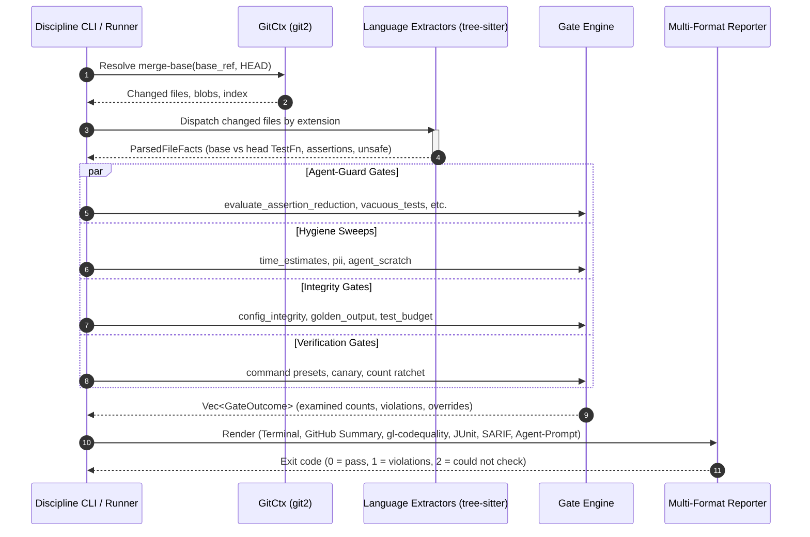
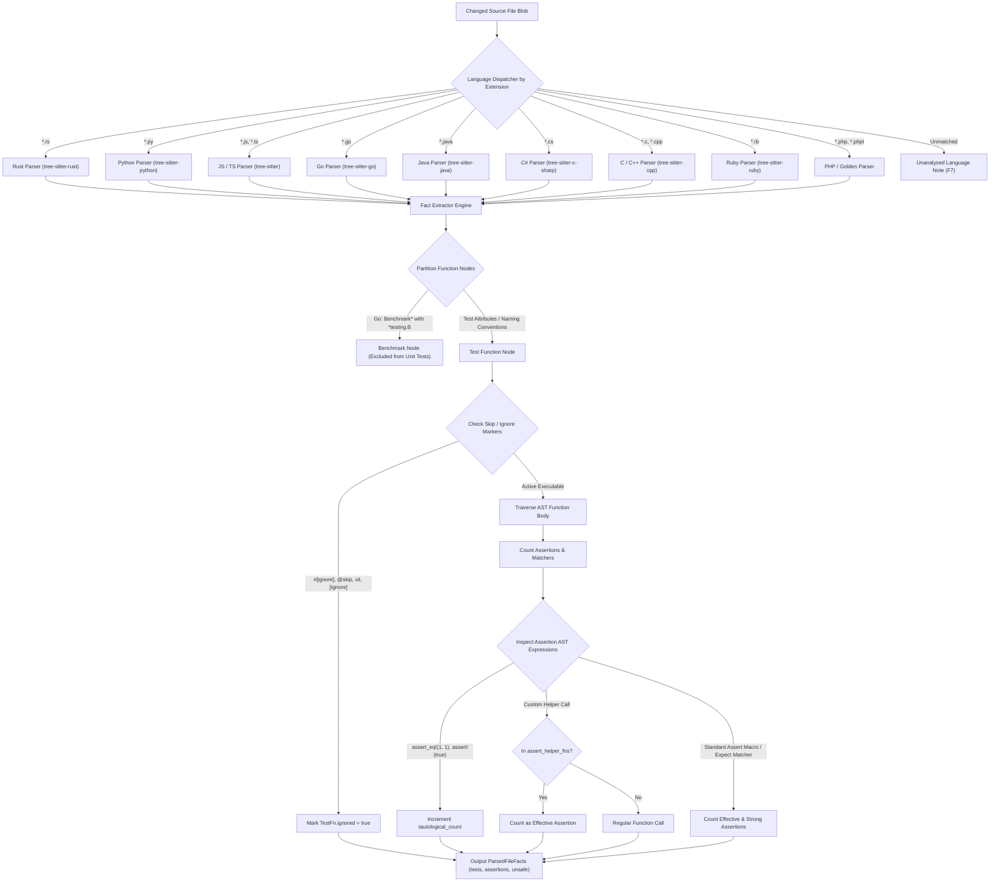

# Architecture & Engineering Sentinel Design

Engine design, fail-closed contracts, CI/CD pipeline architecture, and verification discipline for `discipline`.

**Superseded when:** The engine is restructured, pipeline architecture changes, or gate contracts are modified. Update in place; do not fork.

---

## 1. Overview & System Mission

Discipline is a universal CI/CD gatekeeper and AI coding agent diff sentinel built in Rust. It compiles to a self-contained static binary with zero external runtime dependencies, providing identical diff analysis across GitHub Actions, GitLab CI/CD, Forgejo Actions, Gitea Actions, pre-commit hooks, and local developer environments.

### 1.1 Agent Drift and Test Erosion

Autonomous coding agents operating in iterate-until-green loops frequently introduce subtle test erosion patterns:
1. **Assertion weakening:** `assert_eq!(trie.get(k), Some(&v))` degraded to `assert!(trie.get(k).is_some())` or `assert!(true)`.
2. **Vacuous and ghost tests:** Newly added tests that compile and execute but assert nothing.
3. **Stealth deletions:** Flaky tests, fixtures, or benchmarks removed without justification, or tests renamed or marked `#[ignore]`.
4. **Safety decay:** `unsafe` code introduced without explicit `// SAFETY:` justifications, or safety comments deleted from above untouched blocks.
5. **Editing the gate instead of the code:** Silently disabling gates, lowering severities, or growing exemption lists in `discipline.toml`.
6. **Documentation drift:** Introducing unverified calendar estimates, leaking developer environment paths/IPs, or committing agent transcripts.
7. **Benchmark drift:** Small algorithmic or execution regressions slipping past wall-clock tests lacking statistical rigor.

### 1.2 Design Origin and Prior Art

Discipline's operational rigors were developed to defend high-assurance repositories against subtle automated regressions. Rather than relying on dozens of disparate repository scripts:
- Unlike legacy regex or aggregate count scripts, Discipline uses tree-sitter AST diff inspection to analyze syntactic structures directly.
- The specific failure modes, bypasses, and fail-open traps observed in automated development environments form the binding requirements of the Fail-Closed Contract below.

---

## 2. Architecture Diagram & Binary Design

1. **Binary-first & zero-dependency:** Statically linked musl binaries (`x86_64-unknown-linux-musl`, `aarch64-unknown-linux-musl`) and native macOS binaries (`x86_64-apple-darwin`, `aarch64-apple-darwin`). No Node.js, Python, or container bootstrap required at runtime.
2. **Offline execution & no transport stack:** Built with `vendored-libgit2` with all network and transport features disabled. The binary interacts exclusively with the local git object database.
3. **AST-aware, never regex-naive:** `unsafe` or `assert!` appearing within comments, string literals, or doc tests are never counted as code nodes. Regular expressions are reserved exclusively for prose scanning (markdown, PR bodies).
4. **Unified gate registry:** Every gate possesses a stable kebab-case identifier in `src/config.rs::GATES`.
5. **Language packs behind a shared fact model:** Tree-sitter grammars and extractors map diverse ecosystems onto language-neutral facts (`TestFn`, `UnsafeSite`, assertion counts).

### 2.1 Configuration Resolution Lifecycle

### 2.2 Diff Inspection & Gate Evaluation Pipeline

### 2.3 AST Test Node Extraction & Assertion Counting Pipeline

### 2.4 Binary Footprint & Static Linking Profiles

Discipline compiles to a standalone static binary with zero external runtime dependencies:
- **Full Static Binary (Linux musl `x86_64`):** 23.6 MB (23,624,256 bytes) (measured: `x86_64-unknown-linux-musl`, `32c81b5`). Statically links `libgit2` (vendored, offline) and all 11 `tree-sitter` language grammars (Rust, Python, JavaScript, TypeScript, Go, Java, C#, C, C++, Ruby, PHP). Fully static-pie linked; runs in scratch containers or minimal CI runners without glibc, openssl, or package managers.
- **macOS Native (`aarch64-apple-darwin`):** 22.3 MB (22,310,544 bytes) (measured: `aarch64-apple-darwin`, `32c81b5`). Mach-O binary optimized for local developer inner loops and git hooks.

---

## 3. The Fail-Closed Contract

Every gate in Discipline must satisfy the following 12 load-bearing invariant rules:

| Invariant | Requirement | Incident Origin / Justification |
|---|---|---|
| **F1** | **Three exit states.** `0` = pass, `1` = violations found, `2` = gate could not check. A defective gate or broken environment is never mistaken for a valid change. | CI canaries that passed when underlying build scripts failed. |
| **F2** | **Three-state inputs.** Found / none / could-not-determine. An unresolvable base ref, shallow clone lacking merge base, missing repository, or unreadable file exits `2`. Never an empty diff. | Initial scaffold probe reporting clean zero on invalid refs. |
| **F3** | **Merge-base diffs with rename detection.** Diff measured from `merge-base(base, HEAD)`; moved files are tracked as modifications, not deletions. | Deletion gate false positives on renamed test suites. |
| **F4** | **No vacuous pass.** Every report prints the exact `examined` count per gate. A suite with zero available gates or an empty tracked tree is an error. | Silent fail-open when zero files were scanned ("0 of 52 files scanned, exit 0"). |
| **F5** | **Planned is not passed.** A gate not shipped in the binary cannot be enabled or configured (exit `2`). Every report lists planned gates under "not checked". | Scaffold config accepting and ignoring planned flags. |
| **F6** | **Strict configuration.** Unknown keys, unknown gates, invalid regexes, malformed globs, unsupported schema versions, and contradictory switches (`enable` + `disable`) are errors. | Typo'd TOML keys accepted silently. |
| **F7** | **Named degradation.** When a gate cannot inspect a file (unanalysed language pack, file exceeding size limits, unreadable base config), it explicitly names the file in the report. | Benchmark script silently passing on "NO BASELINE". |
| **F8** | **A gate is not satisfied by prose about the gate.** Directives are strictly line-anchored; mentions in tables, sentences, or code blocks never arm an override. | Incident where a Markdown table describing a token accidentally waived all checks. |
| **F9** | **A change cannot lower its own bar.** Configuration on head is diffed against base ref; loosening requires an explicit `allow-gate-weakening:` directive. | Threshold constants edited in the diff that violated them. |
| **F10** | **Secrets are not echoed.** Denylisted hostnames, local user workstation paths, and PII patterns are reported by file location only, never printed. | Hostname denylists echoed in public CI logs. |
| **F11** | **Untrusted text never reaches a shell parser.** All action inputs pass through `env:`, never inline `${{ }}` interpolation. | Inline shell injection vulnerabilities in workflow expressions. |
| **F12** | **The installer verifies what it runs.** Actions download release archives and verify them against `SHA256SUMS` with no opt-out; no fallbacks to unverified compilation. | Scaffold download failure falling back to unverified local build. |

---

## 4. Module Map

| Module | Responsibility |
|---|---|
| `src/config.rs` | Gate registry (`GATES`), schema definition, layered configuration resolution |
| `src/gitctx.rs` | Git interaction via `libgit2`: base ref detection, merge-base computation, blob streaming, index inspection |
| `src/tokens.rs` | Line-anchored override directive parser and validation |
| `src/ast.rs` | Tree-sitter dispatch and language-specific fact extraction |
| `src/guards/agent_diff.rs` | Semantic diff inspection across base vs. head AST facts |
| `src/guards/hygiene.rs` | Repository sweeps: `time-estimates`, `pii`, `agent-scratch`, `agents-md` |
| `src/guards/integrity.rs` | Structural integrity gates: `config-integrity`, `golden-output` |
| `src/guards/perf/` | Benchmark regression sentinel (`bench-regression`): mathematical bounds engine (`bounds.rs`) and harness adapter (`mod.rs`) |
| `src/guards/mod.rs` | Gate execution scheduling, `GateOutcome`, path filtering, inline marker accounting |
| `src/report/` | Multi-format reporting: terminal, GitHub summary, GitLab Code Quality, JUnit XML, SARIF, JSON |
| `src/docs.rs` | Automated reference docs generator and schema validation sentinel |
| `src/selftest.rs` | Embedded positive and negative controls compiled into binary |
| `src/style.rs` | Zero-dependency ANSI terminal styling |

---

## 5. AST Fact Model & Extraction Rules

### Fact Representation

Tree-sitter AST extraction translates source files into language-neutral fact structures:
- `TestFn`: Qualified name, line number, assertion counts (total, strong, tautological), skip state (`ignored`), expected panic (`should_panic`).
- `UnsafeSite`: Line number, block kind, documentation status (`documented`).
- `has_parse_errors`: Tracks whether unparseable syntax was encountered.

### SAFETY: Invariant Comments

An `unsafe` block or implementation is documented iff a comment containing `SAFETY:` is positioned:
1. In the contiguous run of comments directly preceding the `unsafe` node or its parent statement; or
2. Inline between the start of the statement and the `unsafe` keyword.

**Placeholder Rejection:** Comments consisting entirely of placeholder tokens (`todo`, `tbd`, `n/a`, `safe`, `ok`, `fine`, `valid`, `trust me`, `temporary`, `placeholder`, `fixme`, `wip`, `noop`) or keyword restatements are rejected. Substantive justifications naming actual memory safety invariants are required.

### Assertion Strength & Tautologies

Assertions are classified into two levels:
- **Strong:** Equality and pattern assertions (`assert_eq!`, `assert_ne!`, `matches!`, `toEqual`, `toStrictEqual`).
- **Weak:** General truthiness (`assert!`, `toBeTruthy`, `.unwrap()`, `.expect()`, `?` in fallible tests).

**Tautology Filtering:** Tautological assertions are deducted from effective assertion counts:
- Verbatim equality: `assert_eq!(x, x)`.
- Constant expression tautologies: `assert!(true)`, `assert!(1 == 1)`, `assert!(1 + 1 > 0)`, `assert_ne!(1, 2)`.

---

## 6. Golden-Output Gate Design

Committed test snapshots (e.g. `insta` `.snap`), serialized fixtures, and golden files are common drift vectors. Agents frequently re-bless or edit fixtures to make broken tests pass.
- **Blob diff inspection:** Tracks modifications and deletions across configured file globs (`**/golden/**`, `**/snapshots/**`, `**/*.snap`, `tests/fixtures/**/output*`).
- **Scoped authorization:** Requires explicit `allow-golden-update: <path> <reason>` directive.

---

## 7. Reporter Architecture & Zero-Dependency Cryptography

Discipline exports standard structured formats:
- **GitLab Code Quality (`gl-codequality.json`):** Code Climate JSON array consumed natively by GitLab Merge Request widgets.
- **JUnit XML (`junit.xml`):** Validated offline against Jenkins `junit-10.xsd` with testsuite-level `<properties>` and testcase execution diagnostics.
- **SARIF (`discipline.sarif`):** OASIS Static Analysis Results Interchange Format v2.1.0 schema-compliant report.
- **Terminal & GitHub Job Summaries:** ANSI-styled summaries and GitHub workflow annotations.

### Pure-Rust SHA-256 Implementation

GitLab Code Quality requires unique, deterministic 32-byte hex fingerprints for issue tracking:
- Discipline implements a zero-dependency NIST FIPS 180-4 compliant SHA-256 algorithm in `src/report/gitlab.rs`.
- Avoids pulling in external cryptographic dependencies (`ring`, `openssl`, `sha2`), preserving zero-dependency static musl compilation.
- Verified directly against NIST CAVP test vectors.

---

## 8. CI and Release Pipelines

### 8.1 CI Pipeline (`.github/workflows/ci.yml`)

Third-party GitHub Actions are pinned by full commit SHA. Tooling binaries (`act`, `actionlint`) are installed by version with pinned SHA-256 checksums. The `ci-gate` rollup enforces an **allow-list**: every required job must succeed, and the total job count is asserted.

| Job | Verification Scope |
|---|---|
| `lint` | `cargo fmt --check`, `cargo clippy -- -D warnings`, `actionlint` on workflows, `shellcheck`, `lint-action.py` (F11), `docs --check` (G7), and link integrity validator. |
| `test` (Linux & macOS) | Full test suite execution asserting at least 65 test cases ran, followed by embedded `self-test`. |
| `msrv` | `cargo check` under the pinned Minimum Supported Rust Version (`1.90`). |
| `supply-chain` | `cargo-deny` validation of advisories, bans, license allow-list, and sources. |
| `build-static` | Cross-compiles `x86_64` and `aarch64` musl binaries; validates static linkage and executes `self-test`. |
| `action-github` | Exercises composite action on hosted runner: clean fixture passes, bad fixture fails for expected gates, overrides take effect, unresolvable base exits 2, tampered archive rejected. |
| `action-gitea` | Runs action under `act` using Gitea runner images with mandatory log assertions. |
| `pre-commit` | Runs `pre-commit try-repo` against staged fixtures. |
| `dogfood` | Executes Discipline against its own repository diff. |

### 8.2 Release Pipeline (`.github/workflows/release.yml`)

Releases are triggered exclusively by pushing a `vX.Y.Z` tag:
1. **Verify:** Asserts tag matches `Cargo.toml` version, tagged commit resides on `main`, and tests/lints/deny pass.
2. **Build:** Compiles 4 static release targets (`x86_64-musl`, `aarch64-musl`, `x86_64-darwin`, `aarch64-darwin`); executes `self-test` on each.
3. **Publish:** Generates `SHA256SUMS`, attaches build-provenance attestations, creates GitHub release.
4. **Smoke test:** Action downloads published release assets on Linux and macOS, validates checksums, tests clean and negative fixtures, and verifies GitHub attestations.
5. **Move major tag:** Advances floating major version tag (`v0`) only after all smoke tests succeed.

### 8.3 CodeQL Security Pipeline (`.github/workflows/codeql.yml`)

Static security analysis runs on pull requests, pushes to `main`, and on a weekly schedule using GitHub CodeQL Advanced setup (`github/codeql-action` pinned by SHA):
- **Matrix analysis:** Analyzes `rust`, `actions`, and `python` with `build-mode: none`.
- **Query suite:** Configured with `queries: security-extended` for deep vulnerability scanning.
- **Toolchain:** Pins `dtolnay/rust-toolchain` stable for Rust AST and macro expansion.

---

## 9. Test Discipline for Gates

Every gate implemented in Discipline must satisfy the 4-point testing contract before shipping:
1. **Unit tests:** Detector-level unit tests with both positive and negative controls (`src/**` `#[cfg(test)]`).
2. **End-to-end binary tests:** Real binary executions driving throwaway git repositories and parsing JSON outputs (`tests/test_gates_e2e.rs`).
3. **Mutation evidence:** Detectors must be deliberately inverted or broken, with proof that the test suite fails on the mutant.
4. **Self-test cases:** Compiled directly into the binary (`src/selftest.rs`) to allow deployed binaries to verify their own discriminators.

---

## 10. Known Limits

- **Macro opacity:** Tests generated inside macro invocations (`proptest! { ... }`, `quickcheck! { ... }`) are invisible to tree-sitter AST extractors without macro expansion. Configure `extra_assert_macros` and `assert_helper_fns`.
- **Grammar lag:** Source syntax newer than bundled tree-sitter grammars triggers parse errors, failing closed by design. Use `exempt_paths` until grammars are updated.
- **Untracked files:** Untracked files are excluded from non-staged git diffs. CI inspects committed history and is unaffected.
- **Workflow-level edits:** Edits to `.github/workflows/` within a PR are unguarded until the `ci-integrity` gate ships.
