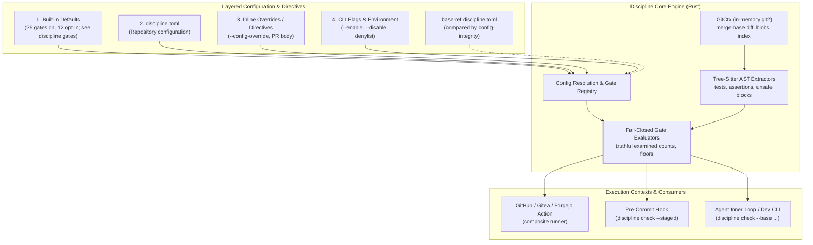
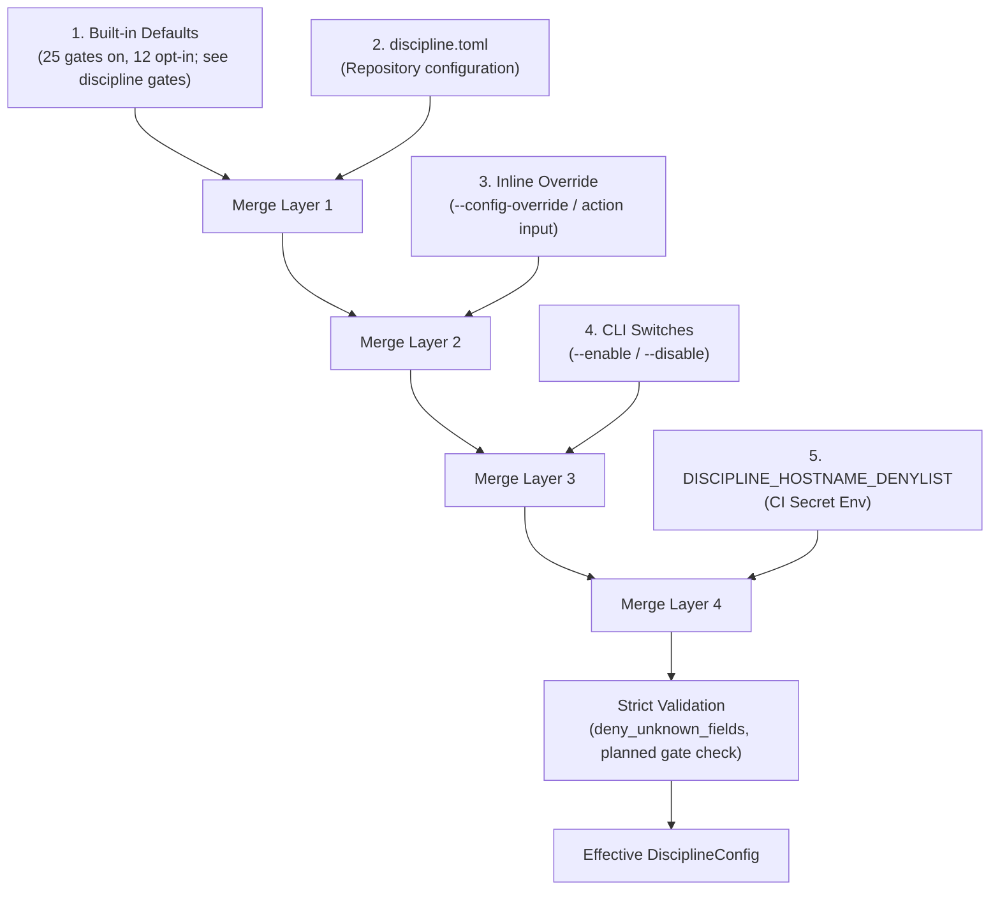
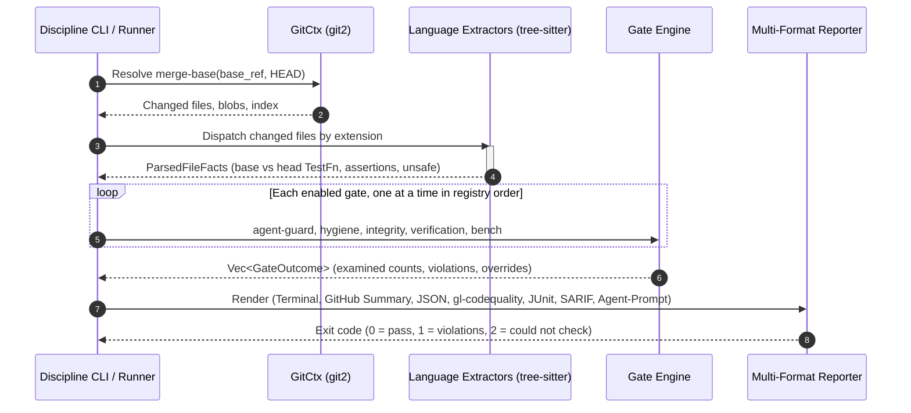
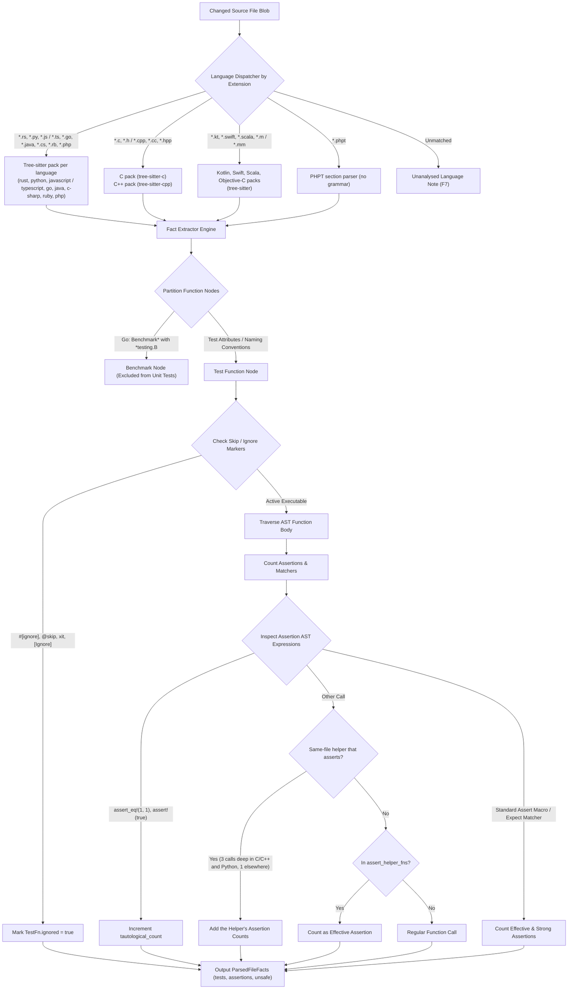

# Architecture & Engineering Sentinel Design

Engine design, fail-closed contracts, CI/CD pipeline architecture, and verification discipline for `discipline`.

**Superseded when:** The engine is restructured, pipeline architecture changes, or gate contracts are modified. Update in place; do not fork.

---

## 1. Overview & System Mission

Discipline is a universal CI/CD gatekeeper and AI coding agent diff sentinel built in Rust. It compiles to a self-contained static binary with zero external runtime dependencies, providing identical diff analysis across GitHub Actions, GitLab CI/CD, Forgejo Actions, Gitea Actions, pre-commit hooks, and local developer environments.

### 1.1 Agent Drift and Test Erosion

Autonomous coding agents operating in iterate-until-green loops frequently introduce subtle test erosion patterns:
1. **Assertion weakening:** `assert_eq!(trie.get(k), Some(&v))` degraded to `assert!(trie.get(k).is_some())` or `assert!(true)`.
2. **Vacuous and ghost tests:** Newly added tests that compile and execute but assert nothing.
3. **Stealth deletions:** Flaky tests, fixtures, or benchmarks removed without justification, or tests renamed or marked `#[ignore]`.
4. **Safety decay:** `unsafe` code introduced without explicit `// SAFETY:` justifications, or safety comments deleted from above untouched blocks.
5. **Editing the gate instead of the code:** Silently disabling gates, lowering severities, or growing exemption lists in `discipline.toml`.
6. **Documentation drift:** Introducing unverified calendar estimates, leaking developer environment paths/IPs, or committing agent transcripts.
7. **Benchmark drift:** Small algorithmic or execution regressions slipping past wall-clock tests lacking statistical rigor.

### 1.2 Design Origin and Prior Art

Discipline's operational rigors were developed to defend high-assurance repositories against subtle automated regressions. Rather than relying on dozens of disparate repository scripts:
- Unlike legacy regex or aggregate count scripts, Discipline uses tree-sitter AST diff inspection to analyze syntactic structures directly.
- The specific failure modes, bypasses, and fail-open traps observed in automated development environments form the binding requirements of the Fail-Closed Contract below.

---

## 2. Architecture Diagram & Binary Design

1. **Binary-first & zero-dependency:** Statically linked musl binaries (`x86_64-unknown-linux-musl`, `aarch64-unknown-linux-musl`) and native macOS binaries (`x86_64-apple-darwin`, `aarch64-apple-darwin`). No Node.js, Python, or container bootstrap required at runtime.
2. **Offline by default, one HTTPS client:** `libgit2` is vendored with its network and transport features disabled, so every diff is read from the local git object database. The forge REST API is reached only through the in-process HTTPS client in `src/forge.rs` (`ureq` over `rustls`, no OpenSSL), for opt-in features: open-issue state and bench citation freshness (`provenance-tags`, `bench-regression`), `require_approval` reviews, the `merged-pr-body` directive source, `discipline replay` and `discipline doctor`; its one write is `check --comment`. `DISCIPLINE_NO_NETWORK=1` keeps that client off the network (a loopback address excepted). One exception sits outside the client: in CI (`CI`, `GITHUB_ACTIONS`, `GITLAB_CI`, `GITEA_ACTIONS` or `FORGEJO_ACTIONS` set), when the base ref cannot be resolved, `src/gitctx.rs` spawns the external `git fetch` against `origin` to deepen a shallow clone, and exits `2` if the base is still missing; `DISCIPLINE_NO_NETWORK` does not cover it.
3. **AST-aware, never regex-naive:** `unsafe` or `assert!` appearing within comments, string literals, or doc tests are never counted as code nodes. Source-code invariants (tests, assertions, `unsafe`, handlers, stubs) are read from the syntax tree only. Regular expressions read text that has no grammar here: prose, PR bodies, shell and workflow lines, manifests and tool output.
4. **Unified gate registry:** Every gate possesses a stable kebab-case identifier in `src/config.rs::GATES`.
5. **Language packs behind a shared fact model:** Tree-sitter grammars and extractors map diverse ecosystems onto language-neutral facts (`TestFn`, `UnsafeSite`, assertion counts).

### 2.1 Configuration Resolution Lifecycle

### 2.2 Diff Inspection & Gate Evaluation Pipeline

### 2.3 AST Test Node Extraction & Assertion Counting Pipeline

### 2.4 Binary Footprint & Static Linking Profiles

Discipline compiles to a standalone static binary with zero external runtime dependencies. It statically links `libgit2` (vendored, no transport), the 15 `tree-sitter` grammars (Rust, Python, JavaScript, TypeScript, Go, Java, C#, C, C++, Ruby, PHP, Kotlin, Swift, Scala, Objective-C) and the `rustls` / `ring` TLS stack of the forge client. It is fully static-pie linked on musl and runs in scratch containers or minimal CI runners without glibc, OpenSSL, or package managers. The sizes below were measured at `32c81b5`, before the Kotlin, Swift, Scala and Objective-C packs and the forge client were added; the current binaries have not been re-measured:
- **Full Static Binary (Linux musl `x86_64`):** 23.6 MB (23,624,256 bytes) (measured: `x86_64-unknown-linux-musl`, `32c81b5`, 11 grammars).
- **macOS Native (`aarch64-apple-darwin`):** 22.3 MB (22,310,544 bytes) (measured: `aarch64-apple-darwin`, `32c81b5`). Mach-O binary optimized for local developer inner loops and git hooks.

---

## 3. The Fail-Closed Contract

Every gate in Discipline must satisfy the following 12 load-bearing invariant rules:

| Invariant | Requirement | Incident Origin / Justification |
|---|---|---|
| **F1** | **Three exit states.** `0` = pass, `1` = violations found, `2` = gate could not check. A defective gate or broken environment is never mistaken for a valid change. On exit 2 the JSON report (stdout under `--format json`, and `--json-out`) has no outcomes and a `could_not_check` object: `reason` (`configuration`, `baseline`, `repository`, `tool-missing`, `tool-timeout`, `toolchain-unavailable`, `forge`, `gate`, `internal`), the `gate` that could not run, and the error as printed on stderr. An error is tagged where it arises (`src/could_not_check.rs`) and the innermost tag wins, so a missing tool inside a gate is `tool-missing`, not `gate`. JUnit, SARIF and GitLab reports, which have no such field, carry one `engine/could-not-run` finding. `replay` and the MCP `check_diff` tool report the same reason. | CI canaries that passed when underlying build scripts failed. |
| **F2** | **Three-state inputs.** Found / none / could-not-determine. An unresolvable base ref, shallow clone lacking merge base, missing repository, or unreadable file exits `2`. Never an empty diff. | Initial scaffold probe reporting clean zero on invalid refs. |
| **F3** | **Merge-base diffs with rename detection.** Diff measured from `merge-base(base, HEAD)`; moved files are tracked as modifications, not deletions. | Deletion gate false positives on renamed test suites. |
| **F4** | **No vacuous pass.** Every report prints the exact `examined` count per gate. A suite with zero available gates or an empty tracked tree is an error. | Silent fail-open when zero files were scanned ("0 of 52 files scanned, exit 0"). |
| **F5** | **Planned is not passed.** A gate not shipped in the binary cannot be enabled or configured (exit `2`). Every report lists planned gates under "not checked". | Scaffold config accepting and ignoring planned flags. |
| **F6** | **Strict configuration.** Unknown keys, unknown gates, invalid regexes, malformed globs, unsupported schema versions, and contradictory switches (`enable` + `disable`) are errors. | Typo'd TOML keys accepted silently. |
| **F7** | **Named degradation.** When a gate cannot inspect a file (unanalysed language pack, file exceeding size limits, unreadable base config), it explicitly names the file in the report. | Benchmark script silently passing on "NO BASELINE". |
| **F8** | **A gate is not satisfied by prose about the gate.** Directives are strictly line-anchored; mentions in tables, sentences, or code blocks never arm an override. | Incident where a Markdown table describing a token accidentally waived all checks. |
| **F9** | **A change cannot lower its own bar.** Configuration on head is diffed against base ref; loosening requires an explicit `allow-gate-weakening:` directive. | Threshold constants edited in the diff that violated them. |
| **F10** | **Secrets are not echoed.** Denylisted hostnames, local user workstation paths, and PII patterns are reported by file location only, never printed. | Hostname denylists echoed in public CI logs. |
| **F11** | **Untrusted text never reaches a shell parser.** All action inputs pass through `env:`, never inline `${{ }}` interpolation. | Inline shell injection vulnerabilities in workflow expressions. |
| **F12** | **The installer verifies what it runs.** A release archive the action downloads is verified against `SHA256SUMS` with no opt-out; no fallbacks to unverified compilation. `binary_path` skips the download, so the operator vouches for that binary. | Scaffold download failure falling back to unverified local build. |

### 3.1 Defaults Are Part of the Compatibility Contract

A consumer who runs Discipline with zero configuration, or who configures only some gates, relies on the built-in default **enablement** and **severity** of every other gate. A default that becomes looser (a gate turned off, or moved from `error` to `warning` or `note`) silently stops blocking for that consumer, with no diff in their repository to review. Defaults are therefore versioned like the configuration schema:

- **Within a major version, a default may only become stricter** (off to on, `note` to `warning`, `warning` to `error`) without further ceremony.
- **A looser default within a major version requires a release-note entry** in the [Default Changes ledger](ROADMAP.md#default-changes-compatibility-ledger) naming the gate, the old and new default, the reason, and the one-line configuration that restores the old behaviour. The entry lands in the same pull request as the change.
- **Every default is pinned by a test.** `tests/test_config.rs::default_enablement_and_severity_match_snapshot` compares the compiled defaults of every available gate against a committed snapshot. Changing a default fails that test until the snapshot is edited, so the change is visible in review next to its ledger entry.
- **The reference is generated.** The *Default* column of the configuration table in `docs/CONFIGURATION.md` is rendered by `discipline docs` from the compiled defaults and the JSON Schema, so documentation cannot claim a default the binary does not ship. Per-gate rationale lives in `docs/GATES.md` ("Default Severity by Gate").

### 3.2 What 1.0 Freezes

From 1.0, the surfaces below change incompatibly only in a new major version. Adding to them (a new flag, key, field, gate, tool or language) is a minor release; changing or removing what exists is a major one. A renamed flag or key keeps its old name as an alias, with a deprecation note in the report, until the next major version. For configuration keys the mechanism is `KEY_ALIASES` in `src/config.rs`: the old name is read as the new one, setting both is a configuration error (exit 2), and each use adds a line to the report's `deprecations` list (`deprecated: ...` in the text report), which never fails the run.

| Surface | Frozen | Free to evolve in a minor release |
|---|---|---|
| CLI | Subcommand and flag names; the `DISCIPLINE_*` environment variables; exit codes `0` pass, `1` findings, `2` could not check | New subcommands and flags; help text |
| Configuration | Table and key names and their value types in `discipline.toml` (`[meta] version = 1`); list reset syntax; how layers merge | New keys and tables; default values under the rules of §3.1 |
| Directives | The directive names (`allow-*:`, `removes:`, `discipline:allow(<gate>)`), their subject grammar, the directive sources | New directives |
| Gates and findings | Gate ids; finding **codes** (`gate/code`, the registry in `src/findings.rs`; a baseline fingerprint is `v2:gate/code:path:line-hash`, so a code is the finding's identity) and the titles of fingerprint-version-1 baselines until they are migrated; severities as `error` / `warning` / `note` | What a gate detects, as recorded in the ledger (below); finding messages and remediation text, except where the next row applies |
| Reports | The JSON report's existing fields, their names and types (`--format json`, `replay --json`), as `discipline.report.schema.json` and `discipline.replay.schema.json` define them (generated by `discipline docs`; `tests/test_output_schemas.rs` pins every field and validates real output); `schema_version`, which a renamed, removed or retyped field raises; the `could_not_check.reason` codes, a failure keeping the reason it has; consumers ignore fields they do not know; SARIF 2.1.0, JUnit and GitLab Code Quality follow their external schemas | New fields; new `could_not_check` reasons for new kinds of failure; terminal, Markdown and agent-prompt text |
| Baselines | The fingerprint formula; `discipline-baseline.toml` layout. A finding with no line is fingerprinted by its message, so such a message changes only with a ledger row naming the regeneration (`discipline baseline`) | |
| Agent surfaces | The MCP tool names, argument names and result shape (`check_diff`'s `structuredContent` is its `outputSchema`, `mcp_check_schema()` in `src/output_schema.rs`, pinned by `tests/test_output_schemas.rs`); `hook run`'s accepted payload fields and each agent's output contract; the files `hook install` writes | Support for more agents |
| Action and templates | `action.yml` inputs and outputs; the major tag (`@v1`) moving only through the release pipeline (§8.2) | New inputs and outputs |

**Detection is not frozen.** Language packs, parsers and gates keep improving, and every change to what a gate reports is a ledger row in `docs/ROADMAP.md`: a stricter one (a new finding, a construct now read) may land in a minor release; a looser one (a false positive fixed) follows §3.1 and names the configuration that restores the old behaviour where one exists. Pinning a version (`@v1.2.3`, an image digest) is the way to hold detection still.

**Before 1.0** a minor release may still change these surfaces; the ledger records each change. The Interface freeze criterion in `docs/ROADMAP.md` ("1.0 Readiness") is met by one full minor release that changes none of the frozen column.

---

## 4. Module Map

| Module | Responsibility |
|---|---|
| `src/config.rs` | Gate registry (`GATES`), schema definition, layered configuration resolution |
| `src/gitctx.rs` | Git interaction via `libgit2`: base ref detection, merge-base computation, blob streaming, index inspection |
| `src/tokens.rs` | Line-anchored override directive parser and validation |
| `src/main.rs`, `src/lib.rs`, `src/cli.rs` | Binary entry point and subcommand wiring (including the `merged-pr-body` read); library root; the `clap` command-line definition |
| `src/schema.rs` | JSON Schema generation for `discipline.toml` |
| `src/output_schema.rs` | JSON Schemas of the `check --format json` report and the `replay --json` summary |
| `src/ast/` | Tree-sitter dispatch (`mod.rs`: registry, `Fact`, shared helper and dispatch-table resolution) and one module per language pack (`rust.rs`, `python.rs`, `javascript.rs`, `java.rs`, `kotlin.rs`, `go.rs`, `php.rs`, `c_cpp.rs`, `csharp.rs`, `ruby.rs`, `swift.rs`, `scala.rs`, `objc.rs`, `golden.rs`), plus the facts every pack shares: `functions.rs` (stubs), `handlers.rs` (swallowed errors), `prose.rs`, `reach.rs` (unreachable code), `mocks.rs`, `calls.rs`, `retries.rs`, `budgets.rs`, `bounds.rs` (numeric bounds inside assertions); `c_macros.rs` masks C extension macros before parsing |
| `src/guards/agent_diff.rs` | Semantic diff inspection across base vs. head AST facts: `assertion-reduction`, `vacuous-tests`, `ignored-tests`, `unsafe-safety-comment`, `deletion-rationale` |
| `src/guards/hygiene.rs` | Repository sweeps: `time-estimates`, `pii`, `agent-scratch`, `agents-md` |
| `src/guards/integrity.rs` | Structural integrity gates: `config-integrity`, `golden-output` |
| `src/guards/<gate>.rs` | One module per remaining gate (`shell_secrets.rs`, `ci_integrity.rs`, `dependency.rs`, `command.rs`, `archive_contents.rs`, ...), with helpers beside their gate: `ci_gitlab.rs` (`ci-integrity`), `lockfile.rs` (`dependency-delta`), `presets.rs` (`command`), `archive_formats.rs` / `archive_presets.rs` / `source_maps.rs` (`archive-contents`), `claim_registry.rs` (`provenance-tags`) |
| `src/guards/perf/` | Benchmark regression sentinel (`bench-regression`): mathematical bounds engine (`bounds.rs`), harness adapter (`mod.rs`), the `paired-ratio` mode (`paired_ratio.rs`) and override citation freshness (`citation.rs`) |
| `src/guards/mod.rs` | Gate execution scheduling, `GateOutcome`, path filtering, inline marker accounting |
| `src/report/` | Multi-format reporting: terminal, GitHub summary, JSON, GitLab Code Quality, JUnit XML, SARIF, `agent-prompt` |
| `src/docs.rs` | Automated reference docs generator and schema validation sentinel |
| `src/selftest.rs` | Embedded positive and negative controls compiled into binary |
| `src/style.rs` | Zero-dependency ANSI terminal styling |
| `src/forge.rs` | The in-process HTTPS client for forge REST APIs (reads, and the one write: `check --comment`), with the path, https, redirect and `DISCIPLINE_NO_NETWORK` checks |
| `src/doctor.rs` | `discipline doctor`: workflow, CODEOWNERS and branch-protection checks |
| `src/override_policy.rs` | `max_overrides` and `require_approval`: whether a run's directive overrides stand |
| `src/baseline.rs` | Grandfathering baseline read / write and fingerprints |
| `src/hook.rs` | `discipline hook run` / `install`: the agent-facing check (base policy, no directives) translated into each agent's hook contract |
| `src/mcp.rs` | `discipline mcp`: the MCP server over stdio (read-only tools) |
| `src/explain.rs` | `discipline explain`: a gate's rule, state, finding codes and lifting directive |
| `src/findings.rs` | The registry of finding kinds: each `gate/code` with its title; a finding that is not registered does not compile |
| `src/replay.rs` | `discipline replay`: rebuild merged changes in a throwaway repository and check each |
| `src/comment.rs` | `check --comment`: the one pull-request comment, found by marker and edited in place |

**Agent-facing surfaces.** The hook, the MCP server and the `agent-prompt` format share one design rule: they tell an agent how to repair a finding and leave out the directive that would waive it, and the check they run is judged by the base ref's configuration and reads no directive, so the change being judged cannot switch off or excuse its own check. Hiding the waiver syntax is a convenience (an agent can run `discipline explain`); the base-side policy and the CI configuration (`policy_from: base`, PR-body directives, `fail_on_overrides`, `require_approval`) are the control.

---

## 5. AST Fact Model & Extraction Rules

### Fact Representation

Tree-sitter AST extraction translates each source file into one `ParsedFileFacts` of language-neutral fact structures. A pack declares which facts it fills (`LanguagePack::supplies(Fact)`); a gate that needs a fact a pack does not supply names the file instead of passing it.
- `TestFn`: Qualified name, line span, assertion counts (total, strong, tautological, fatal, trivial), skip state (`ignored`, `conditional_ignore`), expected panic (`should_panic`), mock setups and verifications, retries, sleeps, `helper_checks` (same-file helpers that assert) and numeric `bounds` inside assertions.
- `UnsafeSite`: Line number, block kind, documentation status (`documented`).
- `escape_hatches`, `functions` (bodies, for stubs), `swallowed` (error handlers and discarded results outside tests), `prose` (comments, docstrings, string literals) and `budgets` (testing-effort settings).
- `has_parse_errors`: Tracks whether unparseable syntax was encountered.

**Helper resolution.** A call from a test to a function defined in the same file adds that helper's assertions to the test. C/C++ and Python follow such helpers up to three calls deep (`HELPER_DEPTH`, `transitive_helper` in `src/ast/mod.rs`); the other packs follow one level. Helpers are never followed across files. A function reached only through a dispatch table (a `*_DISPATCH` spec) is resolved in Rust, JS/TS, Go, Java, Kotlin, C#, C/C++, Ruby, Swift and Scala; Python reads list and tuple dispatch tables in its own extractor; PHP and Objective-C read none.

### SAFETY: Invariant Comments

An `unsafe` block or implementation is documented iff a comment containing `SAFETY:` is positioned:
1. In the contiguous run of comments directly preceding the `unsafe` node or its parent statement; or
2. Inline between the start of the statement and the `unsafe` keyword.

**Placeholder Rejection:** A `SAFETY:` comment whose words all come from the placeholder list is rejected. The default list (`DEFAULT_SAFETY_PLACEHOLDERS` in `src/config.rs`) is `todo`, `tbd`, `n/a`, `na`, `none`, `safe`, `safety`, `unsafe`, `ok`, `fine`, `valid`, `trust me`, `trust`, `me`, `this`, `is`, `totally`, replaceable through the gate's `placeholders` option. The check is a word filter, not a judgement of the justification: one word outside the list passes (`// SAFETY: fixme` is accepted by default).

### Assertion Strength & Tautologies

Assertions are classified into two levels:
- **Strong:** Equality and pattern assertions (`assert_eq!`, `assert_ne!`, `matches!`, `toEqual`, `toStrictEqual`).
- **Weak:** General truthiness (`assert!`, `toBeTruthy`, `.unwrap()`, `.expect()`, `?` in fallible tests).

**Tautology Filtering:** Tautological assertions are deducted from effective assertion counts:
- Verbatim equality: `assert_eq!(x, x)`.
- Constant expression tautologies: `assert!(true)`, `assert!(1 == 1)`, `assert!(1 + 1 > 0)`, `assert_ne!(1, 2)`.

---

## 6. Golden-Output Gate Design

Committed test snapshots (e.g. `insta` `.snap`), serialized fixtures, and golden files are common drift vectors. Agents frequently re-bless or edit fixtures to make broken tests pass.
- **Blob diff inspection:** Tracks modifications and deletions across configured file globs (defaults: `**/golden/**`, `**/snapshots/**`, `**/__snapshots__/**`, `**/*.snap`, `**/*.ambr`, `**/*.golden`, `**/*.approved.*`, `tests/fixtures/**/output*`). An added snapshot is judged too when the test that owns it already existed on the base side: that is an expectation written after the fact.
- **Scoped authorization:** Requires explicit `allow-golden-update: <path> <reason>` directive.

---

## 7. Reporter Architecture & Fingerprint Hashing

Discipline exports standard structured formats:
- **GitLab Code Quality (`gl-codequality.json`):** Code Climate JSON array consumed natively by GitLab Merge Request widgets.
- **JUnit XML (`junit.xml`):** Validated offline against Jenkins `junit-10.xsd` with testsuite-level `<properties>` and testcase execution diagnostics.
- **SARIF (`discipline.sarif`):** OASIS Static Analysis Results Interchange Format v2.1.0 schema-compliant report.
- **Terminal & GitHub Job Summaries:** ANSI-styled summaries and GitHub workflow annotations.

### 7.1 Pure-Rust SHA-256 Implementation & Cryptographic Hygiene

GitLab Code Quality issue tracking and Discipline's grandfathering baseline engine require unique, deterministic 32-byte hex fingerprints:
- Discipline implements a zero-dependency NIST FIPS 180-4 compliant SHA-256 algorithm in `src/report/gitlab.rs` (reused across reporting and `src/baseline.rs`).
- Fingerprints do not depend on a hashing crate (`sha2`). TLS for the forge client is `rustls` with `ring` as its cryptographic provider; OpenSSL is not in the dependency tree, which keeps the musl build static.
- Verified directly against NIST CAVP test vectors.

### 7.2 Grandfathering Baseline Architecture

To support brownfield adoption without weakening gates or ignoring violations, Discipline provides a line-number-independent grandfathering baseline:
- **Fingerprinting Formula (version 2):** `sha256("v2:" + gate/code + ":" + path + ":" + sha256(trimmed_line))`, with the message in place of the line for a finding that has none. The finding's code (`src/findings.rs`) is the key, not its title, and line numbers are excluded, so neither a title change nor a line shift churns baseline hashes. A finding several gates may report (source parse findings) is coded under its first registered gate, so its fingerprint does not depend on which gates are enabled. `check` computes it once per finding: the JSON `fingerprint` field, SARIF `partialFingerprints` and the GitLab Code Quality fingerprint all carry it. Version-1 files (keyed on titles) still match until `discipline baseline --migrate` rewrites them.
- **Fail-Closed Baseline Storage:** Recorded in a committed `discipline-baseline.toml` file at the repository root.
- **Non-Blocking Grandfathering:** Pre-existing baselined findings are reported as non-blocking notes across all output formats (terminal, GitHub step summaries, JSON, JUnit, SARIF, GitLab) and reflected in the `baselined` output of `action.yml`.
- **Ratchet Enforcement:** Covered under the `config-integrity` gate. Adding new entries to `discipline-baseline.toml` is classified as gate weakening and requires an authorized directive: `allow-gate-weakening: baseline <reason>`.
- **Ratchet-Down Cleanup:** When a previously baselined finding is resolved in source code, the baseline engine reports the stale entry as an informational note, guiding repository maintainers to burn down technical debt.

---

### 7.3 Pull-Request Comments (the one forge write)

`check --comment` posts the report as one pull-request comment and edits it on every later run (`src/comment.rs`). It is the only write discipline makes to a forge, and it is in the binary rather than in `action.yml` so every runner gets it: GitHub, Gitea and Forgejo job containers that cannot run `uses:` actions, and GitLab.

- **Opt-in:** off unless `--comment` / `DISCIPLINE_COMMENT` / the action's `comment` input; the action passes its token to the binary only then.
- **One comment:** found by the marker `<!-- discipline:report -->` at the start of its body, paging through the pull request's comments (GitHub and Gitea / Forgejo issue comments, GitLab merge-request notes); edited with `PATCH` (`PUT` on GitLab), created with `POST` when none exists or the marked one belongs to someone the token cannot edit.
- **Safety:** same path checks, https rule and `DISCIPLINE_NO_NETWORK` as the reads; a write is never replayed against a redirect. Text from the change is escaped (no `@` mention, no HTML, no table break, no forged marker), and the comment carries no directive syntax, since agents read pull-request comments too.
- **Failure:** a token that cannot write (HTTP 401 / 403 / 404, the fork case) is a named note and the gates' verdict stands; a forge that cannot be identified or reached stops the run (exit 2), because a comment was asked for. The comment never decides the verdict: the check's status does.

## 8. CI and Release Pipelines

### 8.1 CI Pipeline (`.github/workflows/ci.yml`)

Third-party GitHub Actions are pinned by full commit SHA. Tooling binaries (`act`, `actionlint`) are installed by version with pinned SHA-256 checksums. The `ci-gate` rollup enforces an **allow-list**: every required job must succeed, and the total job count (10, the jobs below) is asserted.

| Job | Verification Scope |
|---|---|
| `lint` | `cargo fmt --check`, `cargo clippy --all-targets --locked -- -D warnings`, `actionlint` on `.github/`, `.gitea/` and `.forgejo/` workflows, `shellcheck`, `lint-action.py` (F11), `docs --check` (generated reference in sync), link and CI-recipe validator (`check-links.py`), ecosystem theme contract, release-notes sanitiser and ledger checks, `test-check-major-tag.sh`, and a PR-title mention lint. |
| `test` (Linux & macOS) | Full test suite execution asserting at least 65 test cases ran, followed by embedded `self-test`. |
| `msrv` | `cargo check` under the pinned Minimum Supported Rust Version (`1.90`). |
| `supply-chain` | `cargo-deny` validation of advisories, bans, license allow-list, and sources. |
| `build-static` | Builds the `x86_64-unknown-linux-musl` binary every downstream job uses; validates static linkage and executes `self-test`. (`aarch64` musl is built by the release pipeline.) |
| `action-github` | Exercises composite action on a hosted Linux runner: clean fixture passes, bad fixture fails for expected gates, overrides take effect, unresolvable base exits 2, tampered archive rejected. |
| `action-gitea` | Runs `.gitea/workflows/action-selftest.yml` under `act` using Gitea runner images with mandatory log assertions, then runs the documented job-container recipe under `act` against an image built from this run's binary. (`.forgejo/workflows/action-selftest.yml` is linted by `actionlint` only.) |
| `pre-commit` | Runs `pre-commit try-repo` against staged fixtures. |
| `dogfood` | Executes Discipline against its own repository diff (`policy_from: base`), then `discipline doctor` (local checks under `--strict`, forge checks without it). |
| `docker-smoke` | Builds the container image from the static binary and runs it against a root-owned workspace (positive control), a bad fixture (negative control) and an in-container checkout. |

### 8.2 Release Pipeline (`.github/workflows/release.yml`)

Releases are triggered exclusively by pushing a `vX.Y.Z` tag:
1. **Verify:** Asserts tag matches `Cargo.toml` version, tagged commit resides on `main`, and tests/lints/deny pass.
2. **Build:** Compiles 4 release targets (`x86_64-musl` and `aarch64-musl`, asserted static; `x86_64-darwin`, `aarch64-darwin`) and executes `self-test` on each target that can run on its runner: `x86_64-darwin` is cross-built on Apple Silicon, and when it cannot execute there its self-test is skipped with a notice. The musl legs also build the `.deb` and `.rpm` packages, which are checksummed into `SHA256SUMS`, attested and uploaded with the archives.
3. **Publish:** Generates `SHA256SUMS`, the Homebrew formula and the MacPorts `Portfile` (with the tag's source-archive and crate checksums), attaches build-provenance attestations, creates the GitHub release (not yet `latest`), and pushes the container image under its exact tags (`0.7.0`, `v0.7.0`) only, with a provenance attestation stored in the registry. Release binaries are built with the toolchain pinned in `RELEASE_TOOLCHAIN`, and the image from an Alpine base pinned by digest.
4. **Smoke test:** Action downloads published release assets on Linux and macOS, validates checksums, tests clean and negative fixtures, and verifies GitHub attestations.
5. **Promote:** Only after every smoke test succeeds: verifies the image's provenance, marks the release `latest`, re-tags the proven image manifest as `v0`, `0`, `v0.7`, `0.7` and `latest` (no rebuild), and updates the Homebrew tap.
6. **Move major tag:** Advances floating major version tag (`v0`) last. A workflow using `@v0` runs the binary of the version in that tag's `Cargo.toml`, never `latest`, so the action code and the binary always come from the same release.
7. **Post-release guard:** Verifies via `tests/action/check-major-tag.sh` that the major tag dereferences to the release commit.

### 8.2.1 Documentation Site and Package Repositories (`.github/workflows/pages.yml`)

The site is built from `docs/` and deployed through GitHub Pages' Actions source. The APT and RPM repositories are assembled at deploy time from the latest stable release's `.deb` and `.rpm` assets (checked against its `SHA256SUMS`) and signed with the `REPO_SIGNING_KEY` secret: an APT `InRelease` / `Release.gpg` and an RPM `repomd.xml.asc`, with the public keys published as `apt/discipline-archive-keyring.gpg` and `rpm/RPM-GPG-KEY-discipline`. No package or repository metadata is committed. Without the key the workflow fails rather than publish an unsigned repository. It runs on every docs change and after each release (dispatched by `promote`).

#### Major Tag Floating Pointer Invariant
Major tags (`v0`, `v1`) provide consumer convenience for action workflows (`uses: orieg/discipline@v0`). The release workflow contract mandates that **major tags are moved exclusively by the release pipeline (`release.yml`) after all smoke tests pass against published release assets**. Moving floating major tags manually or out-of-band bypasses compilation, static linkage verification, attestation generation, and smoke tests, which defeats the security guarantees of the sentinel. To prevent silent tag drift, two automated sentinels enforce this invariant:
- **Post-release assertion:** In `release.yml`, immediately after pushing the updated major tag, `tests/action/check-major-tag.sh` verifies that the tag dereferences to the release commit.
- **Scheduled tag drift guard (`tag-guard.yml`):** Runs on schedule to verify that every major tag dereferences to the newest non-prerelease semver tag's commit in that major series, failing immediately if drift is detected.

### 8.3 CodeQL Security Pipeline (`.github/workflows/codeql.yml`)

Static security analysis runs on pull requests, pushes to `main`, and on a scheduled run (`cron: '30 6 * * 1'`) using GitHub CodeQL Advanced setup (`github/codeql-action` pinned by SHA):
- **Matrix analysis:** Analyzes `rust`, `actions`, and `python`.
- **Query suite:** Configured with `queries: security-extended` for deep vulnerability scanning.
- **Toolchain:** Pins `dtolnay/rust-toolchain` stable for Rust AST and macro expansion.

#### CodeQL Rust Build Mode
- **Mode:** Rust is analysed with `build-mode: none` (source-only extraction), as are `actions` and `python`.
- **Why not a built mode:** a built mode would be the more precise model, and switching was attempted. CodeQL CLI 2.27.0, the version `github/codeql-action` v4.38.1 installs, rejects it at `database init` with "Rust does not support the autobuild build mode. Please try using one of the following build modes instead: none." (run 35563423549, job `Analyze (rust)`). `manual` is not offered either. Revisit when a CodeQL release adds a built mode for Rust.
- **Known consequence:** source-only extraction produced alert `rust/cleartext-logging` (CWE-312) on `src/report/mod.rs`. It was triaged as a false positive: no report format echoes a detected secret, and `tests/test_report_redaction.rs` pins redaction across every output format. Expect heuristic alerts of this kind until a built mode exists.

#### Advisory Security Sentinel Contract & Triage Procedures
- **Advisory, not blocking:** CodeQL is **not** a member of the `ci-gate` rollup's `needs` list and is not counted in its asserted job count. It runs in its own workflow (`codeql.yml`); a job's `needs` can only name jobs of the same workflow, so joining the rollup would mean moving the analysis into `ci.yml`. It stays separate by decision: a query-suite update or a heuristic false positive must not block an unrelated merge, while the gates in `ci-gate` are ones this repository controls and tests.
- **Who reviews results:** the repository maintainer. Pull-request runs surface new alerts on the pull request itself, and the maintainer reviews them before merging; scheduled runs are triaged in the repository's code-scanning alert list as described below. A true positive is treated as a blocking defect even though the check itself is advisory.
- **Scheduled Triage Procedures:** Maintainers audit newly surfaced alerts following each scheduled run:
  1. **Triage:** Review all open alerts in GitHub Advanced Security across `rust`, `actions`, and `python`.
  2. **True Positives:** Classified as blocking security defects. Remediated immediately via prioritized patches with dedicated unit and end-to-end regression tests.
  3. **False Positives / Heuristic Flags:** Must be audited against engine behavior. An alert may only be dismissed if accompanied by a documented justification and pinned by executable regression tests (e.g., `tests/test_report_redaction.rs` verifying cross-format secret redaction across all 7 supported report formats).

---

## 9. Test Discipline for Gates

Every gate implemented in Discipline must satisfy the 4-point testing contract before shipping:
1. **Unit tests:** Detector-level unit tests with both positive and negative controls (`src/**` `#[cfg(test)]`).
2. **End-to-end binary tests:** Real binary executions driving throwaway git repositories and parsing JSON outputs (`tests/test_gates_e2e.rs`).
3. **Mutation evidence:** Detectors must be deliberately inverted or broken, with proof that the test suite fails on the mutant.
4. **Self-test cases:** Compiled directly into the binary (`src/selftest.rs`) to allow deployed binaries to verify their own discriminators.

---

## 10. Known Limits

- **Macro opacity:** Tests generated inside macro invocations (`proptest! { ... }`, `quickcheck! { ... }`) are invisible to tree-sitter AST extractors without macro expansion. Configure `extra_assert_macros` and `assert_helper_fns`.
- **Grammar lag:** Source syntax newer than bundled tree-sitter grammars triggers parse errors, failing closed by design. Use `exempt_paths` until grammars are updated.
- **Untracked files:** Untracked files are excluded from non-staged git diffs. CI inspects committed history and is unaffected.
- **Report contents:** `--format agent-prompt` prints violation titles, messages and locations, never override reasons. Gates whose finding could carry text written for an agent (`instruction-smuggling`) report the location and a class only; other gates may quote a source line (`suppression-delta` quotes the annotation). Every message, and the error of a run that could not check, reaches an agent inside a fenced block one backtick longer than any backtick run in it (`report::quoted`), so quoted text cannot close the quote and read as the report's own; titles and paths are kept to one line. `tests/test_agent_hooks.rs` pins this with a change whose line carries a fence and an instruction.
- **Workflow-level edits:** The `ci-integrity` gate reads edits to Actions workflows under `.github/`, `.gitea/` and `.forgejo/workflows/`. It recognises named weakenings (masked failures, dropped rollup `needs`, unpinned actions, the discipline step's `disable` / `advisory` inputs); a workflow rewritten in a form it does not model passes. GitLab pipelines are read for their own weakenings (`allow_failure`, `when: manual`, masked script lines), except what arrives through `include:`. Protect workflow files with CODEOWNERS and a required check (`discipline doctor`).
