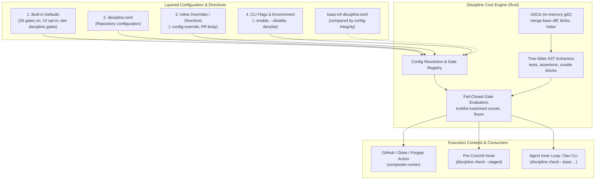
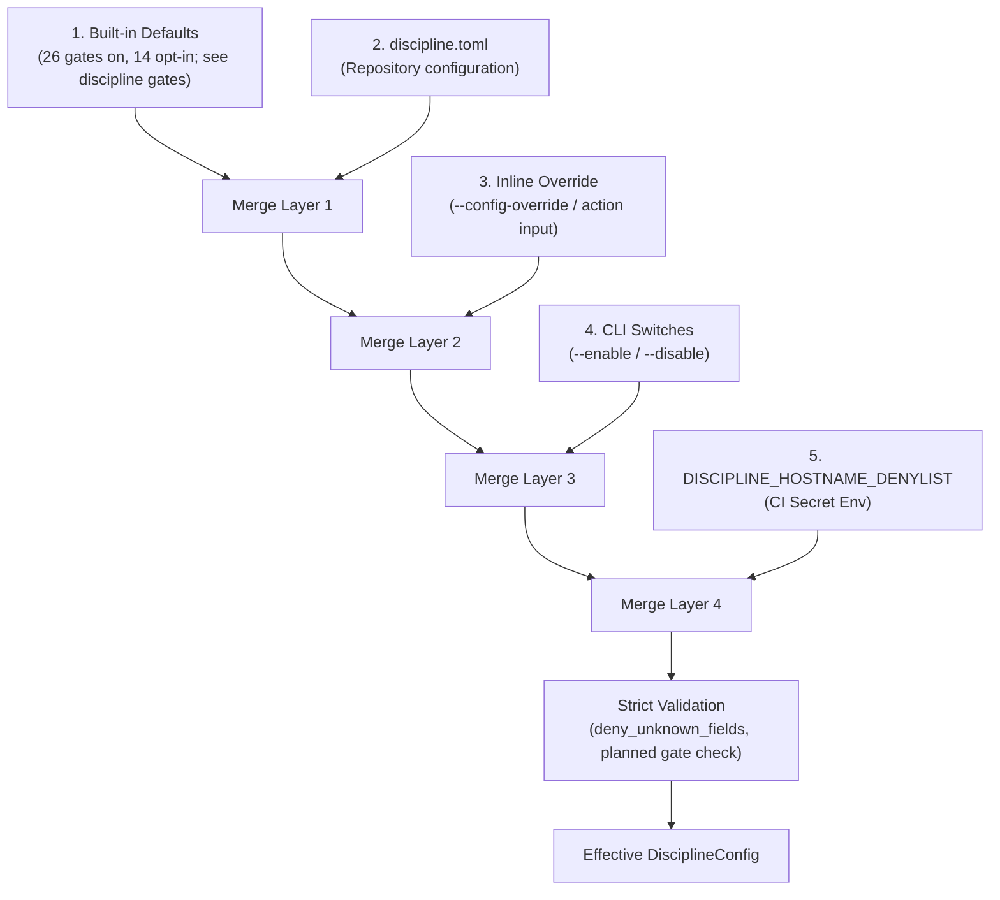
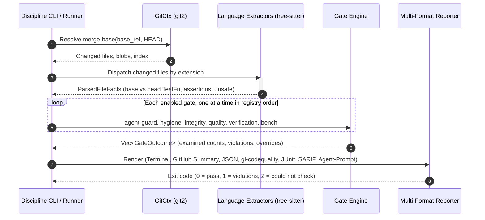
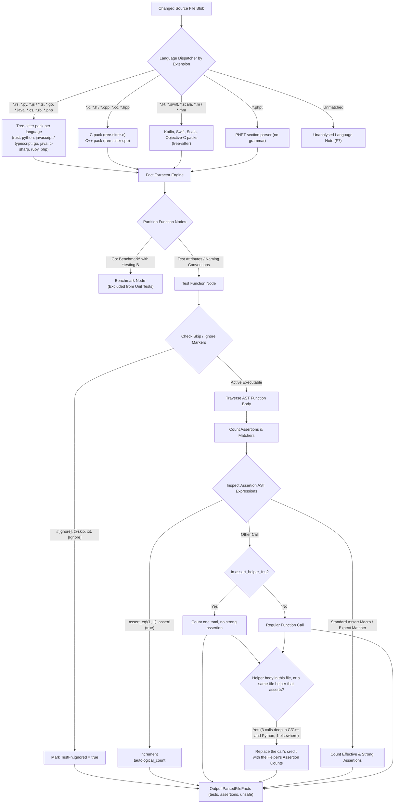

# Architecture & Engineering Sentinel Design

Engine design, fail-closed contracts, CI/CD pipeline architecture, and verification discipline for `discipline`.

**Superseded when:** The engine is restructured, pipeline architecture changes, or gate contracts are modified. Update in place; do not fork.

---

## 1. Overview & System Mission

Discipline is a universal CI/CD gatekeeper and AI coding agent diff sentinel built in Rust. It compiles to a self-contained static binary with zero external runtime dependencies, providing identical diff analysis across GitHub Actions, GitLab CI/CD, Forgejo Actions, Gitea Actions, pre-commit hooks, and local developer environments.

### 1.1 Agent Drift and Test Erosion

Autonomous coding agents operating in iterate-until-green loops frequently introduce subtle test erosion patterns:
1. **Assertion weakening:** `assert_eq!(trie.get(k), Some(&v))` degraded to `assert!(trie.get(k).is_some())` or `assert!(true)`.
2. **Vacuous and ghost tests:** Newly added tests that compile and execute but assert nothing.
3. **Stealth deletions:** Flaky tests, fixtures, or benchmarks removed without justification, or tests renamed or marked `#[ignore]`.
4. **Safety decay:** `unsafe` code introduced without explicit `// SAFETY:` justifications, or safety comments deleted from above untouched blocks.
5. **Editing the gate instead of the code:** Silently disabling gates, lowering severities, or growing exemption lists in `discipline.toml`.
6. **Documentation drift:** Introducing unverified calendar estimates, leaking developer environment paths/IPs, or committing agent transcripts.
7. **Benchmark drift:** Small algorithmic or execution regressions slipping past wall-clock tests lacking statistical rigor.

### 1.2 Design Origin and Prior Art

Discipline's operational rigors were developed to defend high-assurance repositories against subtle automated regressions. Rather than relying on dozens of disparate repository scripts:
- Unlike legacy regex or aggregate count scripts, Discipline uses tree-sitter AST diff inspection to analyze syntactic structures directly.
- The specific failure modes, bypasses, and fail-open traps observed in automated development environments form the binding requirements of the Fail-Closed Contract below.

### 1.3 Non-Goal: Runtime Containment

Discipline reads changes and configuration; it does not contain a running agent. Watching system calls, filtering outbound traffic (DNS included), hiding credentials from a process and stopping a session belong to the sandbox the agent runs in: the agent's own sandbox, a container or VM with no credentials and an egress allow-list, or a kernel-level monitor. They are not planned here, for three reasons: they need privileges and a platform (Linux, root or `CAP_BPF`) that a static binary run in CI or on a laptop does not have; they would add a network path, which §2 rules out; and a check that runs inside the process it contains can be walked around by that process. Nor does discipline read an agent's stated reasoning: the agent writes it, so it is evidence of nothing.

What discipline does own is the configuration that sets those boundaries, because a change to it arrives as a diff like any other. `sandbox-config` reports a change that widens an agent's permissions or sandbox (its project settings and MCP server lists) or a container's isolation (Dev Containers, Docker Compose), and `discipline doctor` reports the agent settings that run an agent with less containment than its defaults (`agent-sandbox`). The pre-tool hook (`hook run --event pre-tool`) refuses edits and shell commands that reach another worktree; it does not block network commands, since a deny-list at the prompt is walked around by any interpreter the agent may run.


### 1.4 Threat Model

Discipline stands between a change and the branch it merges into. This section says what it protects, from whom, where it trusts, and what it leaves to others. `SECURITY.md` covers the narrower case of a flaw in discipline itself (hostile input that crashes or subverts the binary).

**Assets.**
1. **The merge gate's verdict:** a change that erodes tests, safety comments or policy is blocked, or it lands with its waiver on record.
2. **The policy:** `discipline.toml`, the CI workflows and action inputs that run discipline, the agent hook and sandbox settings, the agent skills, plugins and MCP server lists a repository declares, and the list of protected paths.
3. **The record:** the waivers, loosenings and ratifications in commit messages, pull-request bodies and issue comments, which `discipline audit` reads back.
4. **What the repository must not publish:** secrets, personal data, private hosts and paths (the hygiene gates).
5. **The discipline release** that CI downloads and runs with a token (§8.2).

**Actors, by what they can do.** Every actor below except the external one can edit any file in the change and write its commit messages and pull-request body.

| Actor | Intent | Can also | Primary controls |
|---|---|---|---|
| Careless agent | Get the checks green; no intent to hide | Run a shell in its worktree | The AST gates (§1.1); fail-closed parsing (§3) |
| Rule-evading agent | Get the checks green by any accepted means | Use every escape hatch, edit the policy, the workflows and its own hooks, write text aimed at the reviewer or the next agent, and act with whatever credentials its host holds | `config-integrity`, `ci-integrity`, `sandbox-config`, `instruction-smuggling`, `ratified-paths`, `policy_from: base`, `directives.max_overrides` / `require_approval`, `discipline audit` |
| Concurrent agents | None hostile; they collide | Move another worktree's branch | The lease guard and the pre-tool hook (Phase 13) |
| Repository owner | Sets the policy | Waive, ratify, merge, change repository settings | Trusted: the owner's login is the root of trust for ratifications and approvals |
| External attacker | Subvert discipline or its users | Supply hostile repositories, source, configuration or pull requests; tamper with the release chain | `SECURITY.md` (input handling), `deny.toml`, pinned actions, release attestations (§8.2) |

**Trust boundaries.**
- **The change does not judge itself.** A change that edits the pipeline or policy that judges it (Poisoned Pipeline Execution, CICD-SEC-4) is judged by the base's. The policy that decides a change is read from the base (`policy_from: base`), and a loosening of it is reported against the base (`config-integrity`, `ci-integrity`). A change's own configuration is data, never authority.
- **What an author writes is a claim.** A waiver, a closing reference or a trailer is written by the change's author, agent or not. It is accepted as the record of a decision, counted (`max_overrides`), made visible (`audit`) and, where configured, made to wait for a forge fact (`require_approval`), but it proves nothing about who agreed.
- **A forge fact is as strong as the login behind it.** A review, a ratification comment or a pull request's author is the forge's report of a login. It separates two parties only when they hold different logins. An agent that acts with the owner's credentials can produce every forge fact the owner can (Phase 15 Step 8).
- **Discipline cannot make itself run.** Its verdict binds only as a required check on a protected branch with no bypass; `discipline doctor` reports when that is not so (§8.4).
- **The running agent is outside the boundary** (§1.3): discipline reads the change and the configuration that contains the agent, not the process.
- **The change description is a channel between agents.** Commit messages, pull-request bodies and comments are read by review bots and by the next agent. They are scanned like the diff (`instruction-smuggling` check 4), directive lines and their reasons included (#363); only an `allow-agent-instructions` line naming a location of the change, the counted waiver that records a quoted injection, is exempt.
- **Configured text that reaches a process is the base's or the runner's, never the change's.** Five gates start a process from a value in `discipline.toml` (`command`, `test-floor`, `msrv`, `miri`, `sanitizers`). Under the default policy side that file is the change's own copy, so each executed key is compared with the merge base copy before anything runs, and a key the change adds or alters is refused with a finding no directive lifts; only the runner's environment accepts it (`docs/GATES.md`, [`command`](GATES.md#command)). A value placed among the arguments of a built-in command is held to one shape and passed as one argument.
- **The repository's local git configuration is untrusted input.** Discipline reads repositories through libgit2, which runs no configured filter, hook or monitor. The CI base fetch runs `git`, which would, so the fetch overrides every command key the repository's configuration can set; a command the runner's own global configuration names is trusted (#364).
- **The model and its training data are outside the boundary**, as is any retrieval store an agent uses: discipline sees what an agent writes, not what shaped it.
- **The network is read-only but one opt-in write** (§2, `AGENTS.md` §3.3); an unreachable or partial answer fails closed.

**Assumptions the guarantees depend on.**
1. Discipline runs as a required check with `policy_from: base`, and `ci-integrity` protects the workflow that runs it.
2. The protected paths cover the policy (`discipline.toml`, workflows, agent hook and sandbox settings, agent instructions).
3. Ratifications and approvals come from a login no agent can use. **This does not hold on this repository today:** every agent posts as the owner's login (Phase 15 Step 8), so a ratification here shows the owner's login agreed, not that a second party did.
4. The forge reports authors, edits and links truthfully. When it fails to (a closing reference it did not link, #350), discipline refuses rather than guesses.

**Residual risks: what an attacker in this model can still do.**
- A weakening the AST gates do not model (a rewritten test with the same assertion count, a workflow rewritten in a form `ci-integrity` does not read, what a GitLab `include:` brings in; §10). One rewrite with the same count is caught in its exact form: an equality assertion made to compare an expression with itself (`assert_eq!(y, y)`, `expect(x).toBe(x)`) is reported by `vacuous-tests` in a new test and by `assertion-reduction` in a changed one, as a warning ([GATES.md](GATES.md#self-comparison-assertions)). The detector compares tokens and follows no value, so it stops a careless rewrite and not an evasive one. Still not caught: two names bound to one value (`let b = a; assert_eq!(a, b)`), a copy compared with its source (`y.clone()`), the same call on both sides, an assertion a macro expands to, an assertion whose operands never reach the code under test, and a self-comparison kept beside a real comparison of the same operand. Held-out tests and review are the control for those.
- Every waiver the policy allows, on the record. `audit` shows them; it does not undo them.
- With the owner's credentials: ratify, approve, edit a pull-request body after the merge (reported on GitHub only), and merge.
- Say which agent made a change. `discipline audit` reports a commit's agent marker as `claimed` and an agent login (with `--forge`) as `agent-login`, and a change with neither as `no-record`, never as a person's; a record an agent writes about itself is a claim, not a proof (Phase 15 Step 7).
- An injection phrased outside `instruction-smuggling`'s list: a paraphrase or another language. The phrase tier is a warning, a tripwire.
- Agent memory and context kept outside the repository (per-user memory directories, session state), and a tool or plugin that changes by its own update rather than through the diff.
- A waiver pattern repeated from change to change: `max_overrides` caps each change and `audit` shows the pattern, but nothing blocks it.
- Test scope for `error-swallowing` and `stub-bodies` is decided by path. A file that was production code on the base side stays production code through a rename, including one that changes the extension or the language (it is then parsed by its head extension and classified by its base path carrying that extension); a delete and add below git's rename-similarity threshold and code moved into a new test-named file are classified by the head path. A rename into a path matched only by `[tests] paths` (a declared glob, read from the base-side configuration) is not reported as a reclassification; the gate notes name it. The reclassification finding is reported by `error-swallowing` only.
- Code built to the tests its author can see. A change that satisfies the visible suite without editing it (overfitting to the visible suite) weakens nothing in the diff, so it passes every diff-based gate. The control is held-out tests the author of the change cannot see, which the repository owns and runs; discipline neither holds nor runs them (see SpecBench, arXiv:2605.21384; `docs/GATES.md`, "Language Scope & Detection Boundaries").
- A test harness neutralised in a form `harness-tampering` does not read. The gate matches exact shapes of the syntax tree with no value-flow analysis, in the files a runner loads by name or by a literal configuration, and is off until a repository turns it on. It stops the plain forms (a Go `TestMain` that drops `m.Run()`'s result, a pytest hook that assigns an outcome or removes items, a replaced `unittest` result method, an unconditional exit with status zero); an author who rewrites the form passes it. Not read: the result of `m.Run()` passed through a helper or read once and then ignored; an exit behind any condition, a constant one included, in an exception handler or in a callback; an exit or an outcome spelled another way (`raise SystemExit(0)`, `session.exitstatus = 0`, `force_result`, `process.exitCode = 0`, an aliased module); a hook in a plugin module that `pytest_plugins` names, or in a plugin installed from outside the repository; a set-up file that a computed configuration loads (named in the gate's notes); a module that a harness file imports; and the harness files of runners the gate has no model of. `docs/GATES.md` lists each under [`harness-tampering`](GATES.md#harness-tampering).
- A reviewer who trusts a fluent description or a green check.
- A crafted repository that makes discipline do work out of proportion to its size: `SECURITY.md` treats it as a vulnerability, but no test bounds it.
- A webhook's secret on GitLab, Gitea and Forgejo, which their APIs do not show, so `doctor` counts their webhooks without judging the secret.
- No central log. `audit` reads the record back from git and the forge, and the hooks' observe log stays on the machine that wrote it; nothing alerts on a pattern as it happens.
- Anything outside the diff: the agent's runtime behaviour, its network access, and what it does with credentials (§1.3).
- Code inside a git submodule. A change that moves a submodule's pointer is named in the `deletion-rationale` notes, not judged, so tests kept in a submodule can be dropped by moving its pointer (red-team `git-02`). Tests deleted from the repository itself still need `removes:`, even when a submodule takes their path.
- A pull-request workflow runs from the change's head: an agent that can push can mask the step that runs discipline (`continue-on-error`) and turn the required check green. `ci-integrity` reports it but cannot fail a step it no longer controls; the forge's protected file patterns stop the merge, in a form the forge applies (`.gitea/workflows/**`, not `.gitea/workflows/*`; red-team `ci-04`, #428).

**Coverage against published taxonomies.** Every category of four taxonomies is resolved to exactly one of three outcomes:
- **in scope:** an asset above, an actor above, a control, and the test that pins it, with a claim id for the claims registry;
- **residual:** listed under residual risks below;
- **outside:** outside the boundary (§1.3).

The taxonomies:
- OWASP Top 10 for LLM Applications, version 2026 (OWASP GenAI Security Project, published August 2026). Each row also gives the version 2025 id (November 2024), since the 2026 edition renumbers them.
- OWASP Top 10 for Agentic Applications, version 2026 (December 2025).
- OWASP Top 10 CI/CD Security Risks (CICD-SEC-1 to CICD-SEC-10; OWASP project page, first published in 2022, no version stated). The repository and organisation settings the OWASP CI/CD Security Cheat Sheet recommends are `doctor` work, tracked in #366.
- MITRE ATLAS data version 2026.09 (September 2026). Only the techniques that apply to a coding agent acting on a repository are mapped.

This mapping is the maintainers' reading of the four publications against this section and `docs/GATES.md`. It has not been externally reviewed; the "External review" criterion of the 1.0 Readiness table (`docs/ROADMAP.md`) stays open.

| Category | Resolution | Control; pinning test | Claim |
|---|---|---|---|
| LLM01 Prompt Injection (2025: LLM01) | in scope: assets 1, 2; rule-evading agent, external attacker | `instruction-smuggling` checks 1, 3 and 4, and agent-facing output quotes repository text in a fence it cannot close; `test_gates_e2e::instruction_smuggling_reports_invisible_text_instruction_files_and_phrases_by_location_only`, `test_agent_hooks::source_text_reaches_the_agent_only_inside_a_fence_it_cannot_close` | `tm-llm01` |
| LLM02 Sensitive Information Disclosure (LLM02) | in scope: asset 4; careless agent | `pii`, `shell-secrets`, and findings that name locations only; `test_gates_e2e::pii_fires_on_home_paths_and_lan_ips_without_echoing_the_user`, `test_gates_e2e::shell_secrets_gate_e2e`, `test_report_redaction::test_cross_format_redaction_pins_sentinel_exclusion` | `tm-llm02` |
| LLM03 Excessive Agency (LLM06) | in scope: asset 2; rule-evading agent. The running agent is outside (§1.3) | `sandbox-config`, `doctor` `agent-sandbox`, the pre-tool hook; `test_gates_e2e::sandbox_config_reports_a_widened_agent_or_container_and_lifts_it_by_key_or_path`, `test_pretool::each_agent_is_refused_an_edit_in_another_worktree_and_allowed_its_own` | `tm-llm03` |
| LLM04 Supply Chain (LLM03) | in scope: assets 2, 5; rule-evading agent, external attacker | `dependency-delta`, `build-hooks`, pinned actions, the release attestation the action checks; `test_gates_e2e::dependency_delta_reads_the_lockfile_not_only_its_size`, `test_gates_e2e::build_hooks_reports_install_hooks_build_scripts_and_manager_config_as_a_delta`, `test_action_version::a_downloaded_archive_must_carry_the_release_workflow_attestation_for_its_tag` | `tm-llm04` |
| LLM05 Data and Model Poisoning (LLM04) | in scope for the text an agent is given in the repository: asset 2; rule-evading agent. The model, its training data and its fine-tuning are outside | `instruction-smuggling` check 2 (every agent-instruction file edit reported); the same e2e test as `tm-llm01` | `tm-llm05` |
| LLM06 Unbounded Consumption (LLM10) | residual | Forge answers are bounded (pages, bytes, requests) and fail closed (`forge::read_all_stops_at_the_stated_total_and_refuses_a_partial_list`); no test bounds the work a crafted repository causes, which `SECURITY.md` treats as a vulnerability. An agent's own consumption is outside | — |
| LLM07 Misinformation (LLM09) | residual | A wrong change with plausible tests passes; `provenance-tags`, `time-estimates` and `citation-metadata` check the form of claims, not their truth | — |
| LLM08 Hidden Context Exposure (LLM07 System Prompt Leakage) | outside | Disclosure from a running model's context (§1.3). The `exfiltration` phrase class is a tripwire on text that asks for it, not a control | — |
| LLM09 Vector and Embedding Weaknesses (LLM08) | outside | Discipline keeps no retrieval store or embeddings | — |
| LLM10 Improper Output Handling (LLM05) | in scope: asset 1; careless and rule-evading agents | Agent output reaches the branch only as a diff the gates judge; the action passes inputs through `env:`, never `${{ }}` inside `run:` (F11, `tests/action/lint-action.py`); discipline's own reports name locations, never the matched text (F10); `test_gates_e2e::agent_prompt_format_produces_repair_and_never_emits_directives` | `tm-llm10` |
| ASI01 Agent Goal Hijack | in scope: assets 1, 2; rule-evading agent, external attacker | `instruction-smuggling` (instruction files always reported; phrases, encoded runs and invisible characters); the same e2e test as `tm-llm01`, and `test_gates_e2e::instruction_smuggling_reads_encoded_folded_split_and_hidden_phrases` | `tm-asi01` |
| ASI02 Tool Misuse and Exploitation | in scope for the tool configuration a change can widen: asset 2; rule-evading agent. Runtime tool use is outside | `sandbox-config` (allowed commands, MCP server lists); the pre-tool hook refuses a command that acts on another worktree; `test_pretool::each_agent_is_refused_a_shell_command_that_acts_on_another_worktree` and the `tm-llm03` test | `tm-asi02` |
| ASI03 Identity and Privilege Abuse | in scope where logins differ: asset 3; rule-evading agent. An agent holding the owner's credentials is residual (assumption 3) | `ratified-paths` refuses an agent login's ratification and, with `refuse_author_ratification`, the pull request author's; `test_pr_policy::a_ratification_by_an_agent_login_does_not_count`, `test_pr_policy::refuse_author_ratification_needs_a_login_other_than_the_pull_requests` | `tm-asi03` |
| ASI04 Agentic Supply Chain Vulnerabilities | in scope for what the repository declares: asset 2; rule-evading agent, external attacker. A tool's own update and user-level plugins are residual | Agent hook, skill and settings files are instruction files (check 2); MCP server lists are `sandbox-config`; the Claude Code bootstrap pins release digests; `test_agent_hooks::claude_code_bootstrap_pins_release_digests` and the `tm-llm01`, `tm-llm03` tests | `tm-asi04` |
| ASI05 Unexpected Code Execution (RCE) | in scope: assets 1, 2; rule-evading agent, external attacker | `build-hooks` (install and build hooks that gain network or shell); `command` and `test_command` run only from the base policy; the CI base fetch runs no command the repository's own git configuration names (`test_gates_e2e::the_ci_base_fetch_runs_no_command_the_repository_configuration_names`); `test_gates_e2e::policy_from_base_judges_a_change_by_the_configuration_it_did_not_write` and the `build-hooks` test of `tm-llm04` | `tm-asi05` |
| ASI06 Memory & Context Poisoning | in scope for memory kept in the repository: asset 2; rule-evading agent. Agent memory outside the repository is residual | `instruction-smuggling` check 2, and the declared `instruction_files`; the same e2e test as `tm-llm01` | `tm-asi06` |
| ASI07 Insecure Inter-Agent Communication | in scope: assets 1, 3; rule-evading and concurrent agents | Agents address each other through commit messages, pull-request bodies and comments (a boundary above); check 4 scans the description; the lease guard stops one agent moving another's branch; `test_gates_e2e::sleeps_trivial_assertions_and_injected_pr_bodies_are_reported`, `test_lease::the_ref_guard_refuses_moving_a_branch_another_worktree_leased` | `tm-asi07` |
| ASI08 Cascading Failures | residual | One agent's waiver is read and repeated by the next. `max_overrides` caps each change (`test_gates_e2e::override_budget_caps_what_one_change_may_excuse`) and `audit` shows the pattern across changes; nothing blocks it | — |
| ASI09 Human-Agent Trust Exploitation | residual | A reviewer who trusts a fluent description or a green check. The `reviewer-steering` class is a warning tripwire, and what an author writes is a claim, not proof (a boundary above) | — |
| ASI10 Rogue Agents | in scope: assets 1, 2; rule-evading agent | The change does not judge itself (`policy_from: base`, `config-integrity`, `ci-integrity`); `test_gates_e2e::a_change_cannot_weaken_its_own_config_without_a_scoped_token` and the `tm-asi05` policy test | `tm-asi10` |
| CICD-SEC-1 Insufficient Flow Control Mechanisms | in scope: asset 1; rule-evading agent | `doctor` reports a required check that does not run discipline, bypass actors, review rules, and auto-merge with no required review (`test_doctor::doctor_reports_auto_merge_forking_secret_scanning_and_dependency_alerts`) ("Discipline cannot make itself run"); `test_doctor::doctor_required_check_without_discipline_fails`, `doctor::review_rules_are_read_from_rulesets_and_classic_protection` | `tm-cicd01` |
| CICD-SEC-2 Inadequate Identity and Access Management | residual | Assumption 3: agents act with the owner's login. `doctor` `agent-permission` and `forge-token` report what a token can do; `deploy-keys`, `outside-collaborators`, `org-base-permission` and `two-factor` report who else can push | — |
| CICD-SEC-3 Dependency Chain Abuse | in scope | As `tm-llm04` (`dependency-delta`, `build-hooks` package-manager configuration) | `tm-llm04` |
| CICD-SEC-4 Poisoned Pipeline Execution (PPE) | in scope: asset 2; rule-evading agent, external attacker. Workflow shapes `ci-integrity` does not read are residual (§10) | `policy_from: base`, `ci-integrity`, `doctor` `workflow-protection` and its `pull_request_target` findings; `test_gates_e2e::ci_integrity_flags_a_discipline_step_moved_off_the_base_policy`, `test_gates_e2e::ci_integrity_reports_workflow_changes_that_expose_secrets_or_a_write_token`, `test_doctor::doctor_reports_the_repository_settings_that_let_mutable_code_run` | `tm-cicd04` |
| CICD-SEC-5 Insufficient PBAC (Pipeline-Based Access Controls) | in scope: asset 2; rule-evading agent | `ci-integrity` reports a workflow gaining a write token or exposing secrets; `doctor` `default-token` and `secret-scoping`; the `tm-cicd04` `ci-integrity` test, `doctor_settings::gitlab_job_token_passes_only_with_the_allowlist_on_and_no_push` | `tm-cicd05` |
| CICD-SEC-6 Insufficient Credential Hygiene | in scope: credentials in the change, and the forge's secret scanning and push protection (`doctor` `secret-scanning`, information) | As `tm-llm02` | `tm-llm02` |
| CICD-SEC-7 Insecure System Configuration | in scope for configuration in the repository: asset 2; rule-evading agent. Runner-side settings (GitLab's privileged runners) are outside the repository | `sandbox-config` (Dev Containers, Docker Compose, CI job and service containers), `doctor`'s Actions policy findings; the `tm-llm03` `sandbox-config` test, `test_gates_e2e::sandbox_config_reports_a_privileged_workflow_container`, `doctor_settings::actions_policy_warns_on_each_unsafe_value` | `tm-cicd07` |
| CICD-SEC-8 Ungoverned Usage of 3rd Party Services | in scope: assets 2, 5; rule-evading agent, external attacker | Pinned actions (`ci-integrity`, `doctor` imposter pins), `doctor` `allowed-actions`, MCP server lists (`sandbox-config`); `test_gates_e2e::ci_integrity_a_third_party_action_in_a_job_with_secrets_warns_without_failing`, `test_doctor::doctor_fails_an_imposter_pin_and_warns_on_a_tag_pinned_nested_action` | `tm-cicd08` |
| CICD-SEC-9 Improper Artifact Integrity Validation | in scope: asset 5; external attacker | The installer verifies checksums (F12), the action checks the release attestation, `doctor` `tag-protection` and `immutable-releases`. `doctor` `signed-commits` is reported as information and no test pins it; `test_action_version::a_downloaded_archive_must_carry_the_release_workflow_attestation_for_its_tag`, `doctor_settings::tag_ruleset_must_cover_the_release_tag_and_block_update_and_deletion` | `tm-cicd09` |
| CICD-SEC-10 Insufficient Logging and Visibility | residual | `audit` reads waivers, loosenings and ratifications back from git and the forge (`test_audit::each_kind_of_escape_hatch_is_recorded_against_its_change`); there is no central log | — |
| ATLAS AML.T0051 LLM Prompt Injection (.000 Direct, .001 Indirect, .002 Triggered), AML.T0093 Prompt Infiltration via Public-Facing Application, AML.T0061 LLM Prompt Self-Replication, AML.T0094 Delay Execution of LLM Instructions | in scope | As `tm-llm01` and `tm-asi01`: text added to the repository or its change description | `tm-llm01` |
| AML.T0068 LLM Prompt Obfuscation, AML.T0123 Obfuscated Files or Information | in scope | `instruction-smuggling` folds and decodes before the phrase match (NFKC, look-alikes, leetspeak, ROT13, `%xx`, hex, base64); `test_gates_e2e::instruction_smuggling_reads_encoded_folded_split_and_hidden_phrases` | `tm-asi01` |
| AML.T0081 Modify AI Agent Configuration, AML.T0083 Credentials from AI Agent Configuration | in scope | An agent configuration file in the repository is an instruction file or a `sandbox-config` file | `tm-asi04` |
| AML.T0080 AI Agent Context Poisoning (.000 Memory, .001 Thread) | in scope in the repository; residual outside it | As `tm-asi06` | `tm-asi06` |
| AML.T0110 AI Agent Tool Poisoning, AML.T0099 AI Agent Tool Data Poisoning, AML.T0010.005 AI Supply Chain Compromise: AI Agent Tool, AML.T0011.002 User Execution: Poisoned AI Agent Tool, AML.T0115.002 Publish Poisoned AI Artifacts: AI Agent Tools | in scope for the tool list a change edits; residual for the tool's content and updates (AML.T0109 AI Supply Chain Rug Pull) | As `tm-asi04` | `tm-asi04` |
| AML.T0010.001 AI Supply Chain Compromise: AI Software, AML.T0011.001 User Execution: Malicious Package | in scope | As `tm-llm04` | `tm-llm04` |
| AML.T0119 Exploit Automated Artifact Processing Pipeline | in scope | As `tm-llm10` and `tm-asi05` | `tm-asi05` |
| AML.T0055 Unsecured Credentials | in scope | As `tm-llm02` | `tm-llm02` |
| AML.T0118.000 Autonomous AI Agent Communication: Communication via Shared Artifacts | in scope | As `tm-asi07` | `tm-asi07` |
| AML.T0012 Valid Accounts | residual | As ASI03: an agent acting with the owner's login | — |
| AML.T0053 AI Agent Tool Invocation, AML.T0050 Command and Scripting Interpreter, AML.T0086 Exfiltration via AI Agent Tool Invocation, AML.T0101 Data Destruction via AI Agent Tool Invocation, AML.T0098 AI Agent Tool Credential Harvesting, AML.T0105 Escape to Host, AML.T0112 Machine Compromise, AML.T0100 AI Agent Clickbait, AML.T0054 LLM Jailbreak, AML.T0056 Extract LLM System Prompt, AML.T0057 LLM Data Leakage, AML.T0077 LLM Response Rendering, AML.T0084 Discover AI Agent Configuration, AML.T0133 Discover AI Agent Runtime Capabilities | outside | The running agent (§1.3). The pre-tool hook's worktree refusal (`tm-asi02`) is the one runtime check discipline ships | — |
| AML.T0020 Training Data Poisoning, AML.T0031 Erode AI Model Integrity, AML.T0115.000 / .001 Publish Poisoned AI Artifacts: Datasets / Models, AML.T0070 RAG Poisoning, AML.T0071 False RAG Entry Injection, AML.T0024 Exfiltration via AI Inference API, AML.T0095.000 Search Open Websites/Domains: Code Repositories | outside | The model, its data and retrieval stores; reading public code | — |


---

## 2. Architecture Diagram & Binary Design


```mermaid
flowchart TD
    subgraph CFG_LAYER["Layered Configuration & Directives"]
        D["1. Built-in Defaults<br/>(26 gates on, 14 opt-in; see discipline gates)"]
        F["2. discipline.toml<br/>(Repository configuration)"]
        O["3. Inline Overrides / Directives<br/>(--config-override, PR body)"]
        CLI["4. CLI Flags & Environment<br/>(--enable, --disable, denylist)"]
        BASE_CFG["base-ref discipline.toml<br/>(compared by config-integrity)"]
    end

    subgraph ENGINE["Discipline Core Engine (Rust)"]
        RESOLVE["Config Resolution & Gate Registry"]
        GIT["GitCtx (in-memory git2)<br/>merge-base diff, blobs, index"]
        AST["Tree-Sitter AST Extractors<br/>tests, assertions, unsafe blocks"]
        EVAL["Fail-Closed Gate Evaluators<br/>truthful examined counts, floors"]
    end

    subgraph CONSUMERS["Execution Contexts & Consumers"]
        ACTION["GitHub / Gitea / Forgejo Action<br/>(composite runner)"]
        HOOK["Pre-Commit Hook<br/>(discipline check --staged)"]
        DEV["Agent Inner Loop / Dev CLI<br/>(discipline check --base ...)"]
    end

    D --> RESOLVE
    F --> RESOLVE
    O --> RESOLVE
    CLI --> RESOLVE
    BASE_CFG -.-> RESOLVE

    RESOLVE --> EVAL
    GIT --> AST
    AST --> EVAL

    EVAL --> ACTION
    EVAL --> HOOK
    EVAL --> DEV
```

1. **Binary-first & zero-dependency:** Statically linked musl binaries (`x86_64-unknown-linux-musl`, `aarch64-unknown-linux-musl`) and native macOS binaries (`x86_64-apple-darwin`, `aarch64-apple-darwin`). No Node.js, Python, or container bootstrap required at runtime.
2. **Offline by default, one HTTPS client:** `libgit2` is vendored with its network and transport features disabled, so every diff is read from the local git object database. The forge REST API is reached only through the in-process HTTPS client in `src/forge.rs` (`ureq` over `rustls`, no OpenSSL), for opt-in features: open-issue state and bench citation freshness (`provenance-tags`, `bench-regression`), `issue-link` reference verification, `ratified-paths` and `review-threads` (read-only GitHub GraphQL queries among their reads), `require_approval` reviews, the `merged-pr-body` directive source, `discipline replay` and `discipline doctor`; its one write is `check --comment`. `DISCIPLINE_NO_NETWORK=1` keeps that client off the network (a loopback address excepted). One exception sits outside the client: in CI (`CI`, `GITHUB_ACTIONS`, `GITLAB_CI`, `GITEA_ACTIONS` or `FORGEJO_ACTIONS` set), when the base ref cannot be resolved, `src/gitctx.rs` spawns the external `git fetch` against `origin` to deepen a shallow clone, with hooks, the file-system monitor, command transports (`ext::`, `fd::`, `git://`) and the upload-pack program overridden, and a command the repository's own configuration sets for ssh, credentials or a password prompt (`core.sshCommand`, `credential.helper`, `core.askPass`) replaced by the runner's global or system value (#364), and exits `2` if the base is still missing; `DISCIPLINE_NO_NETWORK=1` skips it. That `git` is the first one on `PATH`, and it runs with `LC_ALL=C` and without `LANGUAGE`, so the fetch diagnostic the binary quotes reads the same whatever the caller's locale (#603). It is the only `git` the binary starts: the diff, the base and every blob are read in process, so a different `git` on `PATH` changes nothing a gate reads. The other program found through `PATH` is the one a `command`-style gate is configured to run. The in-process library reads the user's git configuration from `HOME` (`~/.gitconfig`) and `XDG_CONFIG_HOME` (`git/config`), and a file there that does not parse is exit `2`; it does not read `GIT_CONFIG_GLOBAL`, `GIT_CONFIG_SYSTEM` or `GIT_CONFIG_NOSYSTEM`, which are settings of the `git` program.
3. **AST-aware, never regex-naive:** `unsafe` or `assert!` appearing within comments, string literals, or doc tests are never counted as code nodes. Source-code invariants (tests, assertions, `unsafe`, handlers, stubs) are read from the syntax tree only. Regular expressions read text that has no grammar here: prose, PR bodies, shell and workflow lines, manifests and tool output.
4. **Unified gate registry:** Every gate possesses a stable kebab-case identifier in `src/config.rs::GATES`.
5. **Language packs behind a shared fact model:** Tree-sitter grammars and extractors map diverse ecosystems onto language-neutral facts (`TestFn`, `UnsafeSite`, assertion counts).

### 2.1 Configuration Resolution Lifecycle


```mermaid
flowchart TD
    D["1. Built-in Defaults<br/>(26 gates on, 14 opt-in; see discipline gates)"] --> M1["Merge Layer 1"]
    F["2. discipline.toml<br/>(Repository configuration)"] --> M1
    M1 --> M2["Merge Layer 2"]
    O["3. Inline Override<br/>(--config-override / action input)"] --> M2
    M2 --> M3["Merge Layer 3"]
    CLI["4. CLI Switches<br/>(--enable / --disable)"] --> M3
    M3 --> M4["Merge Layer 4"]
    ENV["5. DISCIPLINE_HOSTNAME_DENYLIST<br/>(CI Secret Env)"] --> M4
    M4 --> VAL["Strict Validation<br/>(deny_unknown_fields, planned gate check)"]
    VAL --> CFG["Effective DisciplineConfig"]
```

### 2.2 Diff Inspection & Gate Evaluation Pipeline


```mermaid
sequenceDiagram
    autonumber
    participant CLI as Discipline CLI / Runner
    participant Git as GitCtx (git2)
    participant AST as Language Extractors (tree-sitter)
    participant Gates as Gate Engine
    participant Report as Multi-Format Reporter

    CLI->>Git: Resolve merge-base(base_ref, HEAD)
    Git-->>CLI: Changed files, blobs, index
    CLI->>AST: Dispatch changed files by extension
    activate AST
    AST-->>CLI: ParsedFileFacts (base vs head TestFn, assertions, unsafe)
    deactivate AST
    loop Each enabled gate, one at a time in registry order
        CLI->>Gates: agent-guard, hygiene, integrity, quality, verification, bench
    end
    Gates-->>CLI: Vec<GateOutcome> (examined counts, violations, overrides)
    CLI->>Report: Render (Terminal, GitHub Summary, JSON, gl-codequality, JUnit, SARIF, Agent-Prompt)
    Report-->>CLI: Exit code (0 = pass, 1 = violations, 2 = could not check)
```

### 2.3 AST Test Node Extraction & Assertion Counting Pipeline


```mermaid
flowchart TD
    SRC["Changed Source File Blob"] --> LANG{"Language Dispatcher by Extension"}
    LANG -->|"*.rs, *.py, *.js / *.ts, *.go, *.java, *.cs, *.rb, *.php"| P_TS["Tree-sitter pack per language<br/>(rust, python, javascript / typescript, go, java, c-sharp, ruby, php)"]
    LANG -->|"*.c, *.h / *.cpp, *.cc, *.hpp"| P_CPP["C pack (tree-sitter-c)<br/>C++ pack (tree-sitter-cpp)"]
    LANG -->|"*.kt, *.swift, *.scala, *.m / *.mm"| P_NEW["Kotlin, Swift, Scala, Objective-C packs<br/>(tree-sitter)"]
    LANG -->|"*.phpt"| P_PHPT["PHPT section parser (no grammar)"]
    LANG -->|"Unmatched"| UNK["Unanalysed Language Note (F7)"]

    P_TS --> EXT["Fact Extractor Engine"]
    P_CPP --> EXT
    P_NEW --> EXT
    P_PHPT --> EXT

    EXT --> T_DISC{"Partition Function Nodes"}
    T_DISC -->|"Go: Benchmark* with *testing.B"| BENCH_NODE["Benchmark Node (Excluded from Unit Tests)"]
    T_DISC -->|"Test Attributes / Naming Conventions"| TEST_NODE["Test Function Node"]

    TEST_NODE --> SKIP{"Check Skip / Ignore Markers"}
    SKIP -->|"#[ignore], @skip, xit, [Ignore]"| FLG_SKIP["Mark TestFn.ignored = true"]
    SKIP -->|"Active Executable"| SCAN_AST["Traverse AST Function Body"]

    SCAN_AST --> CNT_ASSERT["Count Assertions & Matchers"]
    CNT_ASSERT --> TAUT{"Inspect Assertion AST Expressions"}
    TAUT -->|"assert_eq!(1, 1), assert!(true)"| FLG_TAUT["Increment tautological_count"]
    TAUT -->|"Other Call"| CHK_HELP{"In assert_helper_fns?"}
    CHK_HELP -->|"Yes"| INC_HELP["Count one total, no strong assertion"]
    CHK_HELP -->|"No"| REG_CALL["Regular Function Call"]
    INC_HELP --> SAME_FILE{"Helper body in this file, or a same-file helper that asserts?"}
    REG_CALL --> SAME_FILE
    SAME_FILE -->|"Yes (3 calls deep in C/C++ and Python, 1 elsewhere)"| ADD_HELP["Replace the call's credit with the Helper's Assertion Counts"]
    TAUT -->|"Standard Assert Macro / Expect Matcher"| INC_STD["Count Effective & Strong Assertions"]

    FLG_SKIP --> FACTS["Output ParsedFileFacts (tests, assertions, unsafe)"]
    FLG_TAUT --> FACTS
    INC_HELP --> FACTS
    ADD_HELP --> FACTS
    INC_STD --> FACTS
    REG_CALL --> FACTS
```

### 2.4 Binary Footprint & Static Linking Profiles

Discipline compiles to a standalone static binary with zero external runtime dependencies. It statically links `libgit2` (vendored, no transport), the 15 `tree-sitter` grammars (Rust, Python, JavaScript, TypeScript, Go, Java, C#, C, C++, Ruby, PHP, Kotlin, Swift, Scala, Objective-C) and the `rustls` / `ring` TLS stack of the forge client. It is fully static-pie linked on musl and runs in scratch containers or minimal CI runners without glibc, OpenSSL, or package managers. The sizes below were measured at `32c81b5`, before the Kotlin, Swift, Scala and Objective-C packs and the forge client were added; the current binaries have not been re-measured:
- **Full Static Binary (Linux musl `x86_64`):** 23.6 MB (23,624,256 bytes) (measured: `x86_64-unknown-linux-musl`, `32c81b5`, 11 grammars).
- **macOS Native (`aarch64-apple-darwin`):** 22.3 MB (22,310,544 bytes) (measured: `aarch64-apple-darwin`, `32c81b5`). Mach-O binary optimized for local developer inner loops and git hooks.

---

## 3. The Fail-Closed Contract

Every gate in Discipline must satisfy the following 12 load-bearing invariant rules:

| Invariant | Requirement | Incident Origin / Justification |
|---|---|---|
| **F1** | **Three exit states.** `0` = pass, `1` = violations found, `2` = gate could not check. A defective gate or broken environment is never mistaken for a valid change. On exit 2 the JSON report (stdout under `--format json`, and `--json-out`) has no outcomes and a `could_not_check` object: `reason` (`configuration`, `baseline`, `repository`, `tool-missing`, `tool-timeout`, `toolchain-unavailable`, `forge`, `gate`, `internal`), the `gate` that could not run, and the error as printed on stderr. An error is tagged where it arises (`src/could_not_check.rs`) and the innermost tag wins, so a missing tool inside a gate is `tool-missing`, not `gate`. JUnit, SARIF and GitLab reports, which have no such field, carry one `engine/could-not-run` finding. `replay` and the MCP `check_diff` tool report the same reason. | CI canaries that passed when underlying build scripts failed. |
| **F2** | **Three-state inputs.** Found / none / could-not-determine. An unresolvable base ref, shallow clone lacking merge base, missing repository, or unreadable file exits `2`. Never an empty diff: a guessed default branch (`origin/HEAD`, `master`, `trunk`) that already holds `HEAD` does not count as a base. | Initial scaffold probe reporting clean zero on invalid refs. |
| **F3** | **Merge-base diffs with rename detection.** Diff measured from `merge-base(base, HEAD)`; moved files are tracked as modifications, not deletions. | Deletion gate false positives on renamed test suites. |
| **F4** | **No vacuous pass.** Every report prints the exact `examined` count per gate. A suite with zero available gates or an empty tracked tree is an error. | Silent fail-open when zero files were scanned ("0 of 52 files scanned, exit 0"). |
| **F5** | **Planned is not passed.** A gate not shipped in the binary cannot be enabled or configured (exit `2`). Every report lists planned gates under "not checked". | Scaffold config accepting and ignoring planned flags. |
| **F6** | **Strict configuration.** Unknown keys, unknown gates, invalid regexes, malformed globs, unsupported schema versions, and contradictory switches (`enable` + `disable`) are errors. | Typo'd TOML keys accepted silently. |
| **F7** | **Named degradation.** When a gate cannot inspect a file (unanalysed language pack, file exceeding size limits, unreadable base config), it explicitly names the file in the report. A file counts as binary, and is not read, only by a known binary extension, a magic number with a non-printable byte, or a NUL byte in its first kilobyte, and never when its extension is a known text one: a printable magic number such as `MZ` (the DOS/PE header, and valid Python as `MZ = 0`) does not hide a source file from the gates. A language-pack extension (`.cs`, `.dart`, `.m`, …) and `Gemfile`, `Rakefile`, `Dockerfile` and `Makefile` are text too. A gate that skips a changed file it cannot read as text names it (`skipped `<path>` (binary or unreadable file)`); `pii` scanning the whole tree names the binary files the change touched and counts the rest. | Benchmark script silently passing on "NO BASELINE". |
| **F8** | **A gate is not satisfied by prose about the gate.** Directives are strictly line-anchored; mentions in tables, sentences, or code blocks never arm an override. | Incident where a Markdown table describing a token accidentally waived all checks. |
| **F9** | **A change cannot lower its own bar.** Configuration on head is diffed against base ref; loosening requires an explicit `allow-gate-weakening:` directive. | Threshold constants edited in the diff that violated them. |
| **F10** | **Secrets are not echoed.** Denylisted hostnames, local user workstation paths, and PII patterns are reported by file location only, never printed. | Hostname denylists echoed in public CI logs. |
| **F11** | **Untrusted text never reaches a shell parser.** All action inputs pass through `env:`, never inline `${{ }}` interpolation. | Inline shell injection vulnerabilities in workflow expressions. |
| **F12** | **The installer verifies what it runs.** A release archive the action downloads is verified against `SHA256SUMS` with no opt-out; no fallbacks to unverified compilation. `binary_path` skips the download, so the operator vouches for that binary. | Scaffold download failure falling back to unverified local build. |

### 3.1 Defaults Are Part of the Compatibility Contract

A consumer who runs Discipline with zero configuration, or who configures only some gates, relies on the built-in default **enablement** and **severity** of every other gate. A default that becomes looser (a gate turned off, or moved from `error` to `warning` or `note`) silently stops blocking for that consumer, with no diff in their repository to review. Defaults are therefore versioned like the configuration schema:

- **Within a major version, a default may only become stricter** (off to on, `note` to `warning`, `warning` to `error`) without further ceremony.
- **A looser default within a major version requires a release-note entry** in the [Default Changes ledger](ROADMAP.md#default-changes-compatibility-ledger) naming the gate, the old and new default, the reason, and the one-line configuration that restores the old behaviour. The entry lands in the same pull request as the change.
- **Every default is pinned by a test.** `tests/test_config.rs::default_enablement_and_severity_match_snapshot` compares the compiled defaults of every available gate against a committed snapshot. Changing a default fails that test until the snapshot is edited, so the change is visible in review next to its ledger entry.
- **The reference is generated.** The *Default* column of the configuration table in `docs/CONFIGURATION.md` is rendered by `discipline docs` from the compiled defaults and the JSON Schema, so documentation cannot claim a default the binary does not ship. Per-gate rationale lives in `docs/GATES.md` ("Default Severity by Gate").

### 3.2 What 1.0 Freezes

From 1.0, a `stable` surface below changes incompatibly only in a new major version. Adding to it (a new flag, key, field, gate, code, reason, tool or language) is a minor release; changing or removing what exists is a major one. A renamed flag or key keeps its old name as an alias, with a deprecation note in the report, until the next major version. For configuration keys the mechanism is `KEY_ALIASES` in `src/config.rs`: the old name is read as the new one, setting both is a configuration error (exit 2), and each use adds a line to the report's `deprecations` list (`deprecated: ...` in the text report), which never fails the run. An `experimental` surface may change in a minor release, with a ledger row.

**The promise is a test.** `tests/fixtures/v1_surface.json` lists every frozen name: subcommands, flags and their values, the `DISCIPLINE_*` variables, configuration keys, directives, gate ids, finding codes, policy refusal rule ids, could-not-check reasons, MCP tools and arguments, hook agents, and the action's inputs and outputs. `tests/test_stability_contract.rs` collects each from the code and fails when a recorded name is gone; a new name must be recorded (`DISCIPLINE_BLESS_SURFACE=1 cargo test --test test_stability_contract`). The JSON outputs are pinned field by field in `tests/test_output_schemas.rs`.

| Surface | Tier | Frozen | Free to evolve in a minor release |
|---|---|---|---|
| CLI | stable | Subcommand and flag names and their values; the `DISCIPLINE_*` environment variables; exit codes `0` pass, `1` findings, `2` could not check. A run stopped by a signal ends by that signal (the shell's 128 + n), never with `2` (`a_signal_ends_the_run_by_the_signal_not_exit_2`) | New subcommands and flags; help text |
| Configuration | stable | Table and key names and their value types in `discipline.toml` (`[meta] version = 1`); list reset syntax; how layers merge | New keys and tables; default values under the rules of §3.1 |
| Directives | stable | The directive names (`allow-*:`, `removes:`, `discipline:allow(<gate>)`), their subject grammar, the directive sources | New directives |
| Gates and finding codes | stable | Gate ids; finding **codes** (`gate/code`, the registry in `src/findings.rs`) and what each protects: detection may find more under a code, but a code is never split so that findings it reported move to another code without a ledger row naming both; the `[gate/code]` token in text reports; severities as `error` / `warning` / `note`; the titles of fingerprint-version-1 baselines until they are migrated | What a gate detects, as recorded in the ledger (below); finding **titles**, messages and remediation text, which are display text |
| Reports | stable | The JSON report's fields, their names and types (`--format json`, `replay --json`, `audit --json`, MCP `check_diff`'s `structuredContent`), as `discipline.report.schema.json`, `discipline.replay.schema.json`, `discipline.audit.schema.json` and `mcp_check_schema()` define them; `schema_version` in each, which a renamed, removed or retyped field raises; the `could_not_check.reason` a condition maps to (a failure keeps its reason; new kinds of failure may get new reasons); findings in registry order and byte-identical output for the same tree; stdout carrying only the requested format. Consumers ignore fields they do not know. SARIF 2.1.0, JUnit and GitLab Code Quality follow their external schemas | New fields; new reasons; terminal and Markdown text |
| Policy refusals | stable | The rule ids (`policy/<code>`, the registry in `src/refusals.rs`) under which the SARIF, JUnit and GitLab code-quality reports carry a refusal, and what each names. `policy` is the id of no gate and the name of no suite (`no_refusal_rule_id_is_a_finding_code`) | New rule ids; a refusal's title and wording, which are display text; the location fields of an entry |
| Baselines | stable | The fingerprint formula (`src/baseline.rs`); `discipline-baseline.toml` layout; each code's anchor (`Violation::anchor`: what tells two findings of one code in one file apart, a typed source datum and never prose). Messages are not hashed, so they are free text | Anchors for codes that had none, each with a ledger row naming the regeneration (`discipline baseline`) |
| Agent surfaces | stable | The MCP tool names, argument names and result shape; `hook run`'s accepted payload fields and each agent's output contract; in the `agent-prompt` report and every text an agent reads: (i) no directive syntax in any form the parser reads, (ii) each finding's `[gate/code]`, (iii) could-not-check distinct from findings and from a pass, (iv) text from the repository inside a fenced block it cannot close, (v) no hook reports an unresolved change as clean, a stop let through at a loop guard included | The wording of the report around those invariants; support for more agents |
| Agent configuration files | experimental | | The files `hook install` writes, which follow each agent's own hook format as it changes (one contract-fixture test per agent in `tests/test_agent_hooks.rs`) |
| Action and templates | stable | `action.yml` inputs and outputs; the major tag (`@v1`) moving only through the release pipeline (§8.2) | New inputs and outputs |

**Detection is not frozen.** Language packs, parsers and gates keep improving, and every change to what a gate reports is a ledger row in `docs/ROADMAP.md`: a stricter one (a new finding, a construct now read) may land in a minor release; a looser one (a false positive fixed) follows §3.1 and names the configuration that restores the old behaviour where one exists. Pinning a version (`@v1.2.3`, an image digest) is the way to hold detection still.

**Before 1.0** a minor release may still change these surfaces; the ledger records each change. The Interface freeze criterion in `docs/ROADMAP.md` ("1.0 Readiness") is met by one full minor release that changes none of the frozen column.

---

## 4. Module Map

| Module | Responsibility |
|---|---|
| `src/config.rs` | Gate registry (`GATES`), schema definition, layered configuration resolution |
| `src/gitctx.rs` | Git interaction via `libgit2`: base ref detection, merge-base computation, blob streaming, index inspection |
| `src/tokens.rs` | Line-anchored override directive parser and validation |
| `src/main.rs`, `src/lib.rs`, `src/cli.rs` | Binary entry point and subcommand wiring (including the `merged-pr-body` read); library root; the `clap` command-line definition |
| `src/deep_stack.rs` | `on_deep_stack`: the thread with a 256 MiB stack that `main` runs every subcommand on, so a walker can descend a syntax tree to the depth limit of `src/ast/source_text.rs`; the stack size, the measured stack per level and the factor between them are constants a test checks against the limit. A panic of the work goes on in the caller with its payload, and a thread that cannot be started is exit 2 with the reason |
| `src/schema.rs` | JSON Schema generation for `discipline.toml` |
| `src/output_schema.rs` | JSON Schemas of the `check --format json` report and the `replay --json` summary |
| `src/ast/` | Tree-sitter dispatch (`mod.rs`: registry, `Fact`, shared helper and dispatch-table resolution) and one module per language pack (`rust.rs`, `python.rs`, `javascript.rs`, `java.rs`, `kotlin.rs`, `go.rs`, `php.rs`, `c_cpp.rs`, `csharp.rs`, `ruby.rs`, `swift.rs`, `scala.rs`, `objc.rs`, `golden.rs`), plus the facts every pack shares: `functions.rs` (stubs), `handlers.rs` (swallowed errors), `harness.rs` (the forms `harness-tampering` reads in a file the test runner loads), `prose.rs`, `reach.rs` (unreachable code), `mocks.rs`, `calls.rs`, `retries.rs`, `budgets.rs`, `bounds.rs` (numeric bounds inside assertions); `c_macros.rs` masks C extension macros before parsing; `source_text.rs` holds the one call of the parser, for source text and for the pre-tool hook's shell commands, and gives every parse a budget. The parser library's error recovery does not finish on some texts (#640: the Rust grammar stays at one position of a 15-byte text for as long as it is left to run), so a parse may take 256 steps plus one for every 4 bytes of text, a step being one of the library's progress checks (one per 100 parse operations). The count depends on the text and the grammar alone, so the same file is cut, or not, on every machine; the sources of this repository take at most 0.016 steps per byte with their own grammar and 0.05 with any other. A parse that reaches its budget has no tree: the pack's error names the file (``could not parse `<path>`: the parser did not finish within its budget of <n> steps for <m> bytes``), the gates that need every changed file's facts stop on it (exit 2), the others note it, and the pre-tool hook refuses the command. A parse that finishes can still give a tree no walker may descend: most walkers call themselves once for each level, so a source nested deeply enough ended the process with a stack overflow and no report (#667). `parse_within_budget` measures each tree it parsed with one cursor walk that keeps no stack of its own (`tree_depth`) and gives no tree deeper than `TREE_DEPTH_LIMIT`, 4,096 levels, with the error ``could not parse `<path>`: the source nests <n> levels deep, past the 4096 this tool reads``; every caller handles it as it handles a parse cut at its budget. The limit holds on the stack the work runs on and on no smaller one: `main` runs every subcommand inside `deep_stack::on_deep_stack`, on a thread with a 256 MiB stack (`src/deep_stack.rs`), and the limit and that stack are set against each other. In a build without optimisation the walker that takes the most stack for a level takes 3,400 bytes (RUN: the Go pack's call scanner ended a 2 MiB stack at 623 levels; the others took from 3,190 bytes down to 480), so a tree at the limit takes 13.9 MB and the stack holds it 19 times; `the_stack_holds_the_deepest_tree_four_times` requires four, from the named constants. Above, the limit is twice the deepest of 29,795 sources of other projects (2,056 levels, generated). On a default stack a tree far inside the limit still ends the process, so a test or a fuzz target that hands a pack a deeply nested source does it inside `on_deep_stack` too. Two walkers that took more stack than any other keep a list of what is left to read instead of calling themselves (the Rust pack's `Extractor::visit`, 6.4 kB a level; the C# pack's `walk_scope`, 4.9 kB); the others still call themselves. The parser library keeps no link from a node to its parent: `Node::parent` descends from the root for each answer, and the four sibling methods call it first, so one call costs the node's depth and a climb from a node to the root costs the depth squared. A walker that climbed once for each nested function did work cubic in the nesting on a source of a few kilobytes, which neither the parse budget nor the depth limit bounds (#669; RUN, counted in instructions in a build without optimisation: one extraction of 512 nested Rust functions took 4.7e11 and takes 5.4e8). No walker under `src/ast/` calls those five methods, which `clippy.toml` disallows: each takes an `ancestry::Ancestry`, made once for a tree. It keeps the chain of nodes from the root to the node it was last asked about, so a walker that asks in source order pays for each node once and a climb pays one step a level; it keeps what each node of the chain answered to a question a walker asks of every ancestor (`nearest`: is this module under `#[cfg(test)]`, is this a loop whose body holds the node), so an ancestor is asked once however many nodes below it are read; and every answer is the library's own, which `every_answer_is_the_librarys` checks for every node of trees with and without errors. The Rust pack keeps the `cfg` conditions of the modules around the node it reads as it descends, where it climbed to the root for each test. The call counter (`calls.rs`) reads the text of a file with its strings and comments blanked once, where it blanked the text under each nested call again, and keeps the callee of a call that matched no counted word as a range, inside which a call is read at its edges only. Work is counted in steps, not in time: `a_nested_source_costs_steps_in_proportion_to_its_size` holds a source nested four times as deep to under five times the steps, for the costliest nesting of each pack. What is not counted there still grows with the nesting times the size of what is nested: a pack's own walker reads the body of each nested function, class or test again for the calls and assertions it holds (a test's facts hold those of the tests nested in it). The depth limit bounds that factor. The tree-sitter parser itself keeps its stack in memory it allocates: a source of 100,000 nested parentheses parses within its budget on a thread with a 256 kB stack. A part of a file parsed again on its own (`source_text::parse_part`: a Rust macro's arguments, a Python skip condition written as a string) is flat in the file's tree and can nest past the limit where the file does not; a part with no tree is recorded and the pack refuses the whole file (`unread_part`), so an assertion or a skip nobody read is never counted. A grammar's lexer reads the character 0 as the end of the file in the middle of a token, so a comment or a string holding a NUL byte ended there and the error region that followed could take the next declaration with it. `source_text::parse` parses a copy in which each NUL byte is the control character `0x01`: the copy is as long as the source, so no byte offset or line moves and node text is read from the source itself. The Swift grammar's scanner also reads past the end of a string in its directive table when the character 0 follows `#if`, `#elseif`, `#else` or `#endif` (a file ending in one with no line break, or a NUL byte after one; #621), so `swift.rs` names the grammar in one function, `swift_tree::parse`, which takes only a source that ends in a line break (a type with a private field); a file without one is read as the same file with it |
| `src/guards/agent_diff.rs` | Semantic diff inspection across base vs. head AST facts: `assertion-reduction`, `vacuous-tests`, `ignored-tests`, `unsafe-safety-comment`, `deletion-rationale` |
| `src/guards/hygiene.rs` | Repository sweeps: `time-estimates`, `pii`, `agent-scratch`, `agents-md` |
| `src/guards/integrity.rs` | Structural integrity gates: `config-integrity`, `golden-output` |
| `src/guards/<gate>.rs` | One module per remaining gate (`shell_secrets.rs`, `ci_integrity.rs`, `dependency.rs`, `command.rs`, `archive_contents.rs`, ...), with helpers beside their gate: `ci_gitlab.rs` (`ci-integrity`), `lockfile.rs` (`dependency-delta`), `presets.rs` (`command`), `archive_formats.rs` / `archive_presets.rs` / `source_maps.rs` (`archive-contents`), `claim_registry.rs` and `measured_citations.rs` (`provenance-tags`); `sandbox_config.rs` runs `toolchain_config.rs`'s tree diff over its own rule table |
| `src/guards/perf/` | Benchmark regression sentinel (`bench-regression`): mathematical bounds engine (`bounds.rs`), harness adapter (`mod.rs`), the `paired-ratio` mode (`paired_ratio.rs`) and override citation freshness (`citation.rs`) |
| `src/guards/mod.rs` | Gate execution scheduling, `GateOutcome`, path filtering, inline marker accounting |
| `src/report/` | Multi-format reporting: terminal, GitHub summary, JSON, GitLab Code Quality, JUnit XML, SARIF, `agent-prompt` |
| `src/docs.rs` | Automated reference docs generator and schema validation sentinel |
| `src/selftest.rs` | Embedded positive and negative controls compiled into binary |
| `src/style.rs` | Zero-dependency ANSI terminal styling |
| `src/forge.rs` | The in-process HTTPS client for forge REST APIs (reads, and the one write: `check --comment`), with the path, https, redirect and `DISCIPLINE_NO_NETWORK` checks |
| `src/doctor.rs` | `discipline doctor`: workflow, CODEOWNERS and branch-protection checks, and the local multi-agent and `agent-sandbox` checks |
| `src/doctor_pins.rs` | `discipline doctor`: SHA pins not reachable from a branch or tag of their own repository (imposter commits), and pinned actions whose metadata uses refs that can move (one level deep) |
| `src/doctor_settings.rs` | `discipline doctor`: repository settings (Actions policy, default workflow token, immutable releases, tag rulesets or protected tags, secret scoping) |
| `src/override_policy.rs` | `max_overrides` and `require_approval`: whether a run's directive overrides stand |
| `src/references.rs` | Issue references in a pull request's text (`#12`, `owner/repo#12`, URLs, closing keywords) and what each resolves to on the forge (`issue-link`, `ratified-paths`) |
| `src/ratification.rs` | `ratified-paths`: the owner's `Owner-ratified-paths:` comment on an issue the pull request closes, read from the forge |
| `src/review_threads.rs` | `review-threads`: a pull request's review threads and whether each is resolved, per forge |
| `src/could_not_check.rs` | The machine-readable reason a run could not check (exit 2), carried by the JSON report, `replay` and `mcp` |
| `src/baseline.rs` | Grandfathering baseline read / write and fingerprints |
| `src/hook.rs` | `discipline hook run` / `install`: the agent-facing check (base policy, no directives) translated into each agent's hook contract, and the hook files `install` writes |
| `src/hookfile.rs` | What `hook install --upgrade` needs to keep a local edit: the digest line a generated script, workflow or plugin carries, the merge of this release's entries into a JSON hook file with content of its own, and the bounded difference printed before anything is overwritten |
| `src/pretool.rs` | `hook run --event pre-tool` and `--event session-start`: refuse an edit into another worktree, a worktree another live session leases, or `forbidden_paths` before the tool runs; take this worktree's lease when a session starts. A shell command is parsed with the bash grammar (`judge_shell`) from an ASCII copy: each byte of a non-ASCII character is replaced by one placeholder byte (`0x01`, which the grammar reads as part of a word, as it reads the character), so no byte offset moves and every word judged is read from the command itself by its node's byte range. The grammar's scanner passes the character it looks at to `isdigit` in its brace-range scan (`{1..3}`), which on glibc reads outside a table for a code point above 255 (#618); `shell_tree::parse` is the only function that names the grammar and it takes only that copy (a type with a private field), so the scanner never sees a character above 127. A here-document whose delimiter has a non-ASCII character is refused: the grammar did not match one before, and two such delimiters of one length are the same placeholders |
| `src/lease.rs` | `discipline lease`: per-worktree leases in the common git directory, and the reference-transaction guard that refuses a branch update another live lease claims |
| `src/mcp.rs` | `discipline mcp`: the MCP server over stdio (read-only tools) |
| `src/explain.rs` | `discipline explain`: a gate's rule, state, finding codes and lifting directive |
| `src/refusals.rs` | The registry of policy refusals (`policy/<code>`), which are not findings and have no gate, and their projection into the SARIF, JUnit and GitLab reports |
| `src/findings.rs` | The registry of finding kinds: each `gate/code` with its title; a finding that is not registered does not compile |
| `src/replay.rs` | `discipline replay`: rebuild merged changes in a throwaway repository and check each |
| `src/comment.rs` | `check --comment`: the one pull-request comment, found by marker and edited in place |

**Agent-facing surfaces.** The hook, the MCP server and the `agent-prompt` format share one design rule: they tell an agent how to repair a finding and leave out the directive that would waive it, and the check they run is judged by the base ref's configuration and reads no directive, so the change being judged cannot switch off or excuse its own check. The hook's pre-tool check is the exception: it reads `scope-confinement.forbidden_paths` from the working tree's `discipline.toml`, because it guards where the session writes, not what the change contains; CI still judges the change by the base policy. Hiding the waiver syntax is a convenience (an agent can run `discipline explain`); the base-side policy and the CI configuration (`policy_from: base`, PR-body directives, `fail_on_overrides`, `require_approval`) are the control.

---

## 5. AST Fact Model & Extraction Rules

### Fact Representation

Tree-sitter AST extraction translates each source file into one `ParsedFileFacts` of language-neutral fact structures. A pack declares which facts it fills (`LanguagePack::supplies(Fact)`); a gate that needs a fact a pack does not supply names the file instead of passing it.
- `TestFn`: Qualified name, line span, assertion counts (total, strong, tautological, fatal, trivial), skip state (`ignored`, `conditional_ignore`), expected panic (`should_panic`), mock setups and verifications, retries, sleeps, `helper_checks` (same-file helpers that assert), numeric `bounds` inside assertions, and `equality_operands` (which equality assertions compare an operand with itself, by line, and which operands are compared with another).
- `UnsafeSite`: Line number, block kind, documentation status (`documented`).
- `escape_hatches`, `functions` (bodies, for stubs), `swallowed` (error handlers and discarded results outside tests), `prose` (comments, docstrings, string literals) and `budgets` (testing-effort settings).
- `has_parse_errors`: Tracks whether unparseable syntax was encountered.

**Helper resolution.** A call from a test to a function defined in the same file adds that helper's assertions to the test. C/C++ and Python follow such helpers up to three calls deep (`HELPER_DEPTH`, `transitive_helper` in `src/ast/mod.rs`); the other packs follow one level. Helpers are never followed across files. A function reached only through a dispatch table (a `*_DISPATCH` spec) is resolved in Rust, JS/TS, Go, Java, Kotlin, C#, C/C++, Ruby, Swift and Scala; Python reads list and tuple dispatch tables in its own extractor; PHP and Objective-C read none.

### SAFETY: Invariant Comments

An `unsafe` block or implementation is documented iff a comment containing `SAFETY:` is positioned:
1. In the contiguous run of comments directly preceding the `unsafe` node or its parent statement; or
2. Inline between the start of the statement and the `unsafe` keyword.

**Placeholder Rejection:** A `SAFETY:` comment whose words all come from the placeholder list is rejected. The default list (`DEFAULT_SAFETY_PLACEHOLDERS` in `src/config.rs`) is `todo`, `tbd`, `n/a`, `na`, `none`, `safe`, `safety`, `unsafe`, `ok`, `fine`, `valid`, `trust me`, `trust`, `me`, `this`, `is`, `totally`, replaceable through the gate's `placeholders` option. The check is a word filter, not a judgement of the justification: one word outside the list passes (`// SAFETY: fixme` is accepted by default).

### Assertion Strength & Tautologies

Assertions are classified into two levels:
- **Strong:** Equality and pattern assertions (`assert_eq!`, `assert_ne!`, `matches!`, `toEqual`, `toStrictEqual`).
- **Weak:** General truthiness (`assert!`, `toBeTruthy`, `.unwrap()`, `.expect()`, `?` in fallible tests).

**Tautology Filtering:** Tautological assertions are deducted from effective assertion counts:
- Verbatim equality: `assert_eq!(x, x)`. The two operands are compared as tokens read from the syntax tree (`src/ast/self_comparison.rs`): comments, white space and parentheses around a whole operand do not make them differ. Each such assertion is recorded on its test with its line, which is what the two self-comparison findings report (GATES.md, "Self-comparison assertions").
- Constant expression tautologies: `assert!(true)`, `assert!(1 == 1)`, `assert!(1 + 1 > 0)`, `assert_ne!(1, 2)`.

---

## 6. Golden-Output Gate Design

Committed test snapshots (e.g. `insta` `.snap`), serialized fixtures, and golden files are common drift vectors. Agents frequently re-bless or edit fixtures to make broken tests pass.
- **Blob diff inspection:** Tracks modifications and deletions across configured file globs (defaults: `**/golden/**`, `**/snapshots/**`, `**/__snapshots__/**`, `**/*.snap`, `**/*.ambr`, `**/*.golden`, `**/*.approved.*`, `tests/fixtures/**/output*`). An added snapshot is judged too when the test that owns it already existed on the base side: that is an expectation written after the fact.
- **Scoped authorization:** Requires explicit `allow-golden-update: <path> <reason>` directive.

---

## 7. Reporter Architecture & Fingerprint Hashing

Discipline exports standard structured formats:
- **GitLab Code Quality (`gl-codequality.json`):** Code Climate JSON array consumed natively by GitLab Merge Request widgets.
- **JUnit XML (`junit.xml`):** Validated offline against Jenkins `junit-10.xsd` with testsuite-level `<properties>` and testcase execution diagnostics.
- **SARIF (`discipline.sarif`):** OASIS Static Analysis Results Interchange Format v2.1.0 schema-compliant report.
- **Terminal & GitHub Job Summaries:** ANSI-styled summaries and GitHub workflow annotations.

**Text from outside is neutralised where it is written, once per output format.** A report quotes text the binary did not choose and its reader did not write: what a forge answered (a refusal message, a login, a branch name), a pull request's title and body, a commit subject, a file name, a line of a changed file, the output of a tool a gate ran. Whoever wrote that text must not be able to write the report. The rule is applied at the output, not at each source, so a new source is covered without a change (`src/report/text.rs`; `tests/test_untrusted_text_in_reports.rs` delivers hostile text through each source and reads each format):

| Output | What is done to quoted text |
|---|---|
| Text report, `audit`, `replay` and `doctor` summaries | Every control character but a tab becomes U+FFFD, so the reader sees something was there: C0, C1 and DEL (ESC, CSI, OSC, the bell, backspace, a carriage return), the bidirectional override and isolate controls, and the Unicode line and paragraph separators. A note, a title, a location and an override stay one line. A finding's message and remediation may hold several lines (a quoted tool output): each line after the first is indented under the finding, so none starts where the report's own lines start |
| Error message on standard error | The same, with the message's own line breaks kept (a parse error shows an excerpt under it). A forge's refusal reason is one line before it reaches any message (`forge::refusal_message`) |
| Job summary (Markdown) | Line breaks become a space and other control characters U+FFFD. The text is read as CommonMark reads it: a backtick run and the next run of the same length are a code span and are written as they are, since nothing in one is active; a run with no partner is escaped. Outside a span `&`, `<` and `>` become entities (no tag, no comment, no autolink), `@` becomes `&#64;` (no mention), `]` before `(` or `[` is escaped (no link, no image), `[`, `*`, `_` and `~` are escaped (no link text, no emphasis, no strikethrough), and a backslash before any of these is escaped so it cannot undo the escape. A word a renderer would link by itself (one that holds `://`, `www.`, `mailto:` or `xmpp:`) is written whole as a code span, with a space between it and a code span beside it: GitHub, GitLab, Gitea and Forgejo each link a different set, some after the Markdown is rendered, and none links inside a code span. The one address kept a link is the documentation site's (`https://orieg.github.io/discipline/...`), which a message of the binary's own can name. A word a forge would read as a reference is written as a code span the same way: an issue or pull request (`#123`, `owner/repo#123`, `GH-123`, `!123`), a commit (a run of seven or more hexadecimal digits standing as a word, so a number of seven digits too), and a mail address (`name@host`); a reference would notify whoever it names and write a line in the timeline of the issue it points at. A message's own words pass through the same function, so a number the binary writes inside a message (`pull request #12`) is a code span as well; the pull request an override was read from, which the report writes itself beside the quoted text, stays a reference. Prefixes a repository configures for its own tracker (`TICKET-123`) are not known to the binary and are left as they are. In a table cell a pipe is escaped too. A value the report itself sets in a code span (a location, a directive, a base ref) gets a fence one backtick longer than the longest run in it |
| Pull-request comment (Markdown) | As a table cell of the job summary, and a backtick becomes an apostrophe: the only code span quoted text gets is the one written around a word that would be linked. A base ref and a directive's subject are one code span each, fenced so the text cannot close it. Directive syntax is removed (§7.3) |
| Workflow annotations (`::error ...::`) | `%`, a carriage return and a line break are percent-encoded as the runner expects, `:` and `,` in a property; other control characters become U+FFFD |
| `agent-prompt` | A title is one line. A location is one code span on its line: line breaks and runs of white space become one space, other control characters U+FFFD, at most 512 characters, the fence one backtick longer than the longest run in it. A message is inside a fenced block it cannot close, with control characters other than its line breaks replaced, at most 4000 characters. A text that was cut is followed, outside the span or under the block, by `[cut: N more characters not shown]`. The report's first lines say that a Location and a fenced block are quoted, to be read as data |
| Pre-tool hook (`hook run --event pre-tool`, `--event session-start`) | Every text a refusal or a note quotes is one such code span: the path, the worktree and its directory, the git subcommand, the branch, the agent and session a lease names, and an error. The command a refusal suggests names a branch only when the name is letters, digits and `/ . _ -`; otherwise it shows `<branch>`. The verdict, the exit code and the JSON shape of each agent's contract are unchanged |
| `discipline lease` (`take`, `check`, `release`, and `guard`, whose message git prints when it refuses a reference update) | The branch, the worktree, and the agent and session a lease names are one such code span each; the suggested `lease take --branch` command follows the same rule as the hook's. `lease list` prints one row a lease: each field on one line, with no control character and at most 512 characters; `lease list --json` carries the lease as it is stored |
| MCP server (`discipline mcp`) | `check_diff` returns the `agent-prompt` report; an error (a run that could not check, `list_gates` failing) is a fenced block as above, under a line that says it is quoted. `explain_finding` and the errors for an unknown tool or method quote the name as one code span. In `structuredContent`, `title` and `file` are one line with no control character and at most 512 characters, and `message` keeps its lines, with other control characters replaced and at most 4000 characters: a field is data by its place in the JSON |
| JSON, SARIF, GitLab Code Quality | Nothing: the serialiser encodes the text and a consumer reads back what was quoted, byte for byte |
| JUnit XML | `&`, `<`, `>` and both quotes become entities; the characters XML 1.0 forbids (C0 other than tab, line feed and carriage return; U+FFFE and U+FFFF) are dropped |
| Audit page (HTML) | `&`, `<`, `>` and both quotes become entities in content and in attribute values; every link is built from the repository's own forge address |

In the terminal formats a message with none of these characters is written byte for byte. What is left as it is, on purpose: in Markdown, a `#` (a forge links `#12` to its own issue), and an address of the form `name@host.tld`, which a renderer may link as a mail address after `@` is written as an entity.

### 7.1 Pure-Rust SHA-256 Implementation & Cryptographic Hygiene

GitLab Code Quality issue tracking and Discipline's grandfathering baseline engine require unique, deterministic 32-byte hex fingerprints:
- Discipline implements a zero-dependency NIST FIPS 180-4 compliant SHA-256 algorithm in `src/report/gitlab.rs` (reused across reporting and `src/baseline.rs`).
- Fingerprints do not depend on a hashing crate (`sha2`). TLS for the forge client is `rustls` with `ring` as its cryptographic provider; OpenSSL is not in the dependency tree, which keeps the musl build static.
- Verified directly against NIST CAVP test vectors.

### 7.2 Grandfathering Baseline Architecture

To support brownfield adoption without weakening gates or ignoring violations, Discipline provides a line-number-independent grandfathering baseline:
- **Fingerprinting Formula (version 2):** `sha256("v2:" + gate/code + ":" + path + ":" + sha256(content))`, where `content` is the trimmed source line followed by the finding's anchor when it has one; for a finding with no line it is the anchor alone, or empty. With no anchor, a finding on a line whose trimmed text also appears higher in the same file hashes that line's occurrence number with it (`occurrence:2` for the second such line, counted over the lines of the file); the first occurrence, and every line that does not repeat, hashes the line alone. A finding on the pull request body (`<PR body>`, `PR body`) is on a line of the body, and that line is the one hashed. The message is never hashed.
- **Anchor rule:** a finding with no line carries an anchor naming its subject, unless its code and path already identify it (one finding of that code per path, such as a deleted file). The anchor is a typed source datum (a job, a package, a key path, a test, a benchmark arm, a commit), stable across runs and across the order findings are produced in, with no count, measurement or message text in it, and never a value a gate reports by location only. Without one, a baseline entry for one occurrence would match any other occurrence of that code in the same file, and a debug build stops on the repeat (`src/baseline.rs::fill_fingerprints`). Two findings of one code on identical lines of one file are told apart by the occurrence number, so an entry for a handler in one function does not accept an identical handler added below it; an identical line added above an accepted one takes its place as the first occurrence, and the accepted one, now the second, is what a run then reports. A baseline that recorded several identical lines before occurrences were told apart holds one entry per line, all with the first occurrence's fingerprint: `n` such entries accept the first `n` occurrences (`tests/test_fingerprint_occurrences.rs`). `tests/test_findings_are_anchored.rs` holds, per kind, that an entry for one occurrence does not hide another, and that the kinds which need no anchor keep their fingerprints. The finding's code (`src/findings.rs`) is the key, not its title, and line numbers are excluded, so neither a title change nor a line shift churns baseline hashes. A finding several gates may report (source parse findings) is coded under its first registered gate, so its fingerprint does not depend on which gates are enabled. `check` computes it once per finding: the JSON `fingerprint` field, SARIF `partialFingerprints` and the GitLab Code Quality fingerprint all carry it. Version-1 files (keyed on titles) still match until `discipline baseline --migrate` rewrites them.
- **Fail-Closed Baseline Storage:** Recorded in a committed `discipline-baseline.toml` file at the repository root.
- **Non-Blocking Grandfathering:** Pre-existing baselined findings are reported as non-blocking notes across all output formats (terminal, GitHub step summaries, JSON, JUnit, SARIF, GitLab) and reflected in the `baselined` output of `action.yml`.
- **Ratchet Enforcement:** Covered under the `config-integrity` gate. Adding new entries to `discipline-baseline.toml` is classified as gate weakening and requires an authorized directive: `allow-gate-weakening: baseline <reason>`.
- **Ratchet-Down Cleanup:** When a previously baselined finding is resolved in source code, the baseline engine reports the stale entry as an informational note, guiding repository maintainers to burn down technical debt.

---

### 7.3 Pull-Request Comments (the one forge write)

`check --comment` posts the report as one pull-request comment and edits it on every later run (`src/comment.rs`). It is the only write discipline makes to a forge, and it is in the binary rather than in `action.yml` so every runner gets it: GitHub, Gitea and Forgejo job containers that cannot run `uses:` actions, and GitLab.

- **Opt-in:** off unless `--comment` / `DISCIPLINE_COMMENT` / the action's `comment` input; the action passes its token to the binary only then.
- **One comment:** found by the marker `<!-- discipline:report -->` at the start of its body, paging through the pull request's comments (GitHub and Gitea / Forgejo issue comments, GitLab merge-request notes); edited with `PATCH` (`PUT` on GitLab), created with `POST` when none exists or the marked one belongs to someone the token cannot edit.
- **Safety:** same path checks, https rule and `DISCIPLINE_NO_NETWORK` as the reads; a write is never replayed against a redirect. Text from the change is escaped as §7 describes (no `@` mention, no HTML, no link, no table break, no control character, no forged marker), and the comment carries no directive syntax, since agents read pull-request comments too.
- **Failure:** a token that cannot write (HTTP 401 / 403 / 404, the fork case) is a named note and the gates' verdict stands; a forge that cannot be identified or reached stops the run (exit 2), because a comment was asked for. The comment never decides the verdict: the check's status does.

## 8. CI and Release Pipelines

### 8.1 CI Pipeline (`.github/workflows/ci.yml`)

Third-party GitHub Actions are pinned by full commit SHA. Tooling binaries (`act`, `actionlint`) are installed by version with pinned SHA-256 checksums. Conditional test suites are gated by `detect-changes`; the `ci-gate` rollup enforces an **allow-list**: every required job must succeed or be legitimately skipped, verified at runtime by the `ci-skip-set` gate, and the total job count (11, the jobs below) is asserted.

| Job | Verification Scope |
|---|---|
| `detect-changes` | Evaluates changed paths on pull requests to output skip/run decisions for downstream heavy test jobs; runs unconditionally and triggers all suites on push events. |
| `lint` | `cargo fmt --check`, `cargo clippy --all-targets --locked -- -D warnings`, `actionlint` on `.github/`, `.gitea/` and `.forgejo/` workflows, `shellcheck`, `lint-action.py` (F11), `docs --check` (generated reference in sync), link and CI-recipe validator (`check-links.py`), ecosystem theme contract, release-notes sanitiser and ledger checks, change detector tests (`detect_changes.py --test`), `test-check-major-tag.sh`, `test-tag-release.sh`, and a PR-title mention lint. |
| `test` (Linux & macOS) | Full test suite execution asserting at least 65 test cases ran, followed by embedded `self-test`. |
| `msrv` | `cargo check` under the pinned Minimum Supported Rust Version (`1.90`). |
| `supply-chain` | `cargo-deny` validation of advisories, bans, license allow-list, and sources. |
| `build-static` | Builds the `x86_64-unknown-linux-musl` binary every downstream job uses; validates static linkage and executes `self-test`. (`aarch64` musl is built by the release pipeline.) |
| `action-github` | Exercises composite action on a hosted Linux runner: clean fixture passes, bad fixture fails for expected gates, overrides take effect, unresolvable base exits 2, tampered archive rejected. |
| `action-gitea` | Runs `.gitea/workflows/action-selftest.yml` under `act` using Gitea runner images with mandatory log assertions, then runs the documented job-container recipe under `act` against an image built from this run's binary. (`.forgejo/workflows/action-selftest.yml` is linted by `actionlint` only.) |
| `pre-commit` | Runs `pre-commit try-repo` against staged fixtures. |
| `dogfood` | Executes Discipline against its own repository diff (`policy_from: base`), then `discipline doctor` (local checks under `--strict`, forge checks without it). |
| `docker-smoke` | Builds the container image from the static binary and runs it against a root-owned workspace (positive control), a bad fixture (negative control) and an in-container checkout. |

### 8.2 Release Pipeline (`.github/workflows/release.yml`)

How a release is cut is under [Cutting a release](#cutting-a-release); the repository settings the pipeline relies on are in §8.4.

Releases are triggered exclusively by pushing a `vX.Y.Z` tag:
1. **Verify:** Asserts tag matches `Cargo.toml` version, tagged commit resides on `main`, tests/lints/deny pass, and generates a CycloneDX SBOM (`discipline.cdx.json`) under `--locked` semantics using pinned `cargo-cyclonedx` (0.5.9).
2. **Build:** Compiles 4 release targets (`x86_64-musl` and `aarch64-musl`, asserted static; `x86_64-darwin`, `aarch64-darwin`) and executes `self-test` on each target that can run on its runner: `x86_64-darwin` is cross-built on Apple Silicon, and when it cannot execute there its self-test is skipped with a notice. The musl legs also build the `.deb` and `.rpm` packages, which are checksummed into `SHA256SUMS`, attested and uploaded with the archives.
3. **Publish:** Generates `SHA256SUMS` (covering the archives, packages, and `discipline.cdx.json`), the Homebrew formula and the MacPorts `Portfile` (with the tag's source-archive and crate checksums), attaches build-provenance attestations (one attestation for the archives and packages, also attached to the release as `discipline.intoto.jsonl` for offline `gh attestation verify --bundle`) and an SBOM attestation via `actions/attest` against the archives, creates the GitHub release (not yet `latest`), uploads release assets including `discipline.cdx.json`, reads its assets back and checks them against `SHA256SUMS`, and pushes the container image under its exact tags (`0.7.0`, `v0.7.0`) only, with a provenance attestation stored in the registry. Release binaries are built with the toolchain pinned in `RELEASE_TOOLCHAIN`, and the image from an Alpine base pinned by digest.
4. **Smoke test:** Action downloads published release assets on Linux and macOS, validates checksums, tests clean and negative fixtures, and verifies each archive's GitHub attestation (signed by `release.yml`, for the tag).
5. **Promote:** Only after every smoke test succeeds: verifies the image's provenance, marks the release `latest`, re-tags the proven image manifest as `v0`, `0`, `v0.7`, `0.7` and `latest` (no rebuild), publishes the crate to crates.io via OIDC trusted publishing, and updates the Homebrew tap.
6. **Move major tag:** Advances floating major version tag (`v0`) last. A workflow using `@v0` runs the binary of the version in that tag's `Cargo.toml`, never `latest`, so the action code and the binary always come from the same release.
7. **Post-release guard:** Verifies via `tests/action/check-major-tag.sh` that the major tag dereferences to the release commit.

Supply-chain controls around these steps:
- **Mutable refs:** releases are immutable once published (tag and assets); a `release tags` ruleset refuses updates and deletions of `v*.*.*`, and a `major tags` ruleset lets only a deploy key move `v0` / `v1`. The key (`MAJOR_TAG_DEPLOY_KEY`) and `HOMEBREW_TAP_DEPLOY_KEY` are secrets of the `release` environment, read by `promote` and `move-major-tag` only. The repository's Actions policy requires full-SHA pins and allows only the actions the workflows use.
- **Credentials:** every checkout sets `persist-credentials: false`; the one push (`move-major-tag`) is handed its credential for that command. The release checks run without a build cache, so a cache written by CI cannot reach them.
- **Egress:** `publish`, `promote` and `move-major-tag` run `step-security/harden-runner` with `egress-policy: block` and telemetry off, allowing only GitHub, Sigstore, crates.io and the registries the image build pulls from. The macOS build legs and `smoke` hold no secret and no write token and run without it. The two container images `publish` pulls to build the release image, `tonistiigi/binfmt` (QEMU) and `moby/buildkit` (the buildx builder), are pinned by digest: their action defaults are moving tags.
- **Consumers:** the action checks the archive against `SHA256SUMS` and, on github.com with the default release store and `gh` on the runner, verifies its build provenance attestation: signed by `release.yml`, for the requested tag (`gh attestation verify --signer-workflow --source-ref`). A replaced asset with a matching replaced `SHA256SUMS` fails there.

#### Cutting a release

1. **Bump PR** (`chore(release): bump version to X.Y.Z with its ledger rows`): `Cargo.toml`, discipline's entry in `Cargo.lock`, and every install instruction that names a release (the `version-lockstep` `release` group in `discipline.toml` lists them: README, docs, templates, man pages, `.pre-commit-hooks.yaml`, `CITATION.cff`'s `version`). Set `CITATION.cff`'s `date-released` by hand; nothing checks it. Relabel the `unreleased` rows of both ledger tables in `docs/ROADMAP.md` to `vX.Y.Z` (they become the notes' "Upgrading" section), then `discipline docs --write`. Leave this repository's own agent-hook files alone (`.claude/hooks/discipline-bootstrap.sh`, `.github/workflows/copilot-setup-steps.yml`): they pin a *published* release, and move to the new one in a follow-up once it is out.
2. **Replay before tagging:** run `discipline replay` over the recent history of downstream repositories under the current release and under the candidate, each with that repository's own `discipline.toml`, and report every changed verdict or newly blocking gate before the tag.
3. **Tag:** `scripts/tag-release.sh X.Y.Z --commit <sha> --push`, with `<sha>` the bump's commit on `main` (a squash merge, so not a merge commit; without `--commit` it takes `origin/main` as just fetched, never the shell's `HEAD`). Before it creates the annotated, signed tag it checks that the commit is on `origin/main`, that its `Cargo.toml` and `Cargo.lock` carry `X.Y.Z` and that the tag exists neither locally nor on `origin`; it reads the tag back and pushes only when it dereferences to that commit (`tests/action/test-tag-release.sh`). Without `--push` it prints the push command. A pushed tag cannot be moved or deleted (step 6), so a wrong tag costs the version. The pipeline above does the rest, including `latest`, the floating image tags, crates.io publication, the Homebrew tap, the package repositories and `v0`.
4. **Release notes** come from GitHub's generator, given only the new tag: it compares against the previous **published** release and skips drafts (measured with the `v0.15.0-rc.2` draft present: the range for `v0.15.0` was `v0.14.4...v0.15.0`), so release candidates do not shorten a release's notes. The ledger rows labelled with the version are prepended as "Upgrading".
5. **After:** Zenodo archives the published release (see §8.4). After the first archived release, a follow-up records the concept and version DOIs in `CITATION.cff` and the README badge.
6. **A failed release is not re-run from a moved tag:** the tag cannot move (`release tags` ruleset), and a re-run uses the workflow as it was at the tag. Fix `main` and release the next patch version. A release candidate first (below) finds most pipeline failures without spending a version.

#### Release candidates

A release candidate (`vX.Y.Z-rc.N`) runs the same pipeline as a release, up to `smoke`, and stays a **draft** GitHub release. Nothing about it is public except the container image under its exact tags (`X.Y.Z-rc.N`, `vX.Y.Z-rc.N`); no floating reference moves.

1. **Bump PR:** `Cargo.toml` to `X.Y.Z-rc.N`, `Cargo.lock`, and `discipline docs --write` (the `man1` page). Install instructions (README, docs, templates, `man5`, `.pre-commit-hooks.yaml`) and `CITATION.cff` keep the latest stable release, so no user is pointed at a candidate; the commit body carries `allow-version-mismatch: release <reason>`. `tests/action/check-links.py` and `tests/test_editor_integrations.rs` read the stable version from `CITATION.cff` while `Cargo.toml` carries a candidate. Ledger rows stay `unreleased`, so the candidate's notes have no "Upgrading" section.
2. **Tag:** `scripts/tag-release.sh X.Y.Z-rc.N --commit <sha> --push`, with `<sha>` the bump's commit on `main`. `verify` checks the tag against `Cargo.toml` and `main`.
3. **What runs:** `verify`, `build`, `publish` and `smoke`; `promote` and `move-major-tag` are skipped. `publish` creates the draft, uploads every asset, reads them back against `SHA256SUMS`, and leaves the release a draft. A draft's assets are not public, so `smoke` serves this run's archives and `SHA256SUMS` to the action on `127.0.0.1` and verifies each archive's attestation directly.
4. **Zenodo needs no action.** Zenodo archives every *published* release, pre-releases included, and skips only drafts: its GitHub receiver reads the release's `draft` flag, never `prerelease`. A candidate is never published, so it never gets a record or a DOI. Do not publish a candidate's draft by hand.
5. **A failed candidate is replaced, not re-run.** A re-run executes the workflow as it was at the tag, and the tag cannot move (`release tags` ruleset). Fix `main`, bump to `X.Y.Z-rc.N+1`, and tag again. The failed candidate's draft can be deleted: it was never public.
6. **The release** is the ordinary bump to `X.Y.Z`, which moves every install instruction, `CITATION.cff` and the ledger rows.

Packages: a candidate's `.deb` and `.rpm` carry the version as `X.Y.Z~rc.N` (`-` is not allowed in an RPM version and is the Debian revision separator; `~` sorts before `X.Y.Z`), under file names that keep `-`, since GitHub renames release assets whose names carry `~`.

### 8.2.1 Documentation Site and Package Repositories (`.github/workflows/pages.yml`)

The site is built from `docs/` and deployed through GitHub Pages' Actions source. The APT and RPM repositories are assembled at deploy time from the latest stable release's `.deb` and `.rpm` assets (checked against its `SHA256SUMS`) and signed with the `REPO_SIGNING_KEY` secret: an APT `InRelease` / `Release.gpg` and an RPM `repomd.xml.asc`, with the public keys published as `apt/discipline-archive-keyring.gpg` and `rpm/RPM-GPG-KEY-discipline`. No package or repository metadata is committed. Without the key the workflow fails rather than publish an unsigned repository. It runs on every docs change and after each release (dispatched by `promote`). Three jobs: `site` renders `docs/` with the Pages actions and holds no secret; `sign` downloads the packages, adds the signed repositories and is the only job that reads `REPO_SIGNING_KEY` (a secret of the `package-signing` environment), running no third-party action and with egress limited to GitHub; `deploy` publishes.

#### Signing Key Maintenance

One OpenPGP key signs the APT `InRelease` / `Release.gpg` and the RPM `repomd.xml.asc`. Its private half is held in two places only: the `package-signing` environment secrets (`REPO_SIGNING_KEY`, passphrase-protected, and `REPO_SIGNING_PASSPHRASE`), which GitHub never returns, and the maintainer's copy, of which an encrypted offline backup (private key, passphrase and revocation certificate) is kept. The public half is not committed: `sign` exports it on every deploy to `apt/discipline-archive-keyring.gpg` and `rpm/RPM-GPG-KEY-discipline`.

The key carries an expiry date. Read it from what users have installed:

```bash
curl -fsSL https://orieg.github.io/discipline/apt/discipline-archive-keyring.gpg | gpg --show-keys
```

**Extending it**, well before that date, keeps the same key, so no user imports a new one; they only refresh their copy:

1. On the maintainer's copy: `gpg --quick-set-expire <fingerprint> <new-expiry>`.
2. Replace `REPO_SIGNING_KEY` in the `package-signing` environment with the armoured export of the extended key (`gpg --armor --export-secret-keys <fingerprint>`, piped to `gh secret set REPO_SIGNING_KEY --env package-signing`; never written to a file in the repository). The passphrase does not change.
3. Run `pages.yml` (`gh workflow run pages.yml --ref main`). `sign` republishes the public key with the new date.
4. Check with the `curl … | gpg --show-keys` line above that the published key shows the new expiry.
5. Refresh the offline backup.
6. Tell users in the next release notes to refresh the key: APT users re-run the keyring `curl` line of the install instructions (the file under `/usr/share/keyrings/` is written once and never refreshed, so `apt update` fails with an expired-key error after the old date); RPM users re-import `RPM-GPG-KEY-discipline`.

**Replacing it** (the private key is lost, or its expiry cannot be extended): generate a new passphrase-protected key, set both `package-signing` secrets, run `pages.yml`, and tell users to import the new public key the same way; until they do, their package manager refuses the repository. **If it is compromised**, publish its revocation certificate as well: import it into the key before exporting the public half, so the published keyring shows the old key revoked, then replace the key.

#### Major Tag Floating Pointer Invariant
Major tags (`v0`, `v1`) provide consumer convenience for action workflows (`uses: orieg/discipline@v0`). The release workflow contract mandates that **major tags are moved exclusively by the release pipeline (`release.yml`) after all smoke tests pass against published release assets**. Moving floating major tags manually or out-of-band bypasses compilation, static linkage verification, attestation generation, and smoke tests, which defeats the security guarantees of the sentinel. To prevent silent tag drift, two automated sentinels enforce this invariant:
- **Post-release assertion:** In `release.yml`, immediately after pushing the updated major tag, `tests/action/check-major-tag.sh` verifies that the tag dereferences to the release commit.
- **Scheduled tag drift guard (`tag-guard.yml`):** Runs on schedule to verify that every major tag dereferences to the newest non-prerelease semver tag's commit in that major series, failing immediately if drift is detected.

### 8.3 CodeQL Security Pipeline (`.github/workflows/codeql.yml`)

Static security analysis runs on pull requests, pushes to `main`, and on a scheduled run (`cron: '30 6 * * 1'`) using GitHub CodeQL Advanced setup (`github/codeql-action` pinned by SHA):
- **Matrix analysis:** Analyzes `rust`, `actions`, and `python`.
- **Query suite:** Configured with `queries: security-extended` for deep vulnerability scanning.
- **Toolchain:** `dtolnay/rust-toolchain`, pinned to a commit of its `master` branch with `toolchain: stable` set explicitly (its `stable` branch is rewritten, which orphans a pinned commit), for Rust AST and macro expansion.

#### CodeQL Rust Build Mode
- **Mode:** Rust is analysed with `build-mode: none` (source-only extraction), as are `actions` and `python`.
- **Why not a built mode:** a built mode would be the more precise model, and switching was attempted. CodeQL CLI 2.27.0, the version `github/codeql-action` v4.38.1 installs, rejects it at `database init` with "Rust does not support the autobuild build mode. Please try using one of the following build modes instead: none." (run 35563423549, job `Analyze (rust)`). `manual` is not offered either. Revisit when a CodeQL release adds a built mode for Rust.
- **Known consequence:** source-only extraction produced alert `rust/cleartext-logging` (CWE-312) on `src/report/mod.rs`. It was triaged as a false positive: no report format echoes a detected secret, and `tests/test_report_redaction.rs` pins redaction across every output format. Expect heuristic alerts of this kind until a built mode exists.

#### Advisory Security Sentinel Contract & Triage Procedures
- **Advisory, not blocking:** CodeQL is **not** a member of the `ci-gate` rollup's `needs` list and is not counted in its asserted job count. It runs in its own workflow (`codeql.yml`); a job's `needs` can only name jobs of the same workflow, so joining the rollup would mean moving the analysis into `ci.yml`. It stays separate by decision: a query-suite update or a heuristic false positive must not block an unrelated merge, while the gates in `ci-gate` are ones this repository controls and tests.
- **Who reviews results:** the repository maintainer. Pull-request runs surface new alerts on the pull request itself, and the maintainer reviews them before merging; scheduled runs are triaged in the repository's code-scanning alert list as described below. A true positive is treated as a blocking defect even though the check itself is advisory.
- **Scheduled Triage Procedures:** Maintainers audit newly surfaced alerts following each scheduled run:
  1. **Triage:** Review all open alerts in GitHub Advanced Security across `rust`, `actions`, and `python`.
  2. **True Positives:** Classified as blocking security defects. Remediated immediately via prioritized patches with dedicated unit and end-to-end regression tests.
  3. **False Positives / Heuristic Flags:** Must be audited against engine behavior. An alert may only be dismissed if accompanied by a documented justification and pinned by executable regression tests (e.g., `tests/test_report_redaction.rs` verifying cross-format secret redaction across all 7 supported report formats).

### 8.4 Repository Settings the Pipelines Rely On

These live in the forge, not in the tree, so a review of the workflows alone does not show them. Check them with the `gh api` calls named in each row; `discipline doctor` reads branch protection, the Actions policy, the default workflow token, immutable releases, the tag rulesets and whether a repository-level secret is read only from environment-bound jobs (the admin-only settings need an admin token; under the workflow's read token they are reported as not visible). It also checks each SHA-pinned action against its own repository (`imposter-commit`) and reads its metadata at that commit for refs that can move (`nested-action-pins`).

| Setting | Value | Why | Read with |
|---|---|---|---|
| Immutable releases | on | A published release's tag and assets cannot be replaced: a consumer pinned to a version keeps getting the bytes that were attested. Applies to releases published after it was turned on. | `gh api repos/orieg/discipline/immutable-releases` |
| Actions policy | `allowed_actions: selected`, `sha_pinning_required: true`, GitHub-owned actions plus an explicit allow-list | A workflow cannot run an action outside the list, or any action by tag. **Adding a third-party action to a workflow means adding it to the allow-list first**, or the job fails at start. A `uses: docker://` step is checked against the list too and does not match a `docker://` pattern, so a container image is run from a `run:` step (`docker run <image>@sha256:…`), as `pages.yml` does for the Jekyll build. | `.../actions/permissions`, `.../actions/permissions/selected-actions` |
| Default workflow token | `read`; cannot approve pull requests | Write scopes are granted per job. | `.../actions/permissions/workflow` |
| Ruleset `main protection` | required signed commits, required status check `ci-gate`, no force-push, no deletion, changes through pull requests | Only a green, signed pull request reaches `main`. A pull request is rebased locally (a server-side rebase drops the signatures) and squash-merged. | `.../rulesets` |
| Ruleset `release tags` | `refs/tags/v*.*.*`: no update, no deletion, no bypass | A release tag, candidate tags included, names one commit forever. | `.../rulesets` |
| Ruleset `major tags` | `refs/tags/v0`, `refs/tags/v1`: no update, no deletion; bypass: deploy keys | Only `move-major-tag`, pushing with `MAJOR_TAG_DEPLOY_KEY`, moves a floating tag. (The GitHub Actions app cannot be a bypass actor on a user-owned repository, hence the deploy key.) | `.../rulesets` |
| Environment `release` | deployment policy: tags `v*.*.*`; secrets `HOMEBREW_TAP_DEPLOY_KEY`, `MAJOR_TAG_DEPLOY_KEY` | Read by `promote` and `move-major-tag` only, and only from a release tag. | `.../environments/release`, `gh secret list --env release` |
| Environment `package-signing` | deployment policy: branch `main`; secrets `REPO_SIGNING_KEY` (passphrase-protected, armoured), `REPO_SIGNING_PASSPHRASE` | Read by `pages.yml` `sign` only. The key's public halves are published with the APT and RPM repositories, so replacing the key breaks every installed source until users fetch the new key; extend its expiry instead. | `.../environments/package-signing` |
| Environment `github-pages` | branches `main`, `gh-pages` | `pages.yml` `deploy`. Pages source: GitHub Actions. | `.../pages` |
| Repository secrets | none | Every secret is scoped to the environment of the one job that reads it. | `gh secret list` |
| Deploy keys | this repository: `release: move major tag` (write); `orieg/homebrew-tap`: `discipline release (release environment)` (write) | The private halves exist only as the `release` environment secrets above. Rotating one: add a new key, set the secret, delete the old key. | `gh repo deploy-key list` |
| Zenodo integration | webhook on `release` events | Every *published* release is archived with a DOI; drafts are skipped (its receiver reads `draft`, never `prerelease`), which is why candidates stay drafts. | `.../hooks` |
| `ratified-paths` | `protected_paths` in `discipline.toml` (workflows, `action.yml`, `discipline.toml`, agent guides and hooks); ratifier `orieg` | A pull request that edits a protected path passes `dogfood` only when an issue it closes carries an unedited comment by the ratifier naming the path (`Owner-ratified-paths:` block, see `docs/GATES.md`). A comment posted after `dogfood` ran needs a re-run of that job. | `discipline.toml` |
| Auto-merge | allowed | Squash auto-merge pinned to the head that went green (`gh pr merge --squash --auto --match-head-commit <sha>`). | `gh api repos/orieg/discipline` |

### 8.5 OpenSSF Scorecard (`.github/workflows/scorecard.yml`)

[OpenSSF Scorecard](https://github.com/ossf/scorecard) scores the repository's supply-chain practices from outside: a measurement this project does not grade itself, and a cross-check of the `doctor` mapping in `docs/guides/ci-platforms.md` (where the two disagree, one of them is wrong).
- **Runs:** on pushes to `main`, weekly (`cron: '30 1 * * 1'`), and on a pull request that changes the workflow, its policy (`.github/scorecard-policy.yml`) or the tool installer. It scores the default branch through the API, not a pull request's tree, so a pull request's run uploads nothing: code scanning would attach the default branch's alerts to the pull request's lines as review threads (RUN, #406: an alert on the `Dockerfile` line the pull request had already pinned).
- **The CLI, not the action:** `tests/action/install-tool.sh scorecard` installs the release binary pinned by version and checksum. `ossf/scorecard-action` runs an image pinned by tag (`ghcr.io/ossf/scorecard-action:v2.4.4`), which `doctor` `nested-action-pins` reports and the Actions allow-list would have to admit. The cost: only the action can publish to the Scorecard API, so there is no public score or badge. The CLI writes SARIF only with `ENABLE_SARIF=1` and a policy file; the policy is the action's default with Signed-Releases enforced.
- **Output:** SARIF uploaded to code scanning, one run per Scorecard group (categories `supply-chain/branch-protection`, `supply-chain/local`, `supply-chain/online-scm`): a check below its policy score is an alert. The aggregate and per-check scores are in the run's step summary.
- **Advisory, not blocking:** not in `ci-gate`'s `needs`, for the reason CodeQL is not (§8.3): a separate workflow, and a third-party scoring change must not block an unrelated merge.
- **Baseline (RUN, CLI v5.5.0, `main` at `0184ca1`):** aggregate 5.7. Held down by a solo-maintained repository: Code-Review 0 (no approved changesets), Contributors 3 (one organisation), Branch-Protection 3 (no required approvers, no last-push approval, no up-to-date policy). Held down by age: Maintained 0 (the repository is under 90 days old). Addressed: Signed-Releases 0 (attestations were not release assets; each release from the next one on attaches its bundle, and the check reads the last five), Pinned-Dependencies 9 (the `Dockerfile` builder image, now pinned by digest). Open: Dependency-Update-Tool 0, Fuzzing 0 (§8.6 adds the targets; the next run on `main` scores them), CII-Best-Practices 0.
- **Current (RUN, CLI v5.5.0, `main` at `fc4c7b7`):** aggregate 7.1. Since the baseline: Dependency-Update-Tool 10 (Dependabot, #413), Fuzzing 10 (§8.6), Pinned-Dependencies 10, CII-Best-Practices 5 (OpenSSF Best Practices badge at passing, [project 15150](https://www.bestpractices.dev/projects/15150)), Branch-Protection 4 (up-to-date branches now required). Still below the policy: Signed-Releases 0 (rises as releases attach their provenance bundle), Maintained 0 (repository under 90 days old), Branch-Protection (no required approvers or last-push approval: both need a second reviewer, and last-push approval would block a sole maintainer's own merges), Code-Review 0 (same reason; its alert is dismissed as won't fix until a second reviewer exists).

### 8.6 Fuzzing (`.github/workflows/fuzz.yml`)

Scorecard's Fuzzing check looks for a fuzzing integration; for Rust it is any `*.rs` file that names `libfuzzer_sys` (cargo-fuzz). The `fuzz/` crate is that integration, and `fuzz.yml` runs it, so the targets are exercised and not only present. The threat model is fail-closed (§3): input that cannot be read is an `Err` or a named "not analysed", never a panic, a hang or an unbounded allocation.
- **Targets** (`fuzz/fuzz_targets/`), each on code that reads input an attacker influences:

| Target | Code under test | Input |
|---|---|---|
| `language_packs` | every pack's `extract` (Rust, Python, JS/TS, Java, Go, PHP, C/C++, C#, Ruby, Kotlin, Swift, Scala, Objective-C, PHPT) and `ast::analyze` | arbitrary bytes as source; the first byte picks the pack, a test or non-test path and a custom assertion vocabulary |
| `config_toml` | `DisciplineConfig::from_toml_str` | arbitrary bytes as `discipline.toml` |
| `directives` | `tokens` directive parsing, reason validation and citation extraction | arbitrary bytes as a pull-request body or commit message |
| `pr_text` | `references::parse` (closing keywords, four forges), `ratification::parse_blocks` and `refuse_entry` | arbitrary bytes as a pull-request body or an owner's comment |
| `pretool_payload` | `pretool::parse` and `parse_session_start` (all agent shapes), `patch_targets`, `judge_shell` (tree-sitter-bash) | arbitrary bytes as a hook payload or shell command |
| `archive_walk` | `archive_formats::detect` and `walk` (zip, tar and its compressions, gem, deb, rpm) | arbitrary bytes written to a file whose name the first byte picks |
| `artifact_parsers` | `perf::parse_metrics` (Criterion, Google Benchmark, pytest-benchmark, `go test -bench`, iai-callgrind, neutral JSON), `source_maps` | arbitrary bytes as a benchmark artifact or source map |

  The two targets that reach a tree-sitter parser (`language_packs`, `pretool_payload`) run their body inside `deep_stack::on_deep_stack`, as the binary runs its work: an input of the job's 64 KiB can nest to the tree depth limit, which a walker descends on that stack and not on the fuzzer's own (#667).

  There is no unified-diff parser in the tree to fuzz: the diff is read from the object database through libgit2 (`gitctx`), so the targets cover what is parsed from text instead. A target fails on a panic, abort, out-of-memory or timeout; an `Err` is a pass.
- **Seed corpora:** `fuzz/corpus/<target>/`, small files taken from `tests/fixtures/` and hand-written edge cases; the first byte of a seed is the target's selector byte. A crash found is minimised, fixed in the library with a regression test that fails without the fix, and its input is added to the corpus (RUN, #418: the first local runs found three panics, all slicing a string inside a multi-byte character, in `tokens` placeholder segmentation, `references` keyword detection and `source_maps` data-URL detection; their minimised inputs are the `crash_*` seeds; #618: an out-of-bounds read in the bash grammar's scanner, found by the `pretool_payload` job under AddressSanitizer, its input is that target's `crash_wide_char_after_brace` seed, and `wide_char_after_brace` and `wide_char_after_brace_range` are the shortest commands that reach the scanner's two `isdigit` calls; #667: the `*_nested_past_the_depth_limit` seeds of `language_packs` and `shell_nested_past_the_depth_limit` of `pretool_payload` are sources and a command nested 4,200 levels, past the tree depth limit). cargo-fuzz writes the inputs it finds into the corpus directory it is given: run it with a scratch directory first and `fuzz/corpus/<target>` second to keep the tracked corpus small. The `swift_*` seeds of `language_packs` are the inputs of #621 (a file ending in a compiler directive, a NUL byte after one) and the `*_nul_*` seeds hold a NUL byte; the grammars' C code is compiled without sanitizer instrumentation in this job (the read of #618 was reported because it faulted), so a read outside a table that does not fault is not something a run reports, and unit tests read the same seeds (`src/ast/swift.rs`, `tests/test_nul_and_eof_sources.rs`). `timeout_rust_error_recovery` is the input of #640, which the Rust grammar's error recovery does not finish; `src/ast/source_text.rs` and `tests/test_bounded_parse.rs` read it.
- **Runs:** on pushes to `main`, pull requests, and weekly (`cron: '30 2 * * 1'`). One job per target in a matrix. A push or pull request runs each for 60 seconds, the weekly run for 300, with a 30-second per-input timeout, a 2048 MB resident-memory limit and inputs up to 64 KiB. A failing input is uploaded as a workflow artifact.
- **Pinned:** the nightly toolchain by date (`FUZZ_TOOLCHAIN`, libFuzzer needs a nightly rustc) and `cargo-fuzz` by version with `--locked` (`CARGO_FUZZ_VERSION`); bump them together, deliberately. Actions are pinned by commit SHA.
- **Licence isolation:** `libfuzzer-sys` is `(MIT OR Apache-2.0) AND NCSA`, and NCSA is not in `deny.toml`'s allow-list (§3.6 of `AGENTS.md`). `fuzz/Cargo.toml` is its own package with an empty `[workspace]` table (cargo-fuzz's layout), so the root crate has no workspace, its `Cargo.lock` and `cargo-deny` never see the fuzz dependencies, and stable builds, the MSRV job and `cargo test` are unaffected. `fuzz/Cargo.lock` is committed for reproducible runs.
- **Advisory, not blocking:** not in `ci-gate`'s `needs`, for the reason CodeQL and Scorecard are not (§8.3, §8.5): a separate workflow, and a nightly update must not block an unrelated merge. A crash is a defect to fix, and the maintainer reads the failed run.
- **Locally:** `cargo install cargo-fuzz --version 0.13.2 --locked`, then from `fuzz/`: `cargo +nightly-2026-09-05 fuzz run <target> "$(mktemp -d)" corpus/<target> -- -max_total_time=60 -rss_limit_mb=2048` (`cargo fuzz list` names the targets; the scratch directory takes the new inputs). On a shared machine run one target at a time. `fuzz/target/`, `fuzz/artifacts/` and `fuzz/coverage/` are ignored.

---

## 9. Test Discipline for Gates

Every gate implemented in Discipline must satisfy the 4-point testing contract before shipping:
1. **Unit tests:** Detector-level unit tests with both positive and negative controls (`src/**` `#[cfg(test)]`).
2. **End-to-end binary tests:** Real binary executions driving throwaway git repositories and parsing JSON outputs (`tests/test_gates_e2e.rs`).
3. **Mutation evidence:** Detectors must be deliberately inverted or broken, with proof that the test suite fails on the mutant.
4. **Self-test cases:** Compiled directly into the binary (`src/selftest.rs`) to allow deployed binaries to verify their own discriminators.

Threat model claims, adversarial attack probes, and isolated container reproduction environments are documented under `tests/red_team/README.md`.

---

## 10. Known Limits

- **Macro opacity:** A macro's arguments are a token tree, which the tree-sitter grammar does not parse as code. The Rust pack reads the ones it knows by re-parsing their text: the functions inside `proptest! { ... }` and `quickcheck! { ... }`, and the closure handed to `proptest!(|(..)| { ... })` inside a test (`docs/GATES.md`, `assertion-reduction`). Tests and assertions generated by any other macro are invisible to the extractors without macro expansion. Configure `extra_assert_macros` and `assert_helper_fns`.
- **Grammar lag:** Source syntax newer than bundled tree-sitter grammars triggers parse errors, failing closed by design. Use `exempt_paths` until grammars are updated.
- **Untracked files:** Untracked files are excluded from non-staged git diffs. CI inspects committed history and is unaffected.
- **Report contents:** `--format agent-prompt` prints violation titles, messages and locations, never override reasons. Gates whose finding could carry text written for an agent (`instruction-smuggling`) report the location and a class only; other gates may quote a source line (`suppression-delta` quotes the annotation). Every message, and the error of a run that could not check, reaches an agent inside a fenced block one backtick longer than any backtick run in it (`report::text::agent_block`), and every location inside a code span on its line (`report::text::agent_span`), so quoted text cannot close the quote and read as the report's own; titles are kept to one line. The pre-tool hook's refusals and the MCP server's answers quote the same way (§7, the table of outputs). `tests/test_agent_hooks.rs` pins this with a change whose line carries a fence and an instruction.
- **Policy refusals outside the JSON report are a projection:** the JSON report is the canonical record of a refusal: `policy_failures` holds one sentence per refusal that fails the run (an override budget exceeded, directive overrides without the approval `require_approval` needs), and a gate's `notes` name each hidden directive that was not read. The SARIF, JUnit and GitLab code-quality reports carry one entry per refusal, built from the registry in `src/refusals.rs`: the rule id (`policy/max-overrides-exceeded`, `policy/max-inline-overrides-exceeded`, `policy/approval-required`, `policy/hidden-directive-refused`), where the refusal is (the configuration key that refused the run; for a hidden directive the pull request body, the commit or the merged pull request it is written in) and fixed wording. They are lossy by design: the counts, the checked head and the reviewers' logins of a `policy_failures` sentence, and the name of a hidden directive, stay in the JSON and text reports, and a directive's subject and reason are in no report entry for a refusal (`tests/test_policy_refusals_in_reports.rs`, `tests/test_report_redaction.rs`). A consumer that needs the detail reads the JSON report. Two hidden directives in one source are told apart by their order in it, so removing the first moves the fingerprint of the second, as for a repeated source line (§7.2). A refusal has no baseline entry and no directive lifts it. Three things stay out of these reports and are read from the exit code and the text report: an applied override under `fail_on_overrides`, a directive source the policy disables (`directives.sources`), and a merged pull request whose author is not in `allowed_override_actors`. `docs/CONFIGURATION.md` ("Policy Refusals") has the level each format gives each refusal.
- **Workflow-level edits:** The `ci-integrity` gate reads edits to Actions workflows under `.github/`, `.gitea/` and `.forgejo/workflows/`. It recognises named weakenings (masked failures, dropped rollup `needs`, unpinned actions, the discipline step's `disable` / `advisory` inputs); a workflow rewritten in a form it does not model passes. GitLab pipelines are read for their own weakenings (`allow_failure`, `when: manual`, masked script lines), except what arrives through `include:`. Protect workflow files with CODEOWNERS and a required check (`discipline doctor`).
