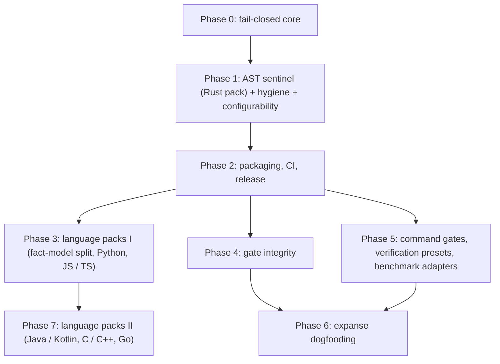

# Product Requirements Document (PRD): `orieg/discipline`

**Universal CI/CD Gatekeeper & AI Coding Agent Diff Sentinel**

| Attribute | Value |
|---|---|
| **Repository** | `orieg/discipline` |
| **Status** | Draft. Phase 0 and Phase 1 implemented; not externally reviewed (§11) |
| **Target Platforms** | GitHub Actions, Gitea Actions (act_runner), local workstations (macOS, Linux) |
| **Implementation Core** | Rust static binary (musl) + tree-sitter + libgit2 |
| **Checked repositories** | Any language for hygiene, integrity and deletion gates (shipped); per-language packs for the AST gates — Rust shipped; Python, JavaScript / TypeScript, Java / Kotlin, C / C++, Go planned (§6.1) |
| **License** | Apache-2.0 / MIT |

Numbers in this document carry a provenance tag: `(measured: <source>)`, `(target)`, or `(projected)`.

---

## 1. Problem Statement

### 1.1 Agent drift and test erosion
Autonomous coding agents (Claude Code, Gemini CLI, Codex, Cursor, Aider, Devin, and whatever follows them) now write a large share of changes. CI was designed for authors who do not quietly lower the bar to get a green build. An agent in an iterate-until-green loop does:

1. **Assertion weakening** — `assert_eq!(trie.get(k), Some(&v))` becomes `assert!(trie.get(k).is_some())` or `assert!(true)`.
2. **Vacuous and ghost tests** — tests that compile, run, and assert nothing.
3. **Stealth deletions** — flaky tests, benchmarks, and fixtures removed without a stated reason; tests renamed away or marked `#[ignore]`.
4. **Safety decay** — new `unsafe` with no `// SAFETY:` justification, or the comment deleted from above an untouched block.
5. **Editing the gate instead of the code** — loosening a threshold, exempting a path, disabling a check, adding `continue-on-error`, in the same change the gate would have blocked.
6. **Documentation and claim drift** — calendar estimates, stale numbers, leaked host paths, numbers with no provenance.
7. **Performance regressions** too small for wall-clock tests to see.

### 1.2 Heritage: what `orieg/expanse` proved, and what it did not
[`orieg/expanse`](https://github.com/orieg/expanse) holds these failure modes off with 68 scripts under `scripts/`, a 151,847-byte `ci.yml` with 46 jobs, and an 809-line `AGENTS.md` (measured: `orieg/expanse` working tree at `63dfcd6131`). Reproducing that per repository is not viable.

Reading that machinery closely changes what there is to inherit:

- **Expanse has no AST-level detection.** Test erosion there is guarded by aggregate floors (a test-count floor, a required-suite list) and PR-body tokens. Nothing in it detects a weakened assertion, a vacuous test, a new `#[ignore]`, or a missing `// SAFETY:` comment (clippy covers the last one). The AST gates in Pillar 1 are **new design work**, not a port.
- **What expanse contributes is hardening.** Its scripts record, in comments and self-tests, the specific ways each gate was bypassed or failed open. Those incidents, not the gate list, are the inheritance. §3 turns them into binding requirements.

### 1.3 Vision
One declarative, static binary — the same one in GitHub Actions, Gitea Actions, a pre-commit hook, and an agent's inner loop, **for a repository in any language** — that combines semantic diff inspection (tree-sitter over `git2` diffs) with expanse's fail-closed engineering, and that a consuming repository can tune gate by gate without being able to quietly switch it off.

---

## 2. Architecture

```
                 discipline.toml  ◄── base-ref copy compared by `config-integrity`
                        │
   built-in defaults ─► │ ◄─ action inputs / CLI flags / env (layered, §5)
                        ▼
              ┌───────────────────────┐
              │  discipline (Rust)    │  git2: merge-base diff, index, blobs
              │  gate registry        │  tree-sitter: tests, assertions, unsafe
              └───┬─────────┬─────────┘
                  │         │
      GitHub / Gitea     pre-commit hook      agent inner loop
      composite action   (`check --staged`)   (`check --base …`)
```

1. **Binary-first.** Static musl binaries for `x86_64` and `aarch64` Linux, native macOS binaries for both architectures. No Node, Python, or container bootstrap. Startup overhead target: under 50 ms (target); the embedded self-test runs in 15 ms wall-clock on an Apple-silicon laptop (measured: single local run, release build, not load-controlled — indicative only).
2. **No network, no openssl.** The binary only reads the local object database. `git2` is built with `vendored-libgit2` and no transport features, which is also what keeps the musl build static.
3. **AST-aware, never regex-naive.** `unsafe` or `assert!` inside a comment, string, or doc example is not a node of that kind and is never counted. Regexes are used only where the input is prose (markdown, PR bodies).
4. **One gate registry.** Every gate has a stable kebab-case id, a suite, and an `available` flag (`src/config.rs::GATES`). Reports, configuration, overrides, and this document all key on that id.
5. **Language packs behind one fact model.** discipline is written in Rust; the repositories it checks need not be. Gates reason over language-neutral facts — test functions, assertion counts and strength, skip markers, escape-hatch sites — and a *language pack* (a tree-sitter grammar plus an extractor) produces them. Gates contain no language-specific logic, so a new language is a new pack, not a new gate (§6.1).
6. **Tool-agnostic orchestration.** Verification and benchmark tooling differs by ecosystem, and some of it does not exist everywhere (callgrind is meaningful for native code, not for a JIT). discipline therefore never hard-codes a toolchain: it wraps *commands* and *result files* with fail-closed semantics, and ships adapters for common harnesses (§6, Pillars 4 and 5).

Engine detail lives in `docs/ARCHITECTURE.md`.

---

## 3. The Fail-Closed Contract

Each rule below is a requirement on every gate, present and future. Each traces to an incident: either one recorded in expanse, or one reproduced against this repository's first scaffold (which reported `PASSED` for a weakened assertion, for an unresolvable base ref, outside a git repository, and for suites that ran zero checks).

| # | Requirement | Origin |
|---|---|---|
| F1 | **Three exit states.** `0` pass, `1` violations, `2` could not check. "The change is bad" and "the gate is broken" are never conflated. | expanse canaries that passed on a build failure |
| F2 | **Three-state inputs.** Found / none / could-not-determine. An unresolvable base ref, a shallow clone with no merge base, a missing repository, or an unreadable file is state three and exits `2`. It is never an empty diff. | scaffold probe; expanse `check_test_floors.py` "never returns `(None, "")`" |
| F3 | **Merge-base diffs with rename detection.** The change is measured from `merge-base(base, HEAD)`, and a moved file is not a deletion. | expanse deletion gate |
| F4 | **No vacuous pass.** Every report prints, per gate, how many items it examined. A suite with no available gates is an error. An empty tracked tree is an error. | expanse "0 of 52 files scanned, exit 0" |
| F5 | **Planned is not passed.** A gate this binary does not ship cannot be enabled or configured (exit `2`), and every report lists the planned gates under "not checked". | scaffold: six config flags parsed and ignored |
| F6 | **Strict configuration.** Unknown keys, unknown gates, bad regexes, bad globs, an unsupported schema version, and a gate listed in both `enable` and `disable` are all errors. | scaffold: typo'd keys accepted |
| F7 | **Named degradation.** When a gate cannot verify something (no PR body supplied, file over the size cap, base config unreadable) it says so by name in the report. It never renders as "0 violations". | expanse `perf_report.py` "NO BASELINE" |
| F8 | **A gate is not satisfied by prose about the gate.** Override directives are line-anchored (§4); inline exemptions are scoped to one gate and counted in the report. | expanse #437: a table cell describing the token approved every regression |
| F9 | **A change cannot lower its own bar.** Configuration on the head side is compared with the base side (§5.4). | expanse floor constants read via `git show <base>` |
| F10 | **Secrets are not echoed.** Denylisted hostnames, user names in home paths, and matches of user-supplied PII patterns are reported by location only. | expanse hostname denylist held as a repo secret |
| F11 | **Untrusted text never reaches a shell parser.** Every action input arrives through `env:`; `tests/action/lint-action.py` fails CI if a `run:` block in `action.yml` interpolates `${{ }}`. | expanse `ci-gate` inline `toJson(needs)` |
| F12 | **The installer verifies what it runs.** The action checks the archive against `SHA256SUMS` with no opt-out and never falls back to building or running something else. | scaffold: download failure fell through to `cargo run` in the consumer's repo |

---

## 4. Override Directives

Every escape hatch uses one parser (`src/tokens.rs`) and one grammar.

```
<directive>: <subject> <reason>
```

- The directive **begins its own line**, optionally inside `<!-- -->`. A mention mid-sentence, in a table cell, in a code span, or inside a fenced block never arms it.
- The reason is non-empty and not a placeholder (`<reason>`, `TODO`, `tbd`, `n/a`, `...`); a trailing `-->` or `--!>` is stripped before that test.
- **Scoped:** a directive covers only a subject its reason names. For paths, the full path, the file name, or a directory prefix (`removes: tests/legacy …` covers everything under it). For tests, the function name. For gates, the gate id. There is no blanket form.
- Directives are read from the PR body (`--pr-body-file` or `PR_BODY`) and from every commit message between the merge base and `HEAD`.

| Directive | Lifts | Subject |
|---|---|---|
| `removes:` / `deletes:` | `deletion-rationale` | path, directory prefix, or test fn |
| `allow-assertion-drop:` | `assertion-reduction` | test fn |
| `allow-ignore:` | `ignored-tests` | test fn |
| `allow-gate-weakening:` | `config-integrity` | gate id |
| `allow-golden-update:` (planned) | `golden-output` | golden/snapshot path or directory prefix |
| `allow-regression:` (planned) | `bench-regression` | benchmark arm, plus a resolvable, fresh citation |
| `allow-test-shrink:` (planned) | `test-floor` | — |

Directives may also use the uniform HTML comment syntax: `<!-- discipline:allow(<gate-id>): <subject> <reason> -->` (or without colon).

There is deliberately **no in-source override comment**: the agent that weakened the test can also write the comment, and nobody reviews it. A directive in the PR body or a commit message is visible where review happens.

In `--staged` mode with no PR body, findings a directive could lift are downgraded to warnings, because a pre-commit hook runs before the commit message exists. CI sees the message and stays authoritative.

Planned hardening, from expanse's `allow-regression:` history (#524, #822, #826, #827): for benchmark overrides the citation must resolve, its numbers must appear in the cited source, it must belong to the current head, and every citation is checked, not just the first.

---

## 5. Configurability

**Principle: solid defaults, everything tunable, nothing silently off.** With no configuration at all, every available gate runs at severity `error`. A consumer can disable a gate, soften it, exempt paths, or extend its patterns — and each of those is visible in the report and, when it loosens an existing setting, requires a scoped directive.

### 5.1 Layers (lowest to highest precedence)

| Layer | Where | Typical use |
|---|---|---|
| 1. Built-in defaults | binary | every available gate on, severity `error` |
| 2. `discipline.toml` | repository | durable, reviewed policy |
| 3. Inline TOML override | `--config-override`, `DISCIPLINE_CONFIG_OVERRIDE`, action input `config_override` | per-workflow tuning without touching the file |
| 4. Gate switches | `--enable` / `--disable`, `DISCIPLINE_ENABLE` / `DISCIPLINE_DISABLE`, action inputs `enable` / `disable` | "this job runs hygiene only, minus `pii`" |
| 5. Secret denylist | `DISCIPLINE_HOSTNAME_DENYLIST`, action input `hostname_denylist` | hostnames that must not appear even in the config file |

Merge rule: tables merge key-wise, **lists append** (a higher layer augments a pattern list; it cannot shorten one), scalars replace. All layers are merged as TOML values and validated once, so every layer gets the strict checks of F6.

### 5.2 Schema (version 1)

Every gate has its own table, `[gates.<id>]`, and every gate accepts:

| Key | Default | Meaning |
|---|---|---|
| `enabled` | `true` | run the gate |
| `severity` | `"error"` | `"warning"` reports without failing (unless `--fail-on-warnings`) |
| `exempt_paths` | `[]` | globs the gate skips |

Gate-specific keys:

```toml
[meta]
version = 1
name = "my-project"

[gates.time-estimates]
include = ["**/*.md"]           # files swept
extra_patterns = []             # additional banned regexes
allow_patterns = ['(?i)\b(retention|ttl|timeout|expir\w*|cache[ds]?|stale|rotat\w*)\b']
scan_pr_body = true

[gates.pii]
home_paths = true               # home-directory paths (Unix and Windows forms)
lan_ips = true                  # RFC 1918 addresses
allowed_users = ["runner", "user", "username", "you", "me", "name", "example", "shared"]
hostname_denylist = []          # whole-token, case-insensitive, never echoed
extra_patterns = []             # e.g. internal domains, e-mail shapes, ticket prefixes
allow_patterns = []
scan_pr_body = true

[gates.agent-scratch]
paths = [".claude/**", ".gemini/**", ".antigravity/**", ".cursor/**", ".aider*", "scratch/**", "**/*.session.*"]

[gates.deletion-rationale]
paths = ["**"]                  # deletions under these globs need a rationale

[gates.vacuous-tests]           # same keys on [gates.assertion-reduction]
extra_assert_macros = []        # e.g. "assert_snapshot", "check"
assert_helper_fns = []          # e.g. "check_invariants"
```

A single line can be exempted with `discipline:allow(<gate-id>)` anywhere on it (for instance inside an HTML comment in markdown). The marker names the gate it exempts, and the report counts how many lines used it.

### 5.3 Action inputs

| Input | Purpose |
|---|---|
| `config`, `suite`, `base_ref`, `working_directory` | what to check, against what |
| `enable`, `disable` | gate switches (comma or newline separated) |
| `config_override` | inline TOML, layer 3 |
| `hostname_denylist` | layer 5; pass a secret |
| `fail_on_warnings` | make warnings blocking |
| `pr_body` | defaults to the pull request body |
| `version`, `binary_path`, `download_url` | which binary: a release, a local build (air-gapped Gitea), a mirror |

Outputs: `status`, `errors`, `warnings`, `failed_gates`, `report` (JSON path), `install_error`.

```yaml
- uses: orieg/discipline@v0
  with:
    disable: time-estimates
    hostname_denylist: ${{ secrets.DOCS_HOSTNAME_DENYLIST }}
    config_override: |
      [gates.pii]
      extra_patterns = ['[a-z0-9._-]+@corp\.example']
      [gates.vacuous-tests]
      severity = "warning"
```

### 5.4 Trust model: configurable is not the same as bypassable

- **`config-integrity` (shipped).** `discipline.toml` at the merge base is compared with the head. A gate disabled, a severity lowered, any `true → false`, a loosening list grown (`exempt_paths`, `allow_patterns`, `allowed_users`, `extra_assert_macros`, `assert_helper_fns`) or a tightening list shrunk (`paths`, `include`, `extra_patterns`, `hostname_denylist`), or the file deleted, each needs `allow-gate-weakening: <gate-id> <reason>`. Tightening needs nothing. If the base-side file does not load with the current binary the gate reports a warning rather than blocking, so the change that repairs it can merge.
- **Directives, overrides, and identity model (T1+T2).** Override directives (`removes:`, `allow-ignore:`, `allow-assertion-drop:`, `allow-gate-weakening:`, `discipline:allow(...)`) are audit-trailed in reports (`overrides` section in terminal, step summary, JSON, and step outputs). Discipline itself does not authenticate human identity directly — it parses directives from authorized channels (`directives.sources`, defaulting to `["pr-body", "commits"]`) and rejects hidden HTML comment directives by default (`directives.allow_hidden = false`). For workflows requiring human sign-off on any override, `directives.fail_on_overrides = true` (or `--fail-on-overrides` / `DISCIPLINE_FAIL_ON_OVERRIDES`) exits non-zero whenever overrides are present, serving as the machine gate that prompts human approval or branch protection bypass.
- **Residual gap, stated plainly.** Action inputs live in the workflow file, which a `pull_request` run takes from the PR itself, so `disable:` added in a workflow edit is not seen by `config-integrity`. Two mitigations: the planned `ci-integrity` gate (§6, Phase 3) diffs workflow files for exactly this, and until it ships the consuming repository should protect `.github/workflows/` and `discipline.toml` with branch rules or CODEOWNERS.
- Every report prints each gate's state, so a disabled gate shows as `OFF` in the terminal, the job summary, and the JSON.

### 5.5 Adoption configurations

Minimal adoption configurations verified against existing repositories:

#### `orieg/expanse` (High-assurance Rust algorithms)
```toml
[meta]
version = 1
name = "expanse"

[gates.vacuous-tests]
assert_helper_fns = [
    "check_invariants",
    "assert_bounds",
    "verify_distribution",
]

[gates.pii]
# Synthetic IP ranges in test suites and examples
exempt_paths = [
    "tests/**",
    "examples/**",
    "docs/archive/**",
]

[gates.time-estimates]
# Archival documentation containing historical research chronicles
exempt_paths = [
    "docs/archive/**",
]
```

#### `orieg/php-judy` (C extension & PHP runtime)
A non-Rust repository: AST gates report 27 unanalysed files `(12 .php, 10 .phpt, 5 .c/.h)` while hygiene, integrity, and file deletion gates remain active.
```toml
[meta]
version = 1
name = "php-judy"

[gates.pii]
# Example script demonstrating IP lookups
exempt_paths = [
    "examples/ip-range-lookup.php",
]

[gates.time-estimates]
exempt_paths = [
    "docs/archive/**",
]
```

---


## 6. Gate Catalog

Status: **shipped** = implemented with discriminating tests (§9); **planned** = in the registry, refuses to be enabled.

### 6.1 Language scope

Six of the ten shipped gates are language-independent and work on any repository today: `deletion-rationale` (file level), `agents-md`, `time-estimates`, `pii`, `agent-scratch`, `config-integrity`. The four AST gates need a language pack. When a change touches source files in a language with no pack, each AST gate **says so by name** in its report ("N changed source file(s) … NOT analysed") rather than showing a quiet zero (F7).

A pack maps its ecosystem onto the shared fact model:

| Language | Test function | Assertion vocabulary (strong = equality / pattern) | Skip markers (`ignored-tests`) | Escape hatches (`unsafe-safety-comment`, `suppression-delta`) | State |
|---|---|---|---|---|---|
| Rust | `#[test]`, `#[tokio::test]`, `#[rstest]`, `#[test_case]` | `assert*!`, `debug_assert*!`, `prop_assert*!`; strong: `_eq`, `_ne`, `matches` | `#[ignore]` | `unsafe` block / impl + `// SAFETY:`; `#[allow]` | **shipped** |
| Python | `test_*` functions, `Test*` methods, `unittest.TestCase` | `assert` statements, `self.assert*`, `pytest.raises`, `pytest.approx`; strong: `==` comparisons, `assertEqual` family | `@pytest.mark.skip` / `skipif` / `xfail`, `@unittest.skip*` | `# type: ignore`, `# noqa`, `# pragma: no cover`, `cast(Any, …)` | planned |
| JavaScript / TypeScript | `test(` / `it(` callbacks (Jest, Vitest, Mocha, node:test) | `expect(…).matcher`, `assert.*`; strong: `toBe`, `toEqual`, `toStrictEqual`, `deepStrictEqual`; weak: `toBeTruthy`, `toBeDefined` | `.skip`, `.todo`, `xit`, `xdescribe`, `.only` (narrows the suite) | `@ts-ignore`, `@ts-expect-error`, `as any`, `eslint-disable*` | planned |
| Java / Kotlin | `@Test`, `@ParameterizedTest`, `@RepeatedTest` | JUnit `assert*`, AssertJ `assertThat(…)` chains, Hamcrest; strong: `assertEquals`, `isEqualTo` | `@Disabled`, `@Ignore`, `Assumptions.*` | `@SuppressWarnings`, `sun.misc.Unsafe`, unchecked casts | planned |
| C / C++ | GoogleTest `TEST*`, Catch2 `TEST_CASE`, doctest | `EXPECT_*` / `ASSERT_*`, `REQUIRE` / `CHECK`; strong: `_EQ`, `_STREQ`; note `EXPECT` → non-fatal is itself a weakening of `ASSERT` | `DISABLED_` prefix, `GTEST_SKIP()` | `reinterpret_cast`, `const_cast`, `// NOLINT`, `#pragma … ignored` | planned |
| Go | `func Test*(t *testing.T)`, subtests | `t.Error*` / `t.Fatal*` under a condition, testify `assert.*` / `require.*`; strong: `Equal`, `DeepEqual`; `require` → `assert` is a weakening | `t.Skip*` | `unsafe` package, `//nolint`, `//go:linkname` | planned |

Design rules for packs:

- **Each pack ships with its own controls** (§9) in its own language; a pack without negative controls is not a pack.
- **Frameworks are vocabulary, not code.** A pack's assertion and skip vocabularies are data with per-repository extension points (`extra_assert_macros`, `assert_helper_fns` today), because every ecosystem has in-house helpers.
- **Callback-style tests** (JS `it("…", () => { … })`) are keyed by their description string, so the pairing logic that today matches Rust tests by qualified name needs a per-pack *test identity* function. This is the one place the current matcher is Rust-shaped.
- **Grammars are compile-time features**, so a size-sensitive build can drop packs; release binaries carry all of them.

### Pillar 1 — Agent conformance and diff guard (`agent-guard`)

| Gate id | Status | Rule |
|---|---|---|
| `assertion-reduction` | shipped (Rust pack) | For each test present on both sides (matched by module-qualified name within a file, then by name across files so a moved test is compared, not re-counted), neither the count of effective assertions nor the count of equality / pattern assertions may drop. |
| `vacuous-tests` | shipped (Rust pack) | A new test needs at least one non-tautological assertion, a configured helper call, `.unwrap()`/`.expect()`, `?` in a fallible test, or `#[should_panic]`. Constant expressions (`assert!(1 == 1)`, `assert!(1 + 1 > 0)`, `assert_ne!(1, 2)`) and verbatim `assert_eq!(x, x)` are tautologies. |
| `ignored-tests` | shipped (Rust pack) | A test may not gain a skip marker (`#[ignore]` in Rust), and a new test may not arrive skipped. |
| `unsafe-safety-comment` | shipped (Rust pack) | Every `unsafe` block or `unsafe impl` on an added line has a `// SAFETY:` comment above it, above its enclosing statement, or inline before it. Trailing comments, lower-case labels, and strings containing the text do not count. A file whose undocumented-site count rose is reported even when the `unsafe` line itself is untouched (a deleted comment). |
| `deletion-rationale` | shipped (files: any language; removed tests: per pack) | A deleted file, or a test removed from a surviving file, needs a scoped `removes:`. |
| `agents-md` | shipped (any language) | `AGENTS.md` is tracked; a tracked `CLAUDE.md` / `GEMINI.md` is a symlink or identical to it. |
| `suppression-delta` | planned | A net increase in the pack's escape hatches (§6.1: `#[allow]`, `@ts-ignore`, `# type: ignore`, `@SuppressWarnings`, `// NOLINT`, `//nolint` …), tests gated out by build configuration, commented-out test functions, expected-failure markers without an expected message, blind snapshot / golden-file re-blessing. None of these is covered by expanse either. |
| `scope-confinement` | planned | Changes stay inside configured paths. |

### Pillar 2 — Repository, research and documentation hygiene (`hygiene`)

| Gate id | Status | Rule |
|---|---|---|
| `time-estimates` | shipped | No calendar or duration estimates in tracked markdown or the PR body. Evaluated clause-by-clause with setting cues; fenced code is skipped; operational caps (retention, TTL, timeouts), benchmarks/measurements, and historical durations are contextually exempt. |
| `pii` | shipped | No home-directory paths, private LAN addresses, denylisted hostnames, or configured patterns in any tracked text file or the PR body. |
| `agent-scratch` | shipped | Agent scratch state is never tracked. |
| `provenance-tags` | planned | Published numerics carry `(measured …)`, `(target)`, or `(projected)`. |
| `pii` extensions | planned | Paths inside *decoded* JSON strings (escaped forms), a superseded-figures registry swept across markdown / HTML / SVG / JSON, "pending" cells that must cite an open issue. |
| `pr-checklist` | planned | A ticked PR checkbox is reconciled against the diff. |

### Pillar 3 — Gate integrity (`integrity`)

| Gate id | Status | Rule |
|---|---|---|
| `config-integrity` | shipped | §5.4. |
| `ci-integrity` | planned | Workflow diffs: a job removed from the rollup's `needs`, new `continue-on-error`, `\|\| true`, a dropped `-D warnings`, an action unpinned from its SHA, a rollup that accepts anything but `success` / a consistent `skipped`, `disable:` added to the discipline step. Expanse polices rollup completeness and skip consistency but not step-level weakening. |
| `test-floor` | planned | Test-count ratchet with the floor read from the base ref; zero tests selected is a failure; `allow-test-shrink:`. |
| `golden-output` | planned | Stealth edits to committed golden files, test outputs, or recorded test fixtures are rejected without an explicit scoped rationale (`allow-golden-update: <path> <reason>`). |
| `snapshot gates` | planned | Public API and exported-symbol snapshots as reviewed diffs, regenerated with `--write`. |

#### Design specification: `golden-output` gate

Committed test outputs, snapshots (such as `insta` `.snap` files), golden test data, and serialized fixtures are high-leverage drift vectors: an agent can silently re-bless or modify expected outputs to make an erosion pass rather than fixing the underlying implementation.

- **Objective:** Detect edits to committed baseline output files and require explicit, scoped human intent to approve updates.
- **Config schema:**
  ```toml
  [gates.golden-output]
  enabled = true
  severity = "error"
  paths = [
      "**/golden/**",
      "**/snapshots/**",
      "**/*.snap",
      "tests/fixtures/**/output*",
  ]
  exempt_paths = []
  ```
- **Detection invariant:**
  1. For every modified or deleted file in the merge-base diff matching `paths` (and not excluded by `exempt_paths`), a violation is raised unless covered by a directive.
  2. Escape hatch directive: `allow-golden-update: <path-or-prefix> <reason>` or `discipline:allow(golden-output): <path-or-prefix> <reason>`.
  3. Directives are parsed through `src/tokens.rs` and validated with `tokens::covers`: bare directory words without a slash are rejected, and placeholder reasons (`TODO`, `update`, `none`) do not arm the override.
- **Fail-closed contract:** Any matching golden file modified without a scoped directive exits with code `1`.


### Pillar 4 — Verification orchestration (`quality`, `verification`)

All planned. Verification tools are ecosystem-specific, so this pillar is built on one language-agnostic primitive and a set of presets on top of it.

**The primitive: a command gate.** A consumer declares a command and what a *real* success looks like; discipline supplies the fail-closed wrapper that ad-hoc CI steps keep getting wrong.

```toml
[[gates.command]]                    # planned schema
id = "unit-tests"
run = "pytest -q"
min_tests = 300                      # ratchet; the floor is read from the base ref
count_pattern = '(\d+) passed'       # how to read the count; no match = could-not-check
forbid_output = ['(?i)\bno tests ran\b']
timeout = "bounded"                  # a hung tool is exit 2, not a pass
```

Rules every command gate inherits from expanse:

- **Zero tests selected is a failure**, whatever the exit code. A filter, tag, or build flag that selects nothing exits `0` in every test runner surveyed.
- **A negative-control canary asserts the diagnostic string**, not just a non-zero exit: a compile error also exits non-zero.
- **A missing tool is exit `2`**, never a skip (expanse: a lint that silently skipped when its binary was absent).
- **Pipelines cannot hide a crash**: output is captured by discipline itself rather than through a shell `| tee`.

**Presets** are named command gates with the right patterns filled in:

| Ecosystem | Presets |
|---|---|
| Rust | `msrv` (`cargo check` under `rust-version`), `miri` (tiered, with shard completeness: every test in exactly one shard), `sanitizers` (ASan / TSan with an audited suppression list and a race canary), `cargo-deny`, `unsafe-budget` (count ratchet from the base ref) |
| C / C++ | ASan / UBSan / TSan builds, `clang-tidy`, warnings-as-errors |
| Python | minimum-interpreter matrix, `mypy` / `pyright` strictness ratchet, `pip-audit` |
| JavaScript / TypeScript | `tsc --noEmit` with a `strict` ratchet (a change may not turn strict flags off), `npm audit` / `pnpm audit` |
| Java / Kotlin | JDK floor, `-Werror`, dependency-vulnerability check |
| Go | `go vet`, `-race`, `govulncheck` |

### Pillar 5 — Benchmark drift (`bench`)

Planned: `bench-regression`. The statistical gate is independent of how samples were produced; harness support is an **adapter** that turns a tool's output into the common sample format.

| Measurement | Where it is valid | Adapters |
|---|---|---|
| **Deterministic counts** (instructions, allocations, fuel) — compared exactly against the merge base, tolerance as configured | Ahead-of-time compiled native code: Rust, C, C++, and Wasm fuel. Not meaningful where a JIT, a garbage collector, or an interpreter loop dominates the count (JVM, V8, CPython), so it is never the default there. | `iai-callgrind`, raw `callgrind`, Wasm fuel |
| **Wall-clock samples** — gated on a BCa bootstrap 95% interval | Everywhere, provided the harness exports per-iteration or per-round samples | `criterion` (Rust), `google-benchmark` (C / C++), `jmh` (JVM), `pytest-benchmark` / `pyperf` (Python), `tinybench` / `vitest bench` / `benchmark.js` (JS / TS), `go test -bench` (Go), `hyperfine` (any CLI) |
| **Anything else** | Any harness, any language | `samples-json`: a documented file of `{arm, unit, direction, samples[]}`; a project with a bespoke harness writes this and gets the full gate |

Rules, from expanse's benchmark history:

- The claim passes only if the interval's **conservative bound** clears the floor; a point estimate is never compared. A degraded interval method (`bc`, `clamped`, `degenerate`) is reported by name, never silently substituted.
- Head and base are measured **in the same job on the same machine**; a missing or unbuildable baseline is exit `2`, not "no regressions" (expanse's residual gap), and fewer than half of the base's arms parsed is fatal.
- JIT and GC runtimes need warm-up and fork isolation; the adapter records the harness's own settings (JMH forks and warm-up iterations, V8 flags) in the artifact so two runs are comparable or visibly not.
- Benchmark artifacts carry host class, estimator, and load-snapshot provenance; a contaminated run is discarded, not averaged in.
- `allow-regression:` per §4.

Per the math-first rule, the statistics ship as cited, unit-tested functions with pinned reference values **before** this gate is enabled anywhere.

---

## 7. Distribution

| Surface | Form | Notes |
|---|---|---|
| GitHub / Gitea Actions | composite `action.yml` | shell only, no JavaScript runtime; downloads a release, verifies `SHA256SUMS`, or takes `binary_path`. Resolves the base ref (PR base, else the pushed-from commit, else the default branch) and fetches it if the clone lacks it. |
| pre-commit framework | `.pre-commit-hooks.yaml` | `discipline` (builds with cargo) and `discipline-system` (binary on `PATH`); both run `check --staged`. |
| Plain git hook | `discipline check --staged` | same binary, same gates. |
| CLI | `check`, `diff`, `init`, `gates`, `self-test` | `gates` prints the registry with each gate's effective state; `self-test` runs embedded positive and negative controls against the installed binary. |

Output formats: terminal, `github-summary` (terminal + workflow-command annotations + job summary + step outputs), `json`; `--json-out` writes the JSON report alongside any of them.

---

## 8. This Repository's CI and Release Pipeline

### 8.1 CI (`.github/workflows/ci.yml`)

Third-party actions are pinned by commit SHA; `actionlint` and `act` are installed by version with a pinned checksum. No job is path-filtered, so the `ci-gate` rollup uses an **allow-list**: every needed job must be `success`, and the number of needed jobs is asserted.

| Job | Proves |
|---|---|
| `lint` | `fmt`, `clippy -D warnings`, `actionlint` on GitHub and Gitea workflows, `shellcheck`, and `lint-action.py` (F11) |
| `test` (Linux, macOS) | the suite passes **and** at least 65 tests ran; then `self-test` |
| `msrv` | `cargo check` under the `rust-version` read from `Cargo.toml` |
| `supply-chain` | `cargo-deny`: advisories, bans, license allow-list, sources |
| `build-static` | the musl binary is statically linked and passes `self-test`; its artifact feeds the jobs below |
| `action-github` | the composite action on a hosted runner: clean fixture passes; bad fixture fails **and the JSON report names exactly the five expected gates**; input-driven `disable` / `config_override` change the fired set; an unresolvable base fails with no verdict; a local release store exercises download + checksum; a tampered archive is refused **for the checksum** |
| `action-gitea` | `.gitea/workflows/action-selftest.yml` run under `act` with `gitea/runner-images`, with proof lines required in the log (act exits `0` when it matched no job) |
| `pre-commit` | `pre-commit try-repo` against a staged fixture: clean passes, bad fails and the output names each gate |
| `dogfood` | the action gates this repository |

### 8.2 Release (`.github/workflows/release.yml`)

Trigger: a `vX.Y.Z` tag. Order and gates:

1. **verify** — tag equals the `Cargo.toml` version; the tagged commit is on `main`; `fmt`, `clippy`, tests, `cargo-deny`.
2. **build** — four targets (`x86_64` / `aarch64` musl on native runners; both macOS architectures). Each binary must report the tagged version and pass `self-test`; Linux binaries must be static. If the cross-built `x86_64-apple-darwin` binary cannot execute on the runner, that is a named notice, not a silent skip.
3. **publish** — exactly four archives or fail; `SHA256SUMS`; build-provenance attestation; the release is created as a draft and published only after every asset is attached.
4. **smoke** — on three runner types, the action at the tagged commit **downloads the published assets**, verifies the checksum, passes the clean fixture, rejects the bad one for the expected gates, and `gh attestation verify` succeeds.
5. **move-major-tag** — the floating `v<major>` tag moves last, only for stable versions, only after smoke passes.

Not in scope yet: crates.io publication, Homebrew, a container image.

---

## 9. Test Discipline for Gates

A gate ships only with all four:

1. **Unit tests** on the detector with a positive and a negative control (`src/**` `#[cfg(test)]`).
2. **End-to-end tests** that drive the real binary against a throwaway git repository and read the JSON report (`tests/test_gates_e2e.rs`): per gate, the violation fires, the legitimate form stays silent, the override works only when scoped, and the configuration knobs take effect.
3. **Mutation evidence.** Each detector is broken on purpose and the suite must fail. Current state: 26 hand-written mutants across the token parser, AST extractor, diff gates, git context, hygiene gates, config layering, and exit codes; 26 killed (measured: local run of the full suite per mutant). Planned: `cargo-mutants` in CI so this stops depending on a hand-maintained list.
4. **A `self-test` case** compiled into the binary (15 cases across detectors), so a released artifact can prove it still discriminates on the machine it runs on.

Test the call site, not the helper: expanse repeatedly shipped gates whose helper was tested while the file-selection logic around it selected nothing.

---

## 10. Roadmap

Ordered by dependency and gated by acceptance criteria.



Phases 3, 4 and 5 depend only on Phase 2 and can proceed in parallel.

| Phase | Deliverables | Go / no-go gate | State |
|---|---|---|---|
| **0 — Fail-closed core** | exit states, three-state git context, strict layered config, gate registry, directive parser, report with examined counts | every row of §3 has a test that fails when the behavior is removed | implemented; tests pass locally |
| **1 — Sentinel, hygiene, configurability** | the ten shipped gates of §6 (AST gates on the Rust pack); §5 in full; unanalysed languages named in reports | §9 items 1–4 for every shipped gate | implemented; 71 tests, 26 of 26 mutants killed (measured: local) |
| **2 — Packaging, CI, release** | `action.yml`, pre-commit hooks, `ci.yml`, `release.yml`, Gitea workflow | `ci-gate` green on GitHub; first tag publishes four verified archives and `smoke` passes | written; action download path, Gitea-under-act, and pre-commit verified locally; **not yet run on GitHub** (no remote) |
| **3 — Language packs I** | extractor trait and per-pack test identity split out of the Rust-shaped matcher; Python and JavaScript / TypeScript packs; grammars as compile-time features | each pack passes §9 items 1–4 in its own language, including a callback-style test renamed without changing its body | planned |
| **4 — Gate integrity** | `ci-integrity`, `test-floor`, `suppression-delta`, snapshot gates | replays of expanse #671 (all-skipped green rollup) and a `continue-on-error` insertion are both rejected | planned |
| **5 — Command gates, presets, benchmark adapters** | the command-gate primitive; Rust presets first; `samples-json`, `criterion`, `iai-callgrind` adapters first, then one adapter per Phase 3 language; bounds module with pinned reference values before any of it | a zero-test run, a missing tool, a crashed benchmark, a missing baseline, and an unsourced override each produce the right non-pass state; one non-native repository (JVM or Node) is gated end to end on wall-clock samples with no callgrind involved | planned |
| **6 — Expanse dogfooding** | `discipline.toml` in expanse; scripts retired one by one | **incident replay**: fixtures reproducing expanse #437, #524, #671, #822 / #826 / #827 are each caught; no retired script catches something discipline misses | planned |
| **7 — Language packs II** | Java / Kotlin, C / C++, Go packs and their presets | as Phase 3, per language | planned |

---

## 11. Known Limits and Outstanding Checks

- **Second-pass adversarial audit completed.** The initial agent-assisted pass was independently audited and hardened across Phases A, B, and B2 on branch `review/second-pass`: fail-closed controls across git contexts verified with positive and negative controls; bypass analysis conducted; contextual time-estimate detection with measurement and question label exemptions; RFC 1918 network ID exemption with decoded JSON inspection; streaming scanners; directory prefix slash enforcement; `#[cfg_attr(..., ignore)]` test skipping detection; and unsupported language grouping reporting verified with discriminating tests.
- **CI has not run on GitHub.** Workflows pass `actionlint`; the action's install step, the Gitea workflow under `act`, and the pre-commit path were executed locally. Hosted-runner behavior (arm runners, artifact hand-off, attestation permissions) is unverified until the first push and the first tag.
- **Gitea is tested through `act`, not a Gitea server.** `act_runner` is built on `act`, so this catches GitHub-only dependencies, but a live Gitea instance with `act_runner` is the stronger check and is outstanding.
- **Macro bodies are opaque.** Tests generated inside `proptest! { … }` and assertions nested in another macro's arguments are unparsed token trees and are not seen. `assert_helper_fns` / `extra_assert_macros` are the workaround.
- **Assertion strength is a two-level proxy** (equality / pattern vs. everything else). Replacing `assert_eq!(a, b)` with `assert_eq!(a, a)` is caught as a tautology; replacing it with a different, weaker equality is not.
- **Grammar lag.** Syntax newer than the bundled tree-sitter grammar reports as a parse error, which blocks by design (F2); `exempt_paths` is the escape.
- **AST gates analyse Rust only** until Phase 3; on other languages they name what they skipped. Hygiene, integrity, and file-level deletion gates already apply to any repository. The test matcher keys on qualified function names, which is Rust-shaped; Phase 3 replaces it with a per-pack identity function.
- **No benchmark or verification gate exists yet**, for any language; the adapter model in §6 is design, not code.
- **Workflow-level weakening** is unguarded until `ci-integrity` ships (§5.4).
- **MSRV is 1.90**, set by the dependency tree's declared `rust-version` (read from crate metadata; the `msrv` CI job is what verifies it).

