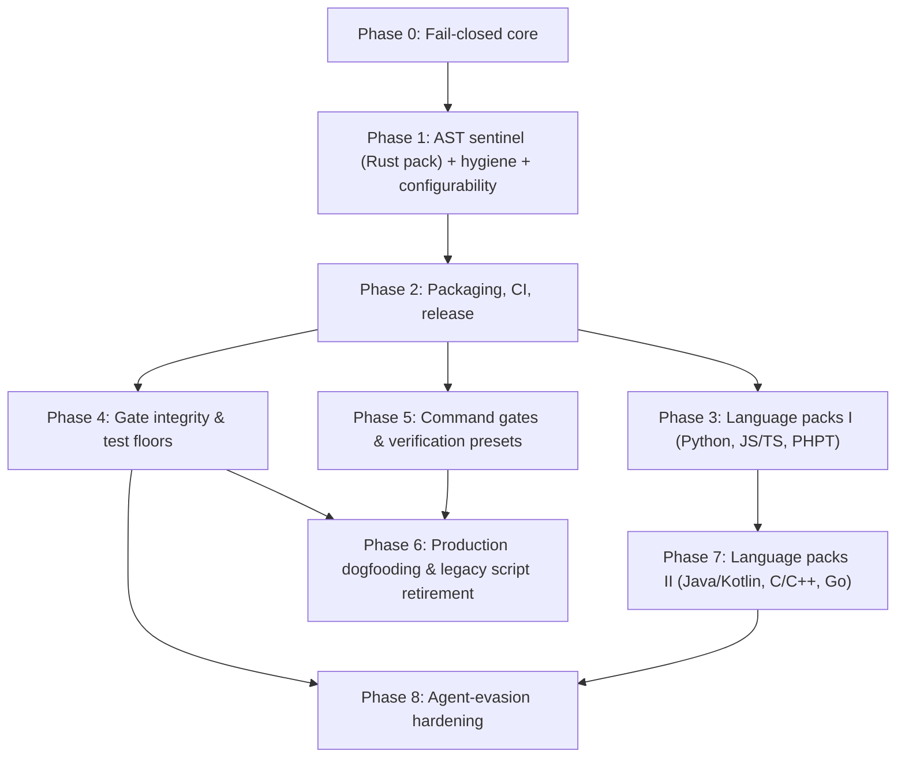

# Discipline Roadmap & Milestones

This document establishes the delivery phases, dependency graph, go/no-go gates, shipped gates, planned extensions, and outstanding checks for `discipline`.

**Superseded when:** A milestone completes, a new phase is initiated, or planned gate scope evolves. Update in place; do not fork.

---

## Dependency Graph

Phases 3, 4, and 5 depend upon Phase 2 and proceed in parallel. Phase 8 Tier 0 and Tier 1 depend only on Phase 4; Tier 2 adds facts to every language pack, so it follows Phase 7.

---

## Shipped Gates

<!-- generated:gates -->
| Gate | Suite | Languages | Rule Description |
|---|---|---|---|
| [`agents-md`](GATES.md#agents-md) | agent-guard | any | AGENTS.md exists; CLAUDE.md / GEMINI.md do not fork it |
| [`assertion-reduction`](GATES.md#assertion-reduction) | agent-guard | Rust, Python, JS/TS, PHPT, Java, Go, PHP, C/C++, C#, Ruby | assertion count / strength must not drop in an existing test |
| [`vacuous-tests`](GATES.md#vacuous-tests) | agent-guard | Rust, Python, JS/TS, PHPT, Java, Go, PHP, C/C++, C#, Ruby | new tests must carry a non-tautological assertion |
| [`ignored-tests`](GATES.md#ignored-tests) | agent-guard | Rust, Python, JS/TS, PHPT, Java, Go, PHP, C/C++, C#, Ruby | tests must not be newly #[ignore]d or skipped without directive |
| [`unsafe-safety-comment`](GATES.md#unsafe-safety-comment) | agent-guard | Rust | unsafe blocks / impls carry a // SAFETY: comment |
| [`deletion-rationale`](GATES.md#deletion-rationale) | agent-guard | any | deleted files and removed tests need a scoped removes: rationale |
| [`time-estimates`](GATES.md#time-estimates) | hygiene | any | no calendar / duration estimates in markdown or the PR body |
| [`pii`](GATES.md#pii) | hygiene | any | no home paths, LAN IPs, or denylisted hostnames in tracked text |
| [`agent-scratch`](GATES.md#agent-scratch) | hygiene | any | agent scratch state is never tracked |
| [`shell-secrets`](GATES.md#shell-secrets) | hygiene | shell, docker, workflows | no command-line secrets or unverified piped scripts in shell, docker, or CI |
| [`issue-link`](GATES.md#issue-link) | hygiene | any | PR title or description links a tracking issue (#123, Fixes #123) |
| [`config-integrity`](GATES.md#config-integrity) | integrity | any | a change cannot weaken its own discipline.toml without a token |
| [`stub-bodies`](GATES.md#stub-bodies) | agent-guard | Rust, Python, JS/TS, Go, Java, C# | added functions are not stubs; existing bodies are not replaced by todo!() / NotImplementedError / return null |
| [`toolchain-config`](GATES.md#toolchain-config) | integrity | tsconfig, ruff, mypy, pytest, coverage, flake8, Cargo lints, rustflags, nextest, eslintrc, golangci, jest, codecov, phpstan, phpunit | compiler, linter, type-checker, test-runner and coverage configuration cannot be loosened without a token |
| [`scope-confinement`](GATES.md#scope-confinement) | agent-guard | any | changes stay inside authorized paths |
| [`suppression-delta`](GATES.md#suppression-delta) | agent-guard | per pack | newly added linter / compiler suppression annotations |
| [`provenance-tags`](GATES.md#provenance-tags) | hygiene | any | published numerics carry (measured|target|projected) |
| [`ci-integrity`](GATES.md#ci-integrity) | integrity | any | workflow weakening: continue-on-error, || true, unpinned actions |
| [`ci-skip-set`](GATES.md#ci-skip-set) | integrity | any | rollup skip set matches each job's `if:` under the observed filter outputs |
| [`test-floor`](GATES.md#test-floor) | integrity | any | test-count ratchet read from the base ref |
| [`golden-output`](GATES.md#golden-output) | integrity | any | prevents stealth edits to committed golden/test output files without explicit override |
| [`dependency-delta`](GATES.md#dependency-delta) | integrity | any | manifest diff inspection: zero wildcards, source/license allowlists, and deny.toml verification |
| [`test-budget`](GATES.md#test-budget) | integrity | Rust, Python, JS/TS, Go, any | property-test and fuzz effort ratchet (cases, shrink iters, fuzztime, seed corpus) |
| [`pr-checklist`](GATES.md#pr-checklist) | hygiene | any | ticked PR checkboxes are reconciled against the diff |
| [`command`](GATES.md#command) | verification | any | fail-closed wrapper for any tool: zero-tests guard, canary, count ratchet |
| [`sanitizers`](GATES.md#sanitizers) | verification | Rust, C/C++ | ASan / TSan preset with audited suppressions and a race canary |
| [`msrv`](GATES.md#msrv) | quality | Rust | cargo check under the pinned MSRV |
| [`miri`](GATES.md#miri) | verification | Rust | Miri tiers with zero-tests guard |
| [`unsafe-budget`](GATES.md#unsafe-budget) | verification | Rust | unsafe count ratchet |
| [`bench-regression`](GATES.md#bench-regression) | bench | Rust, Go, Python, C/C++ | benchmark drift via harness adapters (deterministic counts or BCa intervals) |
| [`archive-contents`](GATES.md#archive-contents) | integrity | any | distribution archive must contain required paths and zero forbidden developer artifacts |
| [`manifest-sync`](GATES.md#manifest-sync) | integrity | any | reconcile git-tracked files against packaging manifest declarations |
| [`version-lockstep`](GATES.md#version-lockstep) | integrity | any | version declarations across headers, manifests, and files must remain in lockstep |
<!-- /generated -->

---

## Milestone Phases & Go / No-Go Gates

### Phase 0: Fail-Closed Core
- **Deliverables:** Three-state exit codes (`0`, `1`, `2`), three-state git context, merge-base diff inspection, strict layered configuration resolution, stable gate registry, line-anchored directive parsing, truthful reporting with examined counts.
- **Go / no-go gate:** Every invariant rule in the Fail-Closed Contract (F1–F12) has discriminating tests that fail if the behavior is removed.
- **Status:** **Completed & Verified**.

### Phase 1: Sentinel, Hygiene, Configurability
- **Deliverables:** AST gates on Rust pack, whole-tree hygiene sweeps (`time-estimates`, `pii`, `agent-scratch`), `agents-md` guide sentinel, full 5-layer configurability, unanalysed source reporting.
- **Go / no-go gate:** Positive and negative unit controls, e2e binary tests, embedded self-test cases, and mutation verification.
- **Status:** **Completed & Verified**.

### Phase 2: Packaging, Multi-Platform CI, Release
- **Deliverables:** Composite `action.yml` for GitHub, Gitea, and Forgejo Actions; pre-commit hooks (`.pre-commit-hooks.yaml`); GitLab CI component template; Argo Workflow template; Dockerfile container; automated multi-architecture release pipeline (`release.yml`).
- **Go / no-go gate:** `ci-gate` 100% green across all platforms; release pipeline builds verified static musl and macOS binaries with SHA-256 attestations.
- **Status:** **Completed & Verified**.

### Phase 3: Language Packs I (Fact Model Split)
- **Deliverables:** Tree-sitter extractor trait and language pack abstraction; Python pack (`test_*`, `unittest`, pytest markers); JavaScript / TypeScript pack (Jest, Vitest, Mocha matchers and callbacks); Golden (PHPT) pack.
- **Go / no-go gate:** Each language pack satisfies 4-point test discipline in its own language, including callback test renaming and assertion weakening detection.
- **Status:** **Completed & Verified**.

### Phase 4: Gate Integrity & Test Floors
- **Deliverables:**
  - `ci-integrity`: Workflow diff inspection detecting dropped jobs from `needs`, addition of `continue-on-error`, unpinned third-party actions, or stripped `-D warnings`.
  - `test-floor`: Test-count ratchet with baseline count read from merge-base ref; `allow-test-shrink:` directive.
  - `suppression-delta`: Catching net increases in compiler/linter suppression annotations (`#[allow]`, `@ts-ignore`, `# type: ignore`, `// NOLINT`).
  - `scope-confinement`: Restricting agent file modifications strictly within authorized directory boundaries.
- **Go / no-go gate:** Incident replays of historical workflow weakening and all-skipped test rollups are rejected with exit `1`.
- **Status:** **Completed & Verified** (`ci-integrity`, `test-floor`, `suppression-delta`, and `scope-confinement` shipped).

### Phase 5: Verification Presets & Benchmark Adapters
- **Deliverables:**
  - `command`: Fail-closed execution wrapper for arbitrary external tools with canary checks, zero-test guards, and timeout limits.
  - Verification presets: `sanitizers` (ASan/TSan), `miri`, `msrv`, `unsafe-budget`.
  - Benchmark regression sentinel (`bench-regression` shipped with dual-file mode, two-tier threshold, and iai/json adapters).
- **Go / no-go gate:** Zero-test runs, missing baseline artifacts, and unprovenanced runs fail closed; deterministic counts and conservative bootstrap intervals discriminate regressions without false positives.
- **Status:** **Completed & Verified** (`command`, presets, and `bench-regression` shipped).

### Phase 6: Production Dogfooding
- **Deliverables:** Production deployment of `discipline.toml` in high-assurance consumer repositories; phased retirement of bespoke shell verification scripts.
- **Go / no-go gate:** Incident replay fixtures reproducing historical bypasses are caught by Discipline without regressing verification fidelity.
- **Status:** **Parity Achieved** (all 12 parity gaps shipped with zero false positives across historical PR corpus).

### Phase 7: Language Packs II
- **Deliverables:** Java / Kotlin pack (JUnit 5, AssertJ, Hamcrest); C / C++ pack (GoogleTest, Catch2); Go pack (`testing.T`, `testify`); PHP AST pack (PHPUnit, Pest).
- **Go / no-go gate:** 100% discriminating test coverage per language pack.
- **Status:** In progress (Java, Go, PHP, and C / C++ packs shipped; Kotlin planned).

### Phase 8: Agent-Evasion Hardening
Candidate work from a review of discipline as a safety net against autonomous coding agents. The review's central finding: the detectors are strong, and the trust boundary around them is the cheaper target. A change that can switch its own run to advisory, or grant itself every override, does not need to beat an AST gate. Tiers are ordered; within a tier, items are independent.

**Tier 0: the gates' own trust boundary.** Blocks the value of every later tier.

| Item | Gap | Status |
|---|---|---|
| Advisory self-switch | `mode = "advisory"` in the change's own `discipline.toml` made the run exit 0 | **Shipped**: reported by `config-integrity` under `[meta]`, and not honoured until it is on the base side or `allow-gate-weakening: meta` lifts it |
| Guard self-disable | `[gates.config-integrity] enabled = false` (or `severity = "note"`) silenced the report of the change's own weakenings | **Shipped**: enablement is read from the base configuration; findings use the stricter of the base and head severity |
| Unclassified options | Most gate options had no loosening direction, among them `min_tests`, `max_increase`, `workflows`, `forbidden_paths`, `deny_dependencies`, `allowed_override_actors`, and every `command` | **Shipped**: one direction table covers every option; a unit test fails on any option the table does not name |
| Action `advisory` input | `advisory: true` on the action step, or `--advisory` on a `discipline check` run line, was invisible to `ci-integrity` | **Shipped** |
| Other forges' workflows | `ci-integrity` read `.github/workflows/` only | **Shipped**: `.gitea/` and `.forgejo/` workflows share the Actions rules; GitLab pipelines have their own base-versus-head diff (`src/guards/ci_gitlab.rs`). Open: what a pipeline pulls in through `include:`, and narrowed `rules:` |
| Self-granted overrides | The PR body and commit bodies are written by the change author, `fail_on_overrides` defaults to false, and nothing capped the count | **Shipped**, opt-in: `directives.max_overrides` is a per-change budget; `directives.require_approval` makes directive overrides fail until the forge shows an approving review of the head commit by an `allowed_override_actors` member who is not the author (read-only, through `src/forge.rs`; exit 2 when it cannot be read). GitLab approvals are open |
| Policy from the base ref | The change is judged by its own `discipline.toml` | **Shipped**, opt-in: `--policy-from base` / action input `policy_from: base`; `ci-integrity` reports the input being moved off `base`. Chosen over signing the file: a verifying key kept in the repository is writable by the same change, and verification needs a cryptography dependency |
| `doctor` enforcement | `discipline doctor` (required check, CODEOWNERS, non-blocking jobs) ran in no workflow here | **Shipped** for the local checks: the `dogfood` job runs `doctor --local-only --strict`, under which an uncovered CODEOWNERS target fails. The forge-side checks (required check, branch rules) need a token that can read branch protection and are open |

**Tier 1: coverage from existing machinery** (base-versus-head structural diffs; no new AST facts).

- **`toolchain-config` gate.** **Shipped** (`src/guards/toolchain_config.rs`): tsconfig, ruff, mypy, pytest, coverage.py, flake8, Cargo `[lints]`, rustflags, nextest, eslintrc, golangci-lint, jest, codecov, phpstan and phpunit, diffed base against head under one rule table; coverage floors, retries and test-selection narrowing included; a configuration written as code is reported as changed, not analysed. Open: `clippy.toml` (its options are thresholds with no single direction), what a file pulls in through `extends` / presets, and a list appearing where none was.
- **`golden-output` coupling.** **Shipped:** default globs cover `__snapshots__/`, `*.ambr`, `*.approved.*` and `*.golden`; a change that rewrites expectations while nothing producing output changed has its own title; the message states the lines rewritten. Open: added snapshot files are still skipped, because telling a snapshot for a new test from one added to an existing test needs the test-to-snapshot mapping of each framework.
- **Lockfile integrity in `dependency-delta`.** **Shipped** for `Cargo.lock`, `package-lock.json` and `yarn.lock` v1 (`src/guards/lockfile.rs`): entry from a new source, dropped integrity hash, manifest changed without its lockfile, lockfile deleted. Open: the other lockfile formats (named as not analysed), and extending the `ci-integrity` `--locked` rule to `npm ci`, `--frozen-lockfile`, `--require-hashes` and `uv sync --locked`.
- **`suppression-delta` on AST facts.** **Shipped:** the gate reads `ParsedFileFacts.escape_hatches` from every pack and compares each changed file's head side with its base side as a multiset, so a moved site is not new and a marker inside a string is not a site. The Rust pack now extracts `#[allow]` / `#[expect]`, the Java pack reads `@SuppressWarnings` as an annotation node, JS gains `@ts-nocheck`, Go gains `//lint:ignore`.
- **Existing-gate corrections.** **Shipped:** `test-floor` counts tests that run (unconditionally ignored tests are left out on both sides) and names files it could not read or that parse with errors. Open: `test-budget` extracts with line patterns (contrary to the AST-aware rule); an assertion under a constant-false branch, or after an unconditional `return`, counts in full.

**Tier 2: new AST facts.** Packs are hand-written visitors, so each fact is written once per language. Prerequisite, **shipped**: `LanguagePack::supplies(Fact)`; a gate that needs a fact a pack does not supply names the file as not analysed.

- **`stub-bodies`.** **Shipped** for Rust, Python, JS/TS, Go, Java and C# (`src/ast/functions.rs`, one walker and classifier with per-language tables; `src/guards/stub_bodies.rs`): an added function whose whole body is a stub marker, and an existing substantive body replaced by a stub, an empty body or a bare constant return. Abstract, overload, Protocol, interface and test members are excluded. Open: PHP, Ruby and C/C++ function facts (their files are named as not analysed); a stub padded with a second statement.
- **Mock infiltration.** **Shipped** (`src/ast/mocks.rs`): each test carries `mock_setups` and `mock_asserts`, counted from the call nodes inside its body against a shared vocabulary that `mock_setup_fns` / `mock_assert_fns` extend. `vacuous-tests` reports a new test whose every assertion is on a double's interactions; `assertion-reduction` reports an existing test whose doubles rose while its assertions on real output did not. Both at warning. Rust, Python, JS/TS, Go, Java, C#.
- **Error swallowing.** Net new empty `catch {}`, `except: pass`, discarded `Result` in non-test code.
- **Retry annotations.** `jest.retryTimes`, `@pytest.mark.flaky`, `@RetryingTest`, CI retry wrappers; reported through `ignored-tests`.

**Tier 3: governance.**

- **`instruction-smuggling` gate.** Ordered by precision. (1) Bidirectional controls, zero-width characters and Unicode tag characters in added lines: deterministic, blocking. (2) Any change to an agent-instruction file (`AGENTS.md`, `.cursorrules`, `copilot-instructions.md`, skill files) needs a directive; no gate reads their content for instructions, and `provenance-tags` skips them. (3) Instruction phrases, role markers and long encoded blobs in comments, docstrings and hidden HTML comments: warning only, because a paraphrase defeats them. Findings carry the location and never the matched text, so the `agent-prompt` report cannot hand the injection to the next agent. Whether file names or override reasons can reach that format today is unaudited.
- **`commit-provenance` gate.** Required commit trailers; an agent-identified commit needs a `Reviewed-by:` from someone other than its author. A trailer is self-asserted text, so this is hygiene. The signals a change cannot forge are forge review state and commit signatures, which `doctor` reads from branch protection; extend `doctor` to code-owner review and last-push approval. Verifying signatures in the binary is declined (cryptography dependency and a trusted keyring). Git notes are not fetched by CI checkouts.
- **Registry verification of new dependencies: declined.** A lookup of package existence and first-publish date needs a network path beyond the forge API, which `AGENTS.md` §3.3 forbids, and it would send internal package names to public registries. Lockfile integrity (Tier 1) is the offline control; existence and advisory checks stay with the `command` presets. Reopen only with a design that keeps private names on the runner.

- **Go / no-go gate:** each item meets the gate contract in `AGENTS.md` §3.4: positive and negative unit controls, an end-to-end case through the binary, a `self-test` case, and a named test that kills a mutated detector. A Tier 2 item additionally names every pack that does not supply its fact.
- **Status:** Tier 0 shipped, with three named remainders (GitLab `include:` / `rules:` in `ci-integrity`, GitLab approvals in `require_approval`, forge-side `doctor` checks in CI); Tier 1 shipped (`toolchain-config`, lockfile integrity, `golden-output`, `test-floor`, `suppression-delta` on AST facts; the named remainders are `clippy.toml`, added snapshot files, the other lockfile formats, and `test-budget`'s line patterns); Tier 2 partly shipped (`stub-bodies`, mock infiltration; error swallowing and retry annotations are open); Tier 3 is a candidate.

---

## Default Changes (Compatibility Ledger)

Default enablement and severity are part of the compatibility contract (`docs/ARCHITECTURE.md` §3.1). Every change to a built-in default is recorded here, newest first; a **loosening** within a major version is not allowed without an entry. Each entry names the one-line configuration that restores the previous behaviour.

| Release | Gate | Old default | New default | Direction | Reason | Restore previous behaviour |
|---|---|---|---|---|---|---|
| unreleased | `stub-bodies` | (new gate) | on, `error` | stricter | An added function whose whole body is `todo!()` / `raise NotImplementedError` / a not-implemented `throw`, or an existing body replaced by a stub, an empty body or a bare constant return, is reported. Rust, Python, JS/TS, Go, Java, C#; other packs name their files as not analysed. | `[gates.stub-bodies]` `enabled = false` |
| unreleased | `toolchain-config` | (new gate) | on, `error` | stricter | A change cannot loosen the toolchain configuration it is judged by: same design as `config-integrity`, one rule table over tsconfig, ruff, mypy, pytest, coverage, flake8, Cargo lints, rustflags, nextest, eslintrc, golangci, jest, codecov, phpstan, phpunit. A configuration written as code is reported at `warning` as not analysed. | `[gates.toolchain-config]` `enabled = false` |
| v0.7.0 | `ci-skip-set` | (new gate) | on, `error` | stricter | Checks a rollup job's skip set against the filter outputs it observed. Inert (reported as not evaluated) until a workflow passes `DISCIPLINE_CI_CONTEXT`. | `[gates.ci-skip-set]` `enabled = false` |
| v0.7.0 | `suppression-delta` | on, `error` | on, `warning` | looser | `#[allow(...)]` is the reviewed escape hatch from `clippy -D warnings` and `# noqa` is routine; 78 findings (measured) across one consumer's last 100 merged pull requests. First entry recorded under this contract. | `[gates.suppression-delta]` `severity = "error"` |
| v0.5.0 (retrospective) | `time-estimates` | on, `error` | on, `warning` | looser | Brownfield documentation produced mostly pre-existing findings. Shipped without a migration note; a consumer relying on the default stopped blocking silently. | `[gates.time-estimates]` `severity = "error"` |
| v0.5.0 (retrospective) | `agents-md` | on, `error` | on, `warning` | looser | Missing or forked agent guidance is hygiene, not a code defect. Shipped without a migration note. | `[gates.agents-md]` `severity = "error"` |
| v0.5.0 (retrospective) | `bench-regression` | on, `error` | on, `warning` | looser | Wall-clock benchmarks are sensitive to runner jitter. Shipped without a migration note. | `[gates.bench-regression]` `severity = "error"` |
| v0.2.1 (retrospective) | `issue-link` | on, `error` | off | looser | Needs a repository-specific tracker convention. Shipped without a migration note. | `[gates.issue-link]` `enabled = true` |
| v0.2.1 (retrospective) | `provenance-tags` | on, `error` | off | looser | Encodes a research-publication policy most repositories do not hold. Shipped without a migration note. | `[gates.provenance-tags]` `enabled = true` |

From v0.7.0 a new gate that ships enabled is listed too, since for a consumer it changes what blocks. Gates introduced between v0.2.0 and v0.6.0 are not listed.

### Behaviour Changes

A change to what a gate reports, an exit code, or an output, with an unchanged default. Newest first; a row marked `unreleased` takes its version when the release is cut; each release's rows are copied into its release notes under "Upgrading" (`scripts/release_notes_upgrade.py`).

| Release | Area | Change | Direction | Migration |
|---|---|---|---|---|
| unreleased | `vacuous-tests`, `assertion-reduction` | Mock usage is read from test bodies. A new test asserting only on a double's interactions is reported (`Test Asserts Only On Mocks`, warning); an existing test whose doubles rose without a stronger assertion on real output is reported (`Mocking Grew Without Stronger Assertions`, warning). New options `mock_setup_fns` / `mock_assert_fns` on both gates. | stricter | `allow-assertion-drop: <test> <reason>` for the delta; assert on the result for the vacuity class. |
| unreleased | `suppression-delta` | Sites come from the language packs and are a base-versus-head delta per file: a moved suppression, or one inside a string, is no longer reported; Java `@SuppressWarnings`, `@ts-nocheck` and `//lint:ignore` now are; Ruby and PHP suppressions are read for the first time. Files whose head side does not parse are named as not analysed. | reclassified | None; findings that were false positives disappear, and a few new ones appear in Java, PHP and Ruby. |
| unreleased | `test-floor` | The static count is of tests that run: an unconditionally ignored / skipped test is no longer counted, on the base or the head side. Counts can drop. | stricter | Re-baseline `min_tests` / constant floors; the gate notes state how many tests were left out. |
| unreleased | `dependency-delta` | Lockfiles are read, not only sized: an entry from a new source, a dropped integrity hash, a manifest changed without its tracked lockfile, and a deleted lockfile are violations. | stricter | `allow-dependency: <package-or-lockfile> <reason>`. |
| unreleased | `golden-output` | Default `paths` add `**/__snapshots__/**`, `**/*.ambr`, `**/*.golden`, `**/*.approved.*`; a rewrite with no output-producing change is titled "Golden Output Regenerated Without Source Change". | stricter | Set `paths` to the previous four globs. |
| unreleased | `ci-integrity` | GitLab pipelines (`.gitlab-ci.yml`, `.gitlab/ci/*.yml`) are in the default `workflows` and are diffed for `allow_failure`, `when: manual`, masked script lines, `--advisory`, deleted verification jobs. | stricter | Remove the GitLab globs from `workflows`. |
| unreleased | directives | New options `directives.max_overrides` and `directives.require_approval`, and the `--policy-from` flag / `policy_from` action input. All default to the previous behaviour. Older binaries reject the two new keys. | stricter when set | Upgrade every binary that reads the file together. |
| unreleased | report | The JSON report gains `policy_failures` when an override budget or approval refuses a run; a run can now exit 1 with `errors: 0`. | reclassified | Read `status` / the exit code, not `errors`. |
| unreleased | `config-integrity` | `mode = "advisory"` introduced by the change under review is reported under `[meta]` and is not honoured: the run keeps its enforcing exit code until the setting is on the base side. | stricter | `allow-gate-weakening: meta <reason>`, or merge the mode change on its own. |
| unreleased | `config-integrity` | The gate runs whenever the base configuration enables it, even if the head configuration or `--disable` turns it off, and reports at the stricter of the base and head severity. | stricter | `allow-gate-weakening: config-integrity <reason>`; the new setting applies from the next change. |
| unreleased | `config-integrity` | Every gate option has a loosening direction. Newly reported: a lowered `min_tests` / `min_assertions_per_test`, a raised `max_increase` / `tolerance`, a removed floor or cap, shrunk `workflows`, `forbidden_paths`, `deny_dependencies`, `manifests`, `required_paths`, `forbidden_patterns`, `forbid_output`, `corpus_dirs`, `fuzz_targets`, `extra_secret_patterns`, `required_suites`, `placeholders`, `commands`, `rules`, `groups`; grown `allowed_suppressions`, `excluded_jobs`, `first_party_action_prefixes`, `allowed_override_actors`; an emptied `allow_dependencies` / `allowed_paths`; `allow_cross_host`, `allow_wildcards`, `allow_increase` switched on; a changed or removed `command`, `test_command`, `canary_command`, `preset`, `count_pattern`, `zero_items_pattern`, `pattern`, `deny_file`, `rollup_job`, `sanitizer`, `archive_path`, `constant_*`, `documented_job_count_*`. | stricter | `allow-gate-weakening: <gate> <reason>`. |
| unreleased | `ci-integrity` | `advisory: true` added to the discipline action step, or `--advisory` added to a `discipline check` / `discipline diff` run line, is a violation. | stricter | `allow-gate-weakening: ci-integrity <reason>`. |
| unreleased | `ci-integrity` | The default `workflows` globs also cover `.gitea/workflows/` and `.forgejo/workflows/`. | stricter | Set `workflows` to the previous two `.github/workflows/` globs. |
| v0.7.2 | `doctor` | On Gitea, doctor reads the instance version; below 1.26 (which ignores a workflow's `permissions:`) the token finding is information, not a warning, and names the upgrade. | narrower | None. |
| v0.7.1 | forge access | An SSH remote's host is resolved through `~/.ssh/config` (`Host` alias to `HostName`, with `Include`) before the forge's API address is built; `doctor` prints that address (`forge_url` in JSON) and points an unreachable host at `DISCIPLINE_FORGE_URL`. | reclassified | None; set `DISCIPLINE_FORGE_URL` if the API is served elsewhere than the SSH host. |
| v0.7.0 | configuration | New keys (`superseded_registry`, `pending_issue_repos`, `mode`, `citation_*`, `[gates.ci-skip-set]`, ...) are rejected by older binaries, which refuse unknown keys. | stricter | Upgrade every binary that reads the file (pre-commit `rev:`, pinned images) together. |
| v0.7.0 | `test-floor` | `test_command` without `min_tests` or a `constant_*` floor exits 2 instead of passing. | stricter | Set `min_tests`, or remove `test_command`. |
| v0.7.0 | `time-estimates` | `allow_patterns` exempt only the text they match, not the whole line. | stricter | Widen the pattern to cover the text to exempt. |
| v0.7.0 | test detection | Python tests follow pytest/unittest collection (`self_test` is not a test; methods count only in `Test*` / `TestCase` classes); the C# name-only fallback is removed. Test counts can drop. | stricter | Re-baseline `min_tests` / constant floors after upgrading. |
| v0.7.0 | `bench-regression` | A malformed `exempt_arms` glob exits 2; an entry that matches no arm in the run is an error at any gate severity. | stricter | Fix or remove the entry. |
| v0.7.0 | `miri`, `sanitizers` | A missing or unsupported toolchain exits 2 (action `status: error`) instead of reporting undefined behaviour or a race (exit 1). | reclassified | Install the toolchain component, or disable the gate. |
| v0.7.0 | `baseline` | `baseline --write` records blocking findings only; `--all-severities` restores the previous output. `--write` refuses to replace an unreadable baseline (exit 2). | narrower | Pass `--all-severities` to keep warnings and notes. |
| v0.7.0 | submodules | A submodule pointer change is skipped instead of exiting 2. | looser | None needed. |
| v0.7.0 | `ci-integrity` | A renamed CI step is paired with its original by body similarity (at least 0.60, same verification markers) instead of being reported as deleted. | looser | None; the rename is listed in the gate notes. |
| v0.7.0 | `pr-checklist` | A ticked test box is backed by a test function added or extended in any analysed file, not only by a changed test file. | looser | None. |
| v0.7.0 | `provenance-tags` | The superseded registry is the base registry plus the head registry; a pending statement citing only another repository's issue is a violation unless listed in `pending_issue_repos`. | stricter | List the tracking repository in `pending_issue_repos`. |
| v0.7.0 | report | A gate that examined nothing because its input is absent is "not evaluated", not passed: the summary adds "N not evaluated" and the `passed_gates` output drops by one. | reclassified | Read `status` / exit code, not `passed_gates`. |
| v0.7.0 | forge access | Forge features call the API over HTTPS in-process: `gh` and `curl` are no longer used and `DISCIPLINE_GH` is gone. GitHub tokens come from `GH_TOKEN` or `GITHUB_TOKEN`. | reclassified | Pass `GH_TOKEN` / `GITHUB_TOKEN` to the job. |
| v0.7.0 | action | `uses: orieg/discipline@v0` downloads the binary of the release the tag points at, not the newest release. | reclassified | None. |
| v0.7.0 | `ci-skip-set` | With `workflow` left at its default, the gate reads the running workflow (`GITHUB_WORKFLOW_REF`) or the first `ci.yml` under `.github/`, `.gitea/` or `.forgejo/workflows/`, instead of always `.github/workflows/ci.yml`. | reclassified | Set `workflow` to keep a fixed path. |
| v0.7.0 | submodules | A skipped submodule pointer change is named in the `deletion-rationale` (and `scope-confinement`) notes. | narrower | None. |
| v0.7.0 | packaging | MacPorts: the `Portfile` is a release asset (the in-tree copy is gone); the in-tree Homebrew formula is removed (the release generates it and updates the tap). | reclassified | Fetch `Portfile` from the release. |

---

## Outstanding Checks & Known Limitations

- **No external review:** The architecture and test coverage were established through internal pairing and rigorous self-tests. External review by independent systems engineers is an outstanding verification check.
- **Runner environment testing:**
  - GitHub Actions: verified on hosted Linux and macOS runners in CI.
  - Gitea Actions: tested via `act` runner images; testing on a physical production Gitea server is outstanding.
  - Forgejo Actions: verified under local and CI runner environments; testing against enterprise Forgejo clusters is outstanding.
  - GitLab CI: reusable component template linted and schema-validated; live GitLab runner execution is outstanding.
  - Argo Workflows: template linted; live Kubernetes cluster DAG execution is outstanding.
- **Macro opacity:** Tests generated dynamically inside complex macro bodies (`proptest! { ... }`, `quickcheck! { ... }`) are invisible to tree-sitter AST fact extractors without compilation expansion. Use `extra_assert_macros` and `assert_helper_fns` to configure macro vocabulary.
- **Grammar lag:** Source syntax newer than the bundled tree-sitter grammars is treated as a parse error, failing closed by design. Use `exempt_paths` until grammars are updated.
- **Self-granted overrides:** A directive in the PR body or a commit body is written by the author of the change it excuses. `max_overrides`, `require_approval` and `--policy-from base` bound that, and all three are opt-in: a repository that sets none of them accepts every well-formed directive. Policy refusals appear in the terminal, step-summary and JSON reports; the JUnit, SARIF and GitLab reports carry gate findings only, so read the exit code.
- **What no static gate closes:** An implementation that special-cases the inputs its tests use, or a wrong change accompanied by plausible tests, passes every diff-based gate. The mutation presets of the `command` gate are the control for that class.
- **Option enumeration in `config-integrity`:** The test that requires every gate option to have a loosening direction enumerates options from the published schema and the serialized defaults. An `Option` field missing from the schema is the one shape it cannot see.
