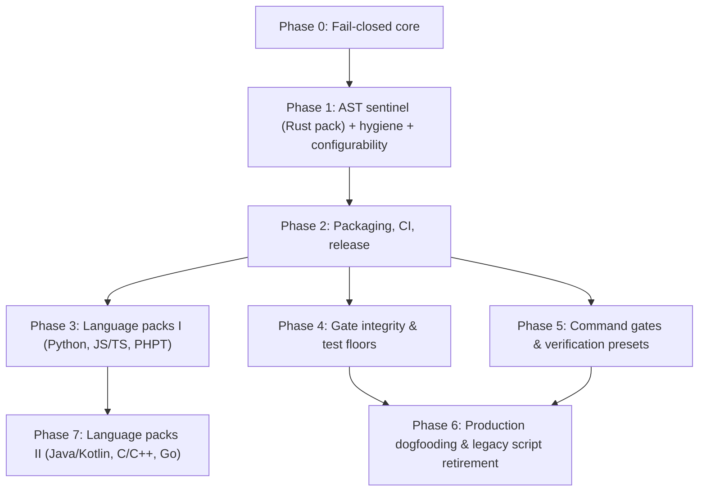

# Discipline Roadmap & Milestones

This document establishes the delivery phases, dependency graph, go/no-go gates, shipped gates, planned extensions, and outstanding checks for `discipline`.

**Superseded when:** A milestone completes, a new phase is initiated, or planned gate scope evolves. Update in place; do not fork.

---

## Dependency Graph

Phases 3, 4, and 5 depend upon Phase 2 and proceed in parallel.

---

## Shipped Gates

<!-- generated:gates -->
| Gate | Suite | Languages | Rule Description |
|---|---|---|---|
| `agents-md` | agent-guard | any | AGENTS.md exists; CLAUDE.md / GEMINI.md do not fork it |
| `assertion-reduction` | agent-guard | Rust, Python, JS/TS, PHPT, Java, Go, PHP, C/C++, C#, Ruby | assertion count / strength must not drop in an existing test |
| `vacuous-tests` | agent-guard | Rust, Python, JS/TS, PHPT, Java, Go, PHP, C/C++, C#, Ruby | new tests must carry a non-tautological assertion |
| `ignored-tests` | agent-guard | Rust, Python, JS/TS, PHPT, Java, Go, PHP, C/C++, C#, Ruby | tests must not be newly #[ignore]d or skipped without directive |
| `unsafe-safety-comment` | agent-guard | Rust | unsafe blocks / impls carry a // SAFETY: comment |
| `deletion-rationale` | agent-guard | any | deleted files and removed tests need a scoped removes: rationale |
| `time-estimates` | hygiene | any | no calendar / duration estimates in markdown or the PR body |
| `pii` | hygiene | any | no home paths, LAN IPs, or denylisted hostnames in tracked text |
| `agent-scratch` | hygiene | any | agent scratch state is never tracked |
| `shell-secrets` | hygiene | shell, docker, workflows | no command-line secrets or unverified piped scripts in shell, docker, or CI |
| `issue-link` | hygiene | any | PR title or description links a tracking issue (#123, Fixes #123) |
| `config-integrity` | integrity | any | a change cannot weaken its own discipline.toml without a token |
| `provenance-tags` | hygiene | any | published numerics carry (measured|target|projected) |
| `ci-integrity` | integrity | any | workflow weakening: continue-on-error, || true, unpinned actions |
| `test-floor` | integrity | any | test-count ratchet read from the base ref |
| `golden-output` | integrity | any | prevents stealth edits to committed golden/test output files without explicit override |
| `dependency-delta` | integrity | any | manifest diff inspection: zero wildcards, source/license allowlists, and deny.toml verification |
| `test-budget` | integrity | Rust, Python, JS/TS, Go, any | property-test and fuzz effort ratchet (cases, shrink iters, fuzztime, seed corpus) |
| `command` | verification | any | fail-closed wrapper for any tool: zero-tests guard, canary, count ratchet |
| `bench-regression` | bench | Rust, Go, Python, C/C++ | benchmark drift via harness adapters (deterministic counts or BCa intervals) |
| `archive-contents` | integrity | any | distribution archive must contain required paths and zero forbidden developer artifacts |
| `manifest-sync` | integrity | any | reconcile git-tracked files against packaging manifest declarations |
| `version-lockstep` | integrity | any | version declarations across headers, manifests, and files must remain in lockstep |
<!-- /generated -->

---

## Milestone Phases & Go / No-Go Gates

### Phase 0: Fail-Closed Core
- **Deliverables:** Three-state exit codes (`0`, `1`, `2`), three-state git context, merge-base diff inspection, strict layered configuration resolution, stable gate registry, line-anchored directive parsing, truthful reporting with examined counts.
- **Go / no-go gate:** Every invariant rule in the Fail-Closed Contract (F1–F12) has discriminating tests that fail if the behavior is removed.
- **Status:** **Completed & Verified**.

### Phase 1: Sentinel, Hygiene, Configurability
- **Deliverables:** AST gates on Rust pack, whole-tree hygiene sweeps (`time-estimates`, `pii`, `agent-scratch`), `agents-md` guide sentinel, full 5-layer configurability, unanalysed source reporting.
- **Go / no-go gate:** Positive and negative unit controls, e2e binary tests, embedded self-test cases, and mutation verification.
- **Status:** **Completed & Verified**.

### Phase 2: Packaging, Multi-Platform CI, Release
- **Deliverables:** Composite `action.yml` for GitHub, Gitea, and Forgejo Actions; pre-commit hooks (`.pre-commit-hooks.yaml`); GitLab CI component template; Argo Workflow template; Dockerfile container; automated multi-architecture release pipeline (`release.yml`).
- **Go / no-go gate:** `ci-gate` 100% green across all platforms; release pipeline builds verified static musl and macOS binaries with SHA-256 attestations.
- **Status:** **Completed & Verified**.

### Phase 3: Language Packs I (Fact Model Split)
- **Deliverables:** Tree-sitter extractor trait and language pack abstraction; Python pack (`test_*`, `unittest`, pytest markers); JavaScript / TypeScript pack (Jest, Vitest, Mocha matchers and callbacks); Golden (PHPT) pack.
- **Go / no-go gate:** Each language pack satisfies 4-point test discipline in its own language, including callback test renaming and assertion weakening detection.
- **Status:** **Completed & Verified**.

### Phase 4: Gate Integrity & Test Floors
- **Deliverables:**
  - `ci-integrity`: Workflow diff inspection detecting dropped jobs from `needs`, addition of `continue-on-error`, unpinned third-party actions, or stripped `-D warnings`.
  - `test-floor`: Test-count ratchet with baseline count read from merge-base ref; `allow-test-shrink:` directive.
  - `suppression-delta`: Catching net increases in compiler/linter suppression annotations (`#[allow]`, `@ts-ignore`, `# type: ignore`, `// NOLINT`).
  - `scope-confinement`: Restricting agent file modifications strictly within authorized directory boundaries.
- **Go / no-go gate:** Incident replays of historical workflow weakening and all-skipped test rollups are rejected with exit `1`.
- **Status:** **Completed & Verified** (`ci-integrity` and `test-floor` shipped; remaining gates planned).

### Phase 5: Verification Presets & Benchmark Adapters
- **Deliverables:**
  - `command`: Fail-closed execution wrapper for arbitrary external tools with canary checks, zero-test guards, and timeout limits.
  - Verification presets: `sanitizers` (ASan/TSan), `miri`, `msrv`, `unsafe-budget`.
  - Benchmark regression sentinel (`bench-regression` shipped with dual-file mode, two-tier threshold, and iai/json adapters).
- **Go / no-go gate:** Zero-test runs, missing baseline artifacts, and unprovenanced runs fail closed; deterministic counts and conservative bootstrap intervals discriminate regressions without false positives.
- **Status:** **Completed & Verified** (`command`, presets, and `bench-regression` shipped).

### Phase 6: Production Dogfooding
- **Deliverables:** Production deployment of `discipline.toml` in high-assurance consumer repositories; phased retirement of bespoke shell verification scripts.
- **Go / no-go gate:** Incident replay fixtures reproducing historical bypasses are caught by Discipline without regressing verification fidelity.
- **Status:** **Parity Achieved** (all 12 parity gaps shipped with zero false positives across historical PR corpus).

### Phase 7: Language Packs II
- **Deliverables:** Java / Kotlin pack (JUnit 5, AssertJ, Hamcrest); C / C++ pack (GoogleTest, Catch2); Go pack (`testing.T`, `testify`); PHP AST pack (PHPUnit, Pest).
- **Go / no-go gate:** 100% discriminating test coverage per language pack.
- **Status:** In progress (Java, Go, PHP, and C / C++ packs shipped; Kotlin planned).

---

## Outstanding Checks & Known Limitations

- **No external review:** The architecture and test coverage were established through internal pairing and rigorous self-tests. External review by independent systems engineers is an outstanding verification check.
- **Runner environment testing:**
  - GitHub Actions: verified on hosted Linux and macOS runners in CI.
  - Gitea Actions: tested via `act` runner images; testing on a physical production Gitea server is outstanding.
  - Forgejo Actions: verified under local and CI runner environments; testing against enterprise Forgejo clusters is outstanding.
  - GitLab CI: reusable component template linted and schema-validated; live GitLab runner execution is outstanding.
  - Argo Workflows: template linted; live Kubernetes cluster DAG execution is outstanding.
- **Macro opacity:** Tests generated dynamically inside complex macro bodies (`proptest! { ... }`, `quickcheck! { ... }`) are invisible to tree-sitter AST fact extractors without compilation expansion. Use `extra_assert_macros` and `assert_helper_fns` to configure macro vocabulary.
- **Grammar lag:** Source syntax newer than the bundled tree-sitter grammars is treated as a parse error, failing closed by design. Use `exempt_paths` until grammars are updated.
