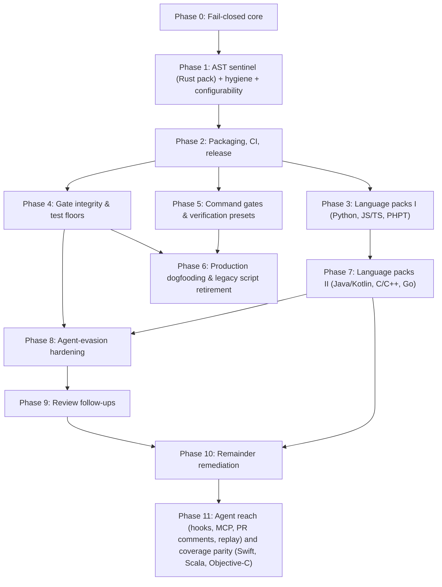

# Discipline Roadmap & Milestones

This document establishes the delivery phases, dependency graph, go/no-go gates, shipped gates, planned extensions, and outstanding checks for `discipline`.

**Superseded when:** A milestone completes, a new phase is initiated, or planned gate scope evolves. Update in place; do not fork.

---

## Dependency Graph

Phases 3, 4, and 5 depend upon Phase 2 and proceed in parallel. Phase 8 Tier 0 and Tier 1 depend only on Phase 4; Tier 2 adds facts to every language pack, so it follows Phase 7.

---

## Shipped Gates

<!-- generated:gates -->
| Gate | Suite | Languages | Rule Description |
|---|---|---|---|
| [`agents-md`](GATES.md#agents-md) | agent-guard | any | AGENTS.md exists; CLAUDE.md / GEMINI.md do not fork it |
| [`assertion-reduction`](GATES.md#assertion-reduction) | agent-guard | Rust, Python, JS/TS, PHPT, Java, Go, PHP, C/C++, C#, Ruby, Kotlin, Swift, Scala, Objective-C | assertion count / strength must not drop in an existing test |
| [`vacuous-tests`](GATES.md#vacuous-tests) | agent-guard | Rust, Python, JS/TS, PHPT, Java, Go, PHP, C/C++, C#, Ruby, Kotlin, Swift, Scala, Objective-C | new tests must carry a non-tautological assertion |
| [`ignored-tests`](GATES.md#ignored-tests) | agent-guard | Rust, Python, JS/TS, PHPT, Java, Go, PHP, C/C++, C#, Ruby, Kotlin, Swift, Scala, Objective-C | tests must not be newly #[ignore]d or skipped without directive |
| [`unsafe-safety-comment`](GATES.md#unsafe-safety-comment) | agent-guard | Rust | unsafe blocks / impls carry a // SAFETY: comment |
| [`deletion-rationale`](GATES.md#deletion-rationale) | agent-guard | any | deleted files and removed tests need a scoped removes: rationale |
| [`time-estimates`](GATES.md#time-estimates) | hygiene | any | no calendar / duration estimates in markdown or the PR body |
| [`pii`](GATES.md#pii) | hygiene | any | no home paths, LAN IPs, or denylisted hostnames in tracked text |
| [`agent-scratch`](GATES.md#agent-scratch) | hygiene | any | agent scratch state is never tracked |
| [`shell-secrets`](GATES.md#shell-secrets) | hygiene | shell, docker, workflows | no command-line secrets or unverified piped scripts in shell, docker, or CI |
| [`issue-link`](GATES.md#issue-link) | hygiene | any | PR title or description links a tracking issue (#123, Fixes #123) |
| [`commit-provenance`](GATES.md#commit-provenance) | hygiene | any | commits carry the required trailers; an agent-produced commit carries a review by someone else |
| [`config-integrity`](GATES.md#config-integrity) | integrity | any | a change cannot weaken its own discipline.toml without a token |
| [`stub-bodies`](GATES.md#stub-bodies) | agent-guard | Rust, Python, JS/TS, Go, Java, C#, PHP, Ruby, C/C++, Kotlin, Swift, Scala, Objective-C | added functions are not stubs; existing bodies are not replaced by todo!() / NotImplementedError / return null |
| [`error-swallowing`](GATES.md#error-swallowing) | agent-guard | Rust, Python, JS/TS, Go, Java, C#, PHP, Ruby, C/C++, Kotlin, Swift, Scala, Objective-C | no new empty error handler or discarded Result outside tests |
| [`instruction-smuggling`](GATES.md#instruction-smuggling) | agent-guard | any (invisible characters, instruction files); Rust, Python, JS/TS, Go, Java, C#, PHP, Ruby, C/C++, Kotlin, Swift, Scala, Objective-C and prose files (phrases) | no invisible Unicode, unreviewed agent-instruction edits, or instruction-like text in comments and prose |
| [`build-hooks`](GATES.md#build-hooks) | integrity | package.json, build.rs, setup.py, .npmrc, .pypirc, pip.conf, .cargo/config.toml, .env* | install and build hooks that gain network or shell access, and package-manager configuration edits, need a token |
| [`toolchain-config`](GATES.md#toolchain-config) | integrity | tsconfig, ruff, mypy, pytest, coverage, flake8, Cargo lints, rustflags, nextest, eslintrc, golangci, jest, codecov, phpstan, phpunit | compiler, linter, type-checker, test-runner and coverage configuration cannot be loosened without a token |
| [`scope-confinement`](GATES.md#scope-confinement) | agent-guard | any | changes stay inside authorized paths |
| [`suppression-delta`](GATES.md#suppression-delta) | agent-guard | per pack | newly added linter / compiler suppression annotations |
| [`provenance-tags`](GATES.md#provenance-tags) | hygiene | any | published numerics carry (measured|target|projected) |
| [`ci-integrity`](GATES.md#ci-integrity) | integrity | any | workflow weakening: continue-on-error, || true, unpinned actions |
| [`ci-skip-set`](GATES.md#ci-skip-set) | integrity | any | rollup skip set matches each job's `if:` under the observed filter outputs |
| [`test-floor`](GATES.md#test-floor) | integrity | any | test-count ratchet read from the base ref |
| [`golden-output`](GATES.md#golden-output) | integrity | any | prevents stealth edits to committed golden/test output files without explicit override |
| [`dependency-delta`](GATES.md#dependency-delta) | integrity | any | manifest diff inspection: zero wildcards, source/license allowlists, and deny.toml verification |
| [`test-budget`](GATES.md#test-budget) | integrity | Rust, Python, JS/TS, Go, any | property-test and fuzz effort ratchet (cases, shrink iters, fuzztime, seed corpus) |
| [`pr-checklist`](GATES.md#pr-checklist) | hygiene | any | ticked PR checkboxes are reconciled against the diff |
| [`command`](GATES.md#command) | verification | any | fail-closed wrapper for any tool: zero-tests guard, canary, count ratchet |
| [`sanitizers`](GATES.md#sanitizers) | verification | Rust, C/C++ | ASan / TSan preset with audited suppressions and a race canary |
| [`msrv`](GATES.md#msrv) | quality | Rust | cargo check under the pinned MSRV |
| [`miri`](GATES.md#miri) | verification | Rust | Miri tiers with zero-tests guard |
| [`unsafe-budget`](GATES.md#unsafe-budget) | verification | Rust | unsafe count ratchet |
| [`bench-regression`](GATES.md#bench-regression) | bench | Rust, Go, Python, C/C++ | benchmark drift via harness adapters (deterministic counts or BCa intervals) |
| [`archive-contents`](GATES.md#archive-contents) | integrity | any | distribution archive must contain required paths and zero forbidden developer artifacts |
| [`manifest-sync`](GATES.md#manifest-sync) | integrity | any | reconcile git-tracked files against packaging manifest declarations |
| [`version-lockstep`](GATES.md#version-lockstep) | integrity | any | version declarations across headers, manifests, and files must remain in lockstep |
<!-- /generated -->

---

## Milestone Phases & Go / No-Go Gates

### Phase 0: Fail-Closed Core
- **Deliverables:** Three-state exit codes (`0`, `1`, `2`), three-state git context, merge-base diff inspection, strict layered configuration resolution, stable gate registry, line-anchored directive parsing, truthful reporting with examined counts.
- **Go / no-go gate:** Every invariant rule in the Fail-Closed Contract (F1–F12) has discriminating tests that fail if the behavior is removed.
- **Status:** **Completed & Verified**.

### Phase 1: Sentinel, Hygiene, Configurability
- **Deliverables:** AST gates on Rust pack, whole-tree hygiene sweeps (`time-estimates`, `pii`, `agent-scratch`), `agents-md` guide sentinel, full 5-layer configurability, unanalysed source reporting.
- **Go / no-go gate:** Positive and negative unit controls, e2e binary tests, embedded self-test cases, and mutation verification.
- **Status:** **Completed & Verified**.

### Phase 2: Packaging, Multi-Platform CI, Release
- **Deliverables:** Composite `action.yml` for GitHub, Gitea, and Forgejo Actions; pre-commit hooks (`.pre-commit-hooks.yaml`); GitLab CI component template; Argo Workflow template; Dockerfile container; automated multi-architecture release pipeline (`release.yml`).
- **Go / no-go gate:** `ci-gate` 100% green across all platforms; release pipeline builds verified static musl and macOS binaries with SHA-256 attestations.
- **Status:** **Completed & Verified**.

### Phase 3: Language Packs I (Fact Model Split)
- **Deliverables:** Tree-sitter extractor trait and language pack abstraction; Python pack (`test_*`, `unittest`, pytest markers); JavaScript / TypeScript pack (Jest, Vitest, Mocha matchers and callbacks); Golden (PHPT) pack.
- **Go / no-go gate:** Each language pack satisfies 4-point test discipline in its own language, including callback test renaming and assertion weakening detection.
- **Status:** **Completed & Verified**.

### Phase 4: Gate Integrity & Test Floors
- **Deliverables:**
  - `ci-integrity`: Workflow diff inspection detecting dropped jobs from `needs`, addition of `continue-on-error`, unpinned third-party actions, or stripped `-D warnings`.
  - `test-floor`: Test-count ratchet with baseline count read from merge-base ref; `allow-test-shrink:` directive.
  - `suppression-delta`: Catching net increases in compiler/linter suppression annotations (`#[allow]`, `@ts-ignore`, `# type: ignore`, `// NOLINT`).
  - `scope-confinement`: Restricting agent file modifications strictly within authorized directory boundaries.
- **Go / no-go gate:** Incident replays of historical workflow weakening and all-skipped test rollups are rejected with exit `1`.
- **Status:** **Completed & Verified** (`ci-integrity`, `test-floor`, `suppression-delta`, and `scope-confinement` shipped).

### Phase 5: Verification Presets & Benchmark Adapters
- **Deliverables:**
  - `command`: Fail-closed execution wrapper for arbitrary external tools with canary checks, zero-test guards, and timeout limits.
  - Verification presets: `sanitizers` (ASan/TSan), `miri`, `msrv`, `unsafe-budget`.
  - Benchmark regression sentinel (`bench-regression` shipped with dual-file mode, two-tier threshold, and iai/json adapters).
- **Go / no-go gate:** Zero-test runs, missing baseline artifacts, and unprovenanced runs fail closed; deterministic counts and conservative bootstrap intervals discriminate regressions without false positives.
- **Status:** **Completed & Verified** (`command`, presets, and `bench-regression` shipped).

### Phase 6: Production Dogfooding
- **Deliverables:** Production deployment of `discipline.toml` in high-assurance consumer repositories; phased retirement of bespoke shell verification scripts.
- **Go / no-go gate:** Incident replay fixtures reproducing historical bypasses are caught by Discipline without regressing verification fidelity.
- **Status:** **Parity Achieved** (all 12 parity gaps shipped with zero false positives across historical PR corpus).

### Phase 7: Language Packs II
- **Deliverables:** Java / Kotlin pack (JUnit 5, AssertJ, Hamcrest); C / C++ pack (GoogleTest, Catch2); Go pack (`testing.T`, `testify`); PHP AST pack (PHPUnit, Pest).
- **Go / no-go gate:** 100% discriminating test coverage per language pack.
- **Status:** Complete (Java, Kotlin, Go, PHP, and C / C++ packs shipped).

### Phase 8: Agent-Evasion Hardening
Candidate work from a review of discipline as a safety net against autonomous coding agents. The review's central finding: the detectors are strong, and the trust boundary around them is the cheaper target. A change that can switch its own run to advisory, or grant itself every override, does not need to beat an AST gate. Tiers are ordered; within a tier, items are independent.

**Tier 0: the gates' own trust boundary.** Blocks the value of every later tier.

| Item | Gap | Status |
|---|---|---|
| Advisory self-switch | `mode = "advisory"` in the change's own `discipline.toml` made the run exit 0 | **Shipped**: reported by `config-integrity` under `[meta]`, and not honoured until it is on the base side or `allow-gate-weakening: meta` lifts it |
| Guard self-disable | `[gates.config-integrity] enabled = false` (or `severity = "note"`) silenced the report of the change's own weakenings | **Shipped**: enablement is read from the base configuration; findings use the stricter of the base and head severity |
| Unclassified options | Most gate options had no loosening direction, among them `min_tests`, `max_increase`, `workflows`, `forbidden_paths`, `deny_dependencies`, `allowed_override_actors`, and every `command` | **Shipped**: one direction table covers every option; a unit test fails on any option the table does not name |
| Action `advisory` input | `advisory: true` on the action step, or `--advisory` on a `discipline check` run line, was invisible to `ci-integrity` | **Shipped** |
| Other forges' workflows | `ci-integrity` read `.github/workflows/` only | **Shipped**: `.gitea/` and `.forgejo/` workflows share the Actions rules; GitLab pipelines have their own base-versus-head diff (`src/guards/ci_gitlab.rs`). Open: what a pipeline pulls in through `include:`, and narrowed `rules:` |
| Self-granted overrides | The PR body and commit bodies are written by the change author, `fail_on_overrides` defaults to false, and nothing capped the count | **Shipped**, opt-in: `directives.max_overrides` is a per-change budget; `directives.require_approval` makes directive overrides fail until the forge shows an approving review of the head commit by an `allowed_override_actors` member who is not the author (read-only, through `src/forge.rs`; exit 2 when it cannot be read). GitLab approvals are open |
| Policy from the base ref | The change is judged by its own `discipline.toml` | **Shipped**, opt-in: `--policy-from base` / action input `policy_from: base`; `ci-integrity` reports the input being moved off `base`. Chosen over signing the file: a verifying key kept in the repository is writable by the same change, and verification needs a cryptography dependency |
| `doctor` enforcement | `discipline doctor` (required check, CODEOWNERS, non-blocking jobs) ran in no workflow here | **Shipped** for the local checks: the `dogfood` job runs `doctor --local-only --strict`, under which an uncovered CODEOWNERS target fails. `doctor` also reports the branch's review rules (`review`, `code-owner-review`, `last-push-approval`). Running the forge-side checks in CI needs a token that can read branch protection and is open |

**Tier 1: coverage from existing machinery** (base-versus-head structural diffs; no new AST facts).

- **`toolchain-config` gate.** **Shipped** (`src/guards/toolchain_config.rs`): tsconfig, ruff, mypy, pytest, coverage.py, flake8, Cargo `[lints]`, rustflags, nextest, eslintrc, golangci-lint, jest, codecov, phpstan and phpunit, diffed base against head under one rule table; coverage floors, retries and test-selection narrowing included; a configuration written as code is reported as changed, not analysed. Open: `clippy.toml` (its options are thresholds with no single direction), what a file pulls in through `extends` / presets, and a list appearing where none was.
- **`golden-output` coupling.** **Shipped:** default globs cover `__snapshots__/`, `*.ambr`, `*.approved.*` and `*.golden`; a change that rewrites expectations while nothing producing output changed has its own title; the message states the lines rewritten. Open: added snapshot files are still skipped, because telling a snapshot for a new test from one added to an existing test needs the test-to-snapshot mapping of each framework.
- **Lockfile integrity in `dependency-delta`.** **Shipped** for `Cargo.lock`, `package-lock.json` and `yarn.lock` v1 (`src/guards/lockfile.rs`): entry from a new source, dropped integrity hash, manifest changed without its lockfile, lockfile deleted. Open: the other lockfile formats (named as not analysed), and extending the `ci-integrity` `--locked` rule to `npm ci`, `--frozen-lockfile`, `--require-hashes` and `uv sync --locked`.
- **`suppression-delta` on AST facts.** **Shipped:** the gate reads `ParsedFileFacts.escape_hatches` from every pack and compares each changed file's head side with its base side as a multiset, so a moved site is not new and a marker inside a string is not a site. The Rust pack now extracts `#[allow]` / `#[expect]`, the Java pack reads `@SuppressWarnings` as an annotation node, JS gains `@ts-nocheck`, Go gains `//lint:ignore`.
- **Existing-gate corrections.** **Shipped:** `test-floor` counts tests that run (unconditionally ignored tests are left out on both sides) and names files it could not read or that parse with errors. Open: `test-budget` extracts with line patterns (contrary to the AST-aware rule); an assertion under a constant-false branch, or after an unconditional `return`, counts in full.

**Tier 2: new AST facts.** Packs are hand-written visitors, so each fact is written once per language. Prerequisite, **shipped**: `LanguagePack::supplies(Fact)`; a gate that needs a fact a pack does not supply names the file as not analysed.

- **`stub-bodies`.** **Shipped** for Rust, Python, JS/TS, Go, Java and C# (`src/ast/functions.rs`, one walker and classifier with per-language tables; `src/guards/stub_bodies.rs`): an added function whose whole body is a stub marker, and an existing substantive body replaced by a stub, an empty body or a bare constant return. Abstract, overload, Protocol, interface and test members are excluded. Open: PHP, Ruby and C/C++ function facts (their files are named as not analysed); a stub padded with a second statement.
- **Mock infiltration.** **Shipped** (`src/ast/mocks.rs`): each test carries `mock_setups` and `mock_asserts`, counted from the call nodes inside its body against a shared vocabulary that `mock_setup_fns` / `mock_assert_fns` extend. `vacuous-tests` reports a new test whose every assertion is on a double's interactions; `assertion-reduction` reports an existing test whose doubles rose while its assertions on real output did not. Both at warning. Rust, Python, JS/TS, Go, Java, C#.
- **Error swallowing.** **Shipped** as the `error-swallowing` gate (`src/ast/handlers.rs`): a new empty handler (`except: pass`, `catch (e) {}`, bare return) or a discarded result (`let _ = f()`, `f().ok()`, Go `_ = err`, `x, _ := f()`) outside tests, base against head per file. Rust, Python, JS/TS, Go, Java, C#. Open: a handler that logs and swallows.
- **Retry annotations.** **Shipped** through `ignored-tests` (`src/ast/retries.rs`): a test that gains a retry / flaky marker, or arrives with one, is `Test Retries On Failure`; a file-level `jest.retryTimes` marks every test in the file. CI-level retry wrappers stay with `ci-integrity` / `toolchain-config` (nextest `retries`, pytest `--reruns`).

**Tier 3: governance.**

- **`instruction-smuggling` gate.** **Shipped** (`src/guards/instruction_smuggling.rs`; `Fact::Prose` in `src/ast/prose.rs`): (1) zero-width, bidirectional and tag characters in added lines, blocking; (2) any edit to an agent-instruction file needs `allow-agent-instructions:`, blocking; (3) instruction phrases, role markers, concealment, exfiltration, reviewer steering and long base64 runs in comments, strings and prose files, warning. Findings name the location and a class, never the text. Audited: `--format agent-prompt` prints titles, messages and locations only, never override reasons; `suppression-delta` still quotes the annotation line, recorded in ARCHITECTURE §10. Open: prose spans for PHP, Ruby and C/C++ packs.
- **`commit-provenance` gate.** **Shipped**, default off (`src/guards/commit_provenance.rs`): required trailers; an agent-identified commit (trailer, author name or email against `agent_markers`) needs a `Reviewed-by:` naming someone other than its author. `doctor` now reports `review`, `code-owner-review` and `last-push-approval` from rulesets and classic protection. Verifying signatures in the binary stays declined (cryptography dependency and a trusted keyring); git notes are not fetched by CI checkouts.
- **Registry verification of new dependencies: declined.** A lookup of package existence and first-publish date needs a network path beyond the forge API, which `AGENTS.md` §3.3 forbids, and it would send internal package names to public registries. Lockfile integrity (Tier 1) is the offline control; existence and advisory checks stay with the `command` presets. Reopen only with a design that keeps private names on the runner.

- **Go / no-go gate:** each item meets the gate contract in `AGENTS.md` §3.4: positive and negative unit controls, an end-to-end case through the binary, a `self-test` case, and a named test that kills a mutated detector. A Tier 2 item additionally names every pack that does not supply its fact.
- **Status:** shipped. Tiers 0-3 landed in v0.8.0 and v0.9.0; every remainder those releases named (GitLab `include:` / `rules:`, GitLab approvals, forge-side `doctor` in CI, `clippy.toml`, added snapshot files, the other lockfile formats, `extends` inheritance, the PHP / Ruby / C / C++ facts, the Kotlin pack, padded stubs, logging swallows, `test-budget` on AST facts, unreachable assertions) is a Phase 10 row and shipped in v0.10.0, with the single partial noted there (forge-side `doctor` under `--strict`).

### Phase 9: Review Follow-Ups
Items from an external written review of Phase 8 (2026-09-21), each checked against the code before acting. The review's "strengths" section was right on the gates and wrong on their reach (six languages for the new facts, not "9+"; `agent_diff` is a module, not a gate).

| Review point | Verdict | Status |
|---|---|---|
| Assertion-free tests, tautologies, mocking the system under test | Already covered by `vacuous-tests` (`Vacuous Test Added`, constant-expression tautologies) and the Phase 8 mock rules. The example `assert val is not None` was a real miss: a near-tautology that counts as an assertion. | **Shipped**: `Test Asserts Only Trivial Properties` (`src/ast/calls.rs`, warning) |
| Assertion density, mutation analysis | `min_assertions_per_test` exists. In-binary mutation stays declined: the `command` gate's mutation presets are the control. | Declined |
| Package hallucination / slopsquatting | Correct description. Decided offline-only in Phase 8 (§3.3; a lookup discloses internal names). | Declined; see the note below |
| Build hooks and dotfiles | Correct and the largest gap. | **Shipped**: `build-hooks` gate |
| Delay-based concurrency patching | Correct. | **Shipped**: `Test Sleeps` through `ignored-tests` (warning) |
| Reviewer-bot injection in PR descriptions | `instruction-smuggling` already carried `reviewer-steering` for code and prose files; it did not read the PR body or commit messages. | **Shipped**: change-description scan, directive lines excluded |

- **Registry lookup, revisited.** An opt-in `dependency-delta.verify_registry` (default off) that asks crates.io, npm and PyPI whether a newly added direct dependency exists and when it was first published is implementable on the forge client (`src/forge.rs`: TLS, redirect pinning, body cap, `DISCIPLINE_NO_NETWORK`, exit 2 when unreachable). It stays declined until three things are settled: `AGENTS.md` §3.3 must be amended in the same PR; the names it sends are the change's new dependencies, which for a private monorepo means internal package names reaching a public registry, so a `private_prefixes` skip list is a precondition, not an option; and the lookup runs on every check of every PR that adds a dependency, so rate limits and outages become CI failures (exit 2), which the fail-closed contract requires. Lockfile integrity remains the offline control. Reopen when a consumer asks for it with those three answered.
- **Go / no-go gate:** as Phase 8.
- **Status:** shipped (`build-hooks`; sleeps, trivial assertions and change-description scanning in existing gates).

### Phase 10: Remainder Remediation
Every item Phases 7 to 9 left named as open, in one ordered plan. Each row is the whole remaining work for that item; a row ships when its gate criterion holds and the AGENTS.md §3.4 contract is met (unit controls, e2e through the binary, self-test case, a named test that kills a mutated detector). Rows in one step are independent of each other; a step depends on the step before it only where stated.

**Step 0: false positives from the first consumer replay** (before anything else: each is a v0.8.0 finding a real repository's CI had already judged correct, checked against the code on 2026-09-21; a gate that blocks correct changes is held at `warning` by that consumer until these ship)

| Item | Verified against the code | Work | Ships when |
|---|---|---|---|
| A consumer cannot declare its own test entry points | **Shipped** (`[tests] functions` / `paths`). Yes: the pytest-collection rule makes a script's `self_test()` production code, and `error-swallowing`, `pii` and the assertion gates all read that boundary; today's workaround is `assert_helper_fns` | One declaration, `[languages.<lang>] test_functions = [...]` and a gate-independent `test_paths`, honoured by every gate that separates test code from production code (`TestFn` collection, `handlers::extract`'s `is_test_line`, `pii`'s scope) | One setting removes the three families of findings from the consumer's replay; three gate-local options are not added |
| `error-swallowing`: expect-this-to-raise | **Shipped.** Yes: `try` / `except: pass` / `else: raise` and `except: continue` followed by a recorded failure are empty handlers to `handlers.rs` | A `try` whose `else:` raises, or whose fall-through records a failure, is an assertion, not a swallow: read the sibling `else` clause and the statement after the `try` | The quoted snippets are silent; a bare `except: pass` in a library module still fails |
| `error-swallowing`: a tuple binding is not a call | **Shipped.** Yes: `rust_discards` accepts any `let _ =` whose right side contains `(`, so `let _ = (word, alloc);` is reported as a discarded result | Report `let _ =` only when the right side is a call expression (AST node, not text) | The tuple is silent; `let _ = file.sync_all();` still fails |
| `error-swallowing`: Cargo `tests/`, `benches/`, `examples/` are test scope | **Shipped.** Yes: test scope is the `TestFn` spans only, so a helper in `crates/x/tests/*.rs` is production code | `is_test_line` also true for every line of a file under those directories (and the other packs' equivalents via `functions::test_path`) | `let _ = catch_unwind(...)` in an integration test is silent |
| `unsafe-safety-comment`: `unsafe trait` documented by rustdoc | **Shipped** (heading required; a run-walk pairing bug in the comment collector, exposed by the fix, is fixed with it). Yes: an `unsafe trait` is an unsafe site requiring `// SAFETY:`; a doc comment with a `# Safety` section (the convention clippy's `missing_safety_doc` checks) is not accepted | Accept a preceding doc comment containing a `# Safety` heading for `unsafe trait` and `unsafe fn`; decide and document whether a contract stated without the heading counts (recommendation: no) | The quoted `OlcEngine` trait is silent |
| `stub-bodies`: abstract base-class methods | **Shipped.** Yes: the skip covers `@abstractmethod` and `Protocol` / `TypedDict` / `NamedTuple` bases, not `abc.ABC` nor a method overridden by a subclass in the same file | Skip a stub in a class deriving from `ABC` / `ABCMeta`, and one whose name a same-file subclass overrides | `bump_version.py`'s base-class pair is silent |
| `time-estimates`: past-interval phrasing | **Shipped.** Yes: "N units later" is exempt, "the N-unit gap between" two past events is not | Extend the terms-of-art list with the past-interval forms (`N-unit gap between`, `N units between`, past-tense equivalents) | The quoted README line is silent; a forward-looking "ships in N units" still fails |
| `--whole-tree` records delta-only rules | **Shipped** (`DELTA_ONLY_GATES` in `src/guards/mod.rs`; symlinks skipped in `changed_files`). Yes: a whole-tree baseline diffs against an empty tree, so `New Direct Dependency Added`, `Agent Instructions Changed` and `Test Arrives Ignored` fire for every file, and symlinked `CLAUDE.md` / `GEMINI.md` are recorded separately | In whole-tree mode, gates whose rule describes a delta report nothing (each `GateOutcome` names itself delta-only); a symlink resolves to its target once | The consumer's baseline records no delta-only rule |
| `provenance-tags`: what satisfies a ratio, and `diff_only` | **Shipped** (`ratio_satisfied_by`, `deterministic_units`, `diff_only`). Policy disagreement, not a defect: the consumer's paragraph-scoped rule accepts an interval, a results artifact reference, or a `superseded` / `unsourced` / `provisional` marker, and exempts deterministic units | `ratio_satisfied_by = ["interval", "artifact:<glob>", "marker:<word>"]` and `deterministic_units`, default unchanged; `diff_only` as on the other hygiene gates | With a config expressing the consumer's rule, the gate agrees with its script on every tracked Markdown line |
| Wiring recipes | **Shipped** (`docs/guides/ci-platforms.md`, two sections: rollup skip-set wiring, benchmark job wiring). Documentation | A complete `ci-skip-set` rollup job (`DISCIPLINE_CI_CONTEXT` from `toJson(needs)` plus path-filter outputs, and the `if:` forms modelled) and a `bench-regression` job (merge base and head measured with iai-callgrind, `require_sourced_override`, which citation-freshness rules are enforced) in `docs/guides/ci-platforms.md` | The consumer retires its two remaining scripts against the recipes |

Acceptance for Step 0 as a whole: the consumer's 100-PR replay with its config, the test-entry declaration and `error-swallowing` at `error` blocks only on `instruction-smuggling` `AGENTS.md` edits, its three true positives and its two deliberate `|| true` lines.

**Step 1: parity of the new facts across packs** (the Tier 2 remainder; every later step benefits)

| Item | From | Work | Ships when |
|---|---|---|---|
| Function, handler and prose facts for PHP, Ruby and C/C++ | **Shipped** (`PHP_FUNCTIONS` / `RUBY_FUNCTIONS` / `C_FUNCTIONS` and the matching handler, mock, retry and prose specs; PHP `@` and Ruby `rescue nil` are `Error Silenced`, C/C++ `(void)call()` is `Result Discarded`). Tier 2, Tier 3 | Fill `FunctionSpec`, `HandlerSpec`, mock/call kinds and prose kinds in `src/ast/php.rs`, `ruby.rs`, `c_cpp.rs`; classifiers exist in `functions.rs` (`classify_php`, `classify_ruby`, `classify_c`); set `supplies()` for `Functions`, `Handlers`, `Prose` | `stub-bodies`, `error-swallowing` and `instruction-smuggling` report no "supplies no facts" note on a `.php`, `.rb`, `.c` / `.cpp` change, and the pack tests mirror the six existing ones |
| Kotlin pack | **Shipped** (`src/ast/kotlin.rs` behind the default `lang-kotlin` feature, grammar `tree-sitter-kotlin-ng`). Phase 7 | New `src/ast/kotlin.rs` behind `lang-kotlin`: `@Test` / `@ParameterizedTest`, JUnit / AssertJ / Kotest matchers, `@Disabled` / `@Ignore`, `@Suppress`, plus the four new facts | The four-point contract per language holds, `docs/GATES.md` language table no longer lists Kotlin as planned, `UNSUPPORTED_SOURCE_EXTS` drops `kt` / `kts` |

**Step 2: precision of existing detectors** (Tier 1 and Tier 2 corrections; independent of Step 1)

| Item | From | Work | Ships when |
|---|---|---|---|
| `test-budget` on AST facts | **Shipped** (`src/ast/budgets.rs`, `Fact::Budgets`; Rust, Python, JS/TS packs; scripts and workflows stay line-based). Tier 1 | Replace the line patterns in `src/guards/test_budget.rs` with pack facts: a `Fact::Budgets` (proptest `cases`, quickcheck `tests`, hypothesis `max_examples`, fast-check `numRuns`) read from call and attribute nodes | The `min_tests = 40` fixture class cannot recur (a budget inside a string or comment is not a budget); existing e2e cases pass unchanged |
| Unreachable assertions | **Shipped** (`src/ast/reach.rs`, every pack). Tier 1 | In each pack's assertion walk, do not count an assertion under a constant-false condition or after an unconditional `return` / `panic!` / `pytest.skip()` at the same block level; reuse the Rust constant-expression check | `assert_eq!` inside `if false {}` and after `return` counts 0; a self-test case pins each |
| Padded stubs | **Shipped** (`functions::classify_body`, shared `inert_statement`). Tier 2 | `BodyShape::Stub` also when a body is a stub marker plus statements that cannot affect the result (logging, a bare assignment, `println!`), judged per language | `fn f() { log::warn!("todo"); todo!() }` is a stub; `fn f() { init(); todo!() }` is not |
| Logging swallow | **Shipped** (`handlers::body_swallows` returns the kind; `LOGGING_VOCAB` shared with the stub classifier). Tier 2 | In `handlers.rs`, a handler whose statements are all logging calls (`log.`, `logger.`, `console.error`, `eprintln!`, `warn!`) and no re-raise, return of the error, or state change is `Empty Error Handler Added` with a "logs and swallows" message | The e2e negative control keeps a handler that logs **and** re-raises silent |

**Step 3: coverage of files and forges** (Tier 0 and Tier 1 remainders)

| Item | From | Work | Ships when |
|---|---|---|---|
| Other lockfile formats | **Shipped** (`src/guards/lockfile.rs`: pnpm, Yarn 2+, poetry, uv, composer, Gemfile). Tier 1 | `parse_lock` for `pnpm-lock.yaml`, `poetry.lock`, `uv.lock`, `composer.lock`, `Gemfile.lock`, Yarn 2+ (`__metadata:`); `go.sum` stays exempt | Each format has a source-swap and a dropped-hash test; the "not analysed" note is gone for them |
| Frozen-install flags in CI | **Shipped** (`Frozen Install Flag Dropped`, `Install Command Softened`). Tier 1 | Extend the `ci-integrity` `--locked` rule to `npm ci` → `npm install`, `--frozen-lockfile`, `--immutable`, `--require-hashes`, `uv sync --locked` / `--frozen`, `poetry install --no-update` | A dropped flag or a softened install command is `Cargo Flag Dropped`-class finding under its own title |
| Added snapshot files | **Shipped** (`Snapshot Added For Existing Test`; Jest, insta, syrupy / pytest-snapshot). Tier 1 | In `golden-output`, an added snapshot whose name maps to a test that already existed on the base side (Jest `__snapshots__/<file>.snap` keyed by test title, insta `<module>__<test>.snap`, pytest-snapshot `<test>.ambr`) is reported; a snapshot for a new test is not | Two e2e cases per framework: new test + new snapshot silent, existing test + new snapshot reported |
| GitLab `include:` and `rules:` | **Shipped** (local includes followed; `Verification Job Narrowed`). Tier 0 | `ci_gitlab.rs` follows `include: local:` files in the same tree (never `project:` / `remote:`, which are named as not read) and reports a `rules:` / `only:` / `except:` change on a verification job as `Verification Job Narrowed` | A local include that adds `allow_failure` is reported; a remote include is a note |
| `clippy.toml` | **Shipped**. Tier 1 | Per-key direction table for the threshold keys (`too-many-arguments-threshold`, `cognitive-complexity-threshold`, `type-complexity-threshold`, ... all `Cap`); `allowed-*` lists `Grown`; `disallowed-*` lists `Shrunk` | Raising a threshold or growing an allow list is `Toolchain Configuration Weakened` |
| `toolchain-config` inheritance | **Shipped** (`inherited_changes`). Tier 1 | Report a changed `extends` / `plugins` / `presets` entry as `Toolchain Configuration Changed (not analysed)` at warning, the same way a configuration written as code is | An `extends` swap is never silent |

**Step 4: forge-side enforcement** (Tier 0 remainders; needs a token that can read branch protection and pull-request reviews)

| Item | From | Work | Ships when |
|---|---|---|---|
| Forge-side `doctor` in CI | **Partial**: the `dogfood` job runs `discipline doctor` against the forge with the workflow's read token (rulesets are readable without a secret) and its findings are in the log; `--strict` waits on a second reviewer account: the branch rules now block deletion and require pull requests (`deletion`, `pull-request`, `last-push-approval` Pass), but `review` and `code-owner-review` need a required approving review, which a solo-maintained repository cannot require without blocking its own merges; the bypass list and the merge methods are shown to push or admin tokens only, so `bypass` is Warn under the workflow token and `push-trigger` is Info because `merged-pr-body` is on. Tier 0 | A `doctor` job in `ci.yml` with a fine-grained token (read: administration, pull requests) stored as a repository secret, `--strict`, on `main` pushes only | The job is in `ci-gate`'s `needs` and the asserted job count; `required-check`, `review`, `code-owner-review`, `last-push-approval` are Pass on this repository |
| GitLab approvals in `require_approval` | **Shipped** (`forge::gitlab_approvers`; the pull context comes from `CI_MERGE_REQUEST_IID` / `CI_MERGE_REQUEST_SOURCE_BRANCH_SHA`). Tier 0 | `pull_approvers` for `ForgeKind::GitLab`: `projects/{id}/merge_requests/{iid}/approval_state`, matched on the head SHA of the approval rule | The `FakeForge` e2e has a GitLab variant; an approval of an earlier SHA is refused |

**Step 5: PR-body waivers on a push to the default branch** (from a consumer's replay at v0.9.0: a pull request whose body carried `allow-agent-instructions: AGENTS.md <reason>` passed on `pull_request`, was squash-merged, and the `push` run on `main` — base from `github.event.before` — failed on the same edit because a squash or rebase merge builds the commit message from the branch's commits, not from the body, and a merge commit's default message does not carry it either; every PR-body directive reproduces this)

| Item | From | Work | Ships when |
|---|---|---|---|
| Say why a waiver is missing on a push | **Shipped** (`check` appends the push note to every directive-liftable finding and the gate notes). Consumer replay | On a push (or `--commit` / `--commit-range`) run, a violation the matching directive would have lifted names the event and says PR-body directives are not in scope; the remediation names commit-message directives and the `merged-pr-body` source instead of a PR body the run never reads | The replay of the consumer's merge as a push says why it failed |
| Event / source matrix in the docs | **Shipped** (CONFIGURATION.md Override Directives and Action Reference, ci-platforms.md §8, README quickstart note). Consumer replay | `docs/CONFIGURATION.md` (action reference and directives) and `docs/guides/ci-platforms.md` state which sources each event sees (`pull_request`: body and branch commits; `push`: pushed commits, plus `merged-pr-body` once shipped), that squash and rebase merges drop the body, and the recommended trigger set; the README quickstart comment covers the push case next to `edited` | The matrix is in both documents |
| `ci-integrity`: a narrowed verification step | **Shipped** (`Verification Step Narrowed`, warning). Consumer workaround | A newly added or narrowed step-level `if:` on a verification step (including the discipline step) is `Verification Step Narrowed` at `warning`, liftable with `allow-gate-weakening: ci-integrity <reason>` | A diff adding `if: github.event_name == 'pull_request'` to a verification step is reported |
| `merged-pr-body` directive source | **Shipped** (`forge::merged_pull_for_commit`, `tokens::extract_directives_with_merged`, `directives.degrade_offline`; on by default). Consumer replay | On a push event, each commit in the range resolves its merged pull request through the forge client (GitHub `commits/{sha}/pulls`, Gitea / Forgejo `commits/{sha}/pull`, GitLab `repository/commits/:sha/merge_requests`) and its body is read under the same trust rules as on the pull request (line-anchored, `allow_hidden`, scoped subjects, `allowed_override_actors` against the PR author, `max_overrides`, `require_approval`); on by default for push events, reported in the notes with the PR number; a direct push keeps commits only; an unreachable forge or a token without permission is a named note with the finding standing (`directives.degrade_offline`, default `true`, fail-closed), or `could not check` (exit 2) when set to `false` | A squash-merge commit whose PR body carries the waiver passes on push; the same commit with a body lacking it fails; a direct push fails; the GitLab / Gitea / Forgejo lookups have unit coverage |
| `doctor` flags the configuration | **Shipped** (`push-trigger` finding: Warn when squash or rebase is allowed and `merged-pr-body` is not in `directives.sources`, Info when the source is on (the push run then needs a token that reads pull requests), Pass when only merge commits are, Unknown when the API does not say; `--local-only` names the trigger). Consumer replay | When a workflow runs the discipline action (or `discipline check`) on `push` to the default branch and the branch's merge method allows squash or rebase, a `Warn` finding names the fix: enable `merged-pr-body`, restrict the step to `pull_request`, or put directives in commit messages | The consumer's `ci.yml` as it stood is reported |

- **Go / no-go gate:** as Phase 8; the `merged-pr-body` source ships with the offline behaviour decided and documented, never as a silent pass.
- **Status:** shipped in v0.10.0, in the order listed (the message and docs first, the source second, `doctor` last).

**Declined, and stays declined unless the stated condition changes:** registry verification of new dependencies (Phase 9 note: needs a `private_prefixes` contract, accepts registry outages as CI failures, and an amendment to `AGENTS.md` §3.3); in-binary mutation analysis (the `command` gate's presets are the control); in-binary commit-signature verification (cryptography dependency and a trusted keyring; `doctor` reads the branch rule).

- **Go / no-go gate:** as Phase 8; additionally, Step 1 ships all three packs together or names in `docs/GATES.md` which fact each pack still lacks.
- **Status:** shipped in v0.10.0 (Steps 0-5), with one row partial: the forge-side `doctor` step runs in CI but not under `--strict`, which needs a second reviewer account (the branch rules now block deletion and require pull requests). Order followed: Step 0 (correctness for a live consumer), Step 1 (it widened what every later step covers), Step 2, Step 5 (a second consumer-replay correctness item, ahead of coverage work), Step 3, Step 4.

### Phase 11: Agent Reach and Coverage Parity
What most widens adoption after v0.10.2: findings reaching an agent inside its edit loop and a reviewer on every forge, a one-command preview for a new repository, then the pack-parity and language gaps and the two live checks. The detection catalogue is not extended here. Each row ships when its gate criterion holds and the AGENTS.md §3.4 contract is met (unit controls, e2e through the binary, self-test case, a named test that kills a mutated detector).

**Step 0: live checks** (no code; evidence recorded in Outstanding Checks)

| Item | Status | Work | Ships when |
|---|---|---|---|
| Consumer replay of the `merged-pr-body` push event | **Done** (RUN 2026-09-22) | Replay the consumer's squash merge of its #1071 as a push (base `020ec7a4`, head `a8eb5e30`, `GITHUB_EVENT_NAME=push`, a token that reads pull requests) with a build of `main` after #153; control with `DISCIPLINE_NO_NETWORK=1` | Forge reachable: `errors: 0`, one override, the `Agent Instructions Changed` finding on `AGENTS.md` lifted by the directive read from merged pull request #1071, every gate noting the pull request. Offline: `errors: 1` (the same finding), each gate noting `merged-pr-body: not read`. Both held. |
| Gitea Actions on a production server | Open | A private Gitea instance already runs the job-container recipe (`container: image:` pinned by tag and digest, `refs/pull/<n>/head` checkout) on `pull_request` and `push`. Record: the Gitea and `act_runner` versions; a clean pull-request run; an inverted canary (a pull request seeding a known violation) whose report names the expected gate ids; a push run to the default branch whose notes read the merged pull request through `commits/{sha}/pull`; `discipline doctor` against that instance's API | The five records exist and are summarised in Outstanding Checks without naming the instance or repository |

**Step 1: the agent loop** (uses output the binary already produces; `diff` and `check --staged` are the fast path)

| Item | Status | Work | Ships when |
|---|---|---|---|
| Agent hook recipes | **Shipped** (`discipline hook run` / `hook install`, `src/hook.rs`; Claude Code, Codex, Cursor, Aider, Copilot CLI, Antigravity, Qwen Code, OpenCode) | `discipline hook install --agent <claude-code\|cursor\|codex\|aider>` writes the agent's hook configuration, and `docs/guides/` documents each by hand: Claude Code `PostToolUse` (after `Edit` / `Write`) and `Stop` hooks running `discipline diff --format agent-prompt`, exit 2 feeding the repair text back to the agent; the equivalents the other agents expose. The installer refuses to overwrite an existing hook and prints what it would add | An e2e test drives the installed hook command on a working tree whose edit weakens an assertion and gets the blocking exit and the repair text; a clean edit passes |
| `discipline mcp` | **Shipped** (`src/mcp.rs`; `check_diff`, `list_gates`, `explain_finding`, read-only) | An MCP server over stdio in the binary (no listening socket, no network): `check_diff` (working tree or staged, the `agent-prompt` findings as structured content), `list_gates`, `explain_finding`. Read-only: no tool writes a file or a directive | A stdio e2e test lists the tools and runs each; no tool's output contains a directive token (the `agent-prompt` self-test extended to the MCP output) |

The agent-facing surfaces never print waiver syntax: `agent-prompt` already omits directive tokens, so an agent learns to repair, not to excuse. Human output (`explain`, the terminal report) keeps it.

**Step 2: pull-request comments** (the reviewer-visible surface on Gitea and Forgejo, which have no code-scanning UI)

| Item | Status | Work | Ships when |
|---|---|---|---|
| Decide the write path | **Decided**: in the binary, opt-in (`AGENTS.md` §3.3, `docs/ARCHITECTURE.md` §7.3) | Posting is a forge write, which `AGENTS.md` §3.3 does not allow (three opt-in reads). Either amend §3.3 in the same PR (opt-in, a token that can write comments, exit 2 when the forge is unreachable, `DISCIPLINE_NO_NETWORK` honoured) or post from `action.yml` through the forge API without the binary | The decision and its reason are in `docs/ARCHITECTURE.md` |
| One updating comment | **Shipped** (`check --comment`, `src/comment.rs`; GitHub, Gitea, Forgejo, GitLab) | GitHub, Gitea, Forgejo and GitLab: one comment per pull request, found by a hidden marker and edited on each run; findings, lifted overrides and notes, no waiver syntax for findings an agent authored | A second run edits the comment and adds none; a pull request from a fork, whose token cannot write, gets a named note, not a failure |

**Step 3: adoption in one command**

| Item | Status | Work | Ships when |
|---|---|---|---|
| `discipline replay --last N` | **Shipped** (`src/replay.rs`; RUN 2026-09-23 on the consumer at its harness's tip: 100 changes, 86 passed, 14 blocked, the same gates blocking the same changes as the harness) | The consumer's replay harness built in: rebuild each merged pull request on a base carrying the configuration under test, run the gates with that pull request's body (through the forge read path when a token is present, commit messages only otherwise, said in the output), and print blocked / passed and per-gate counts. Reading pull-request bodies is a forge read: listed in `AGENTS.md` §3.3 with the other three | Run against the consumer with its configuration, it reproduces the consumer harness's 100-PR table (blocked count and per-gate errors) |
| `discipline explain <gate-id>` | **Shipped** (`src/explain.rs`; a finding line resolves too) | The rule, what it catches and misses, the default severity, and the directive and inline marker that lift it, from the same source as `docs/GATES.md`; a finding's id or title resolves to its gate | Every gate id resolves; the text matches the generated docs (`docs --check`) |
| `check --help` lists `merged-pr-body` | **Shipped** | The `--directive-sources` help still names only `pr-body, commits` | The help text lists all three sources |

A `--fix` suggestion (restore a deleted assertion from the base side, a `// SAFETY:` stub) waits until `explain` ships: it edits test files and needs its own design.

**Step 4: pack parity** (independent rows; the missing capability in a pack that already exists)

| Item | Status | Work | Ships when |
|---|---|---|---|
| Same-file helper resolution in JS / TS and PHP | **Shipped** (`javascript.rs` / `php.rs` `resolve_same_file_helpers`, `helper_checks` counted) | `resolve_same_file_helpers` in `javascript.rs` and `php.rs`, one level, cycle-safe, as the other eight packs: a module function or method whose body asserts or throws counts at each call from a test; `helper_checks` counted | A JS test calling a local `expectValid()` and a PHPUnit test calling `$this->checkRow()` are not vacuous and a helper refactor is silent; removing the call is still a drop |
| Discards sorted by callee in Go and C / C++ | **Shipped** (`go_discard_class`, `c_discard_class`) | The `classify_discard` hook `handlers.rs` added for Rust, for Go `x, _ := f()` / `_ = f()` and C / C++ `(void)call()`: a known-fallible callee list (Go `Write`, `Close`, `Sync`, `Flush`, `Scan`, `Encode`, `os.*`, `io.Copy`, ...; C `write`, `fclose`, `fsync`, `close`, `pthread_*`, ...), known-infallible accessors not reported, anything else `Value Discarded` at `warning` | Each pack has a fixture of a fallible discard (still `error`), an accessor (silent) and an unknown callee (`warning`) |
| Dispatch-table resolution beyond Python | **Shipped** (`ast::dispatch_calls` with a `DispatchSpec` per pack: Rust, JS / TS, Go, Java, Kotlin, C#, Ruby) | A same-file function named as an element of an array or list literal in a test body resolves as a call: JS / TS (`[checkA, checkB].forEach(f => f())`), Rust (`for f in [check_a, check_b] { f() }`), Go (`[]func(){checkA, checkB}`), Java / Kotlin / C# method references (`this::checkA`, `::checkA`, delegates), Ruby (`%i[check_a]` / `method(:check_a)`) where the grammar exposes the name | A table refactor is silent and a removed entry is a drop, per pack |

**Step 5: new language packs** (Swift first: the most agent-heavy of the three; each needs a tree-sitter grammar crate whose licence is inside `deny.toml` and whose ABI matches the bundled `tree-sitter`; a pack whose grammar fails either is not started)

| Item | Status | Work | Ships when |
|---|---|---|---|
| Swift pack | **Shipped** (`src/ast/swift.rs` behind the default `lang-swift` feature, grammar `tree-sitter-swift`; tests, handlers, functions, prose; no unsafe facts) | `src/ast/swift.rs` behind `lang-swift`: XCTest `func test*()` in `XCTestCase` subclasses and Swift Testing `@Test`; `XCTAssert*` / `#expect` / `#require` (strong: `XCTAssertEqual`, `#expect(a == b)`); `XCTSkip` / `.disabled` traits; handlers (`catch {}`, `try?` as a silenced error); functions; prose; same-file helpers | The four-point contract holds; `docs/GATES.md` language table lists Swift; `UNSUPPORTED_SOURCE_EXTS` drops `swift` |
| Scala pack | **Shipped** (`src/ast/scala.rs` behind the default `lang-scala` feature, grammar `tree-sitter-scala`; tests, handlers (per `catch` arm), functions, prose; no unsafe facts) | `src/ast/scala.rs` behind `lang-scala`: ScalaTest (`test("...")`, `"x" should "y" in`), MUnit, specs2; `assert` / `assertEquals` / `shouldBe` matchers; `ignore` / `.ignore`; handlers (`catch { case _ => }`, `Try(...).getOrElse`); functions; prose; same-file helpers | As Swift, for `scala` |
| Objective-C pack | **Shipped** (`src/ast/objc.rs` behind the default `lang-objc` feature, grammar `tree-sitter-objc`; tests, handlers, functions, prose; `.mm` C++ constructs are parse errors) | `src/ast/objc.rs` behind `lang-objc` for `.m` and `.mm` (the C / C++ pack's facts for the C part): XCTest `- (void)test*` in `XCTestCase` subclasses; `XCTAssert*`; `@catch {}`; `(void)` discards; functions; prose. `.mm` parses as Objective-C, and the Objective-C++ constructs the grammar cannot read are named in the notes | As Swift, for `m` and `mm` |

**Step 6: distribution**

| Item | Status | Work | Ships when |
|---|---|---|---|
| GitHub Marketplace listing | Open | Publish the action (`action.yml` branding, the release as the listing's version) | The listing resolves and installs the tagged release |
| pre-commit.ci | **Declined** | The published hook runs `discipline check --staged`; pre-commit.ci runs hooks on a checkout of the pull request where nothing is staged, so the hook would check an empty change and pass every pull request. A useful hook needs the pull request's base, which pre-commit.ci's clone is not known to provide, and a prebuilt-binary install (a PyPI wheel) because building the Rust crate there is heavy. The action and the container already gate every pull request, and the local pre-commit hook works | Reopen when a sandbox repository shows pre-commit.ci exposing the base commit, and a PyPI project with trusted publishing exists |
| Editor and bot integrations | **Shipped**: VS Code (a documented `tasks.json` problem matcher) and Renovate (`renovate/discipline.json`, extended as `github>orieg/discipline//renovate/discipline`); both are checked by `tests/test_editor_integrations.rs`, the preset also validated with `renovate-config-validator --strict` (RUN 2026-09-23, Renovate 44.111.2) | A VS Code problem matcher for the terminal report; a Renovate preset that keeps the action, image tag and digest in lockstep | Each has a sample and a test reading its output |

**In parallel: a public benchmark** (independent of every step)

| Item | Status | Work | Ships when |
|---|---|---|---|
| Precision on agent-produced pull requests | Open | A pre-registered study on public repositories only: how a pull request is labelled agent-produced (co-author trailers, bot accounts) and how a finding is adjudicated a false positive (human review, blind to the gate) are fixed before any data is read; per-gate precision with Wilson intervals; bounds and the detectable effect computed in committed, unit-tested code before any data is collected | Every published number resolves to a committed artifact; a gate's precision is claimed only where the interval's lower bound clears the stated floor |

- **Go / no-go gate:** as Phase 10; a new pack ships only with all four facts (tests, handlers, functions, prose) or names in `docs/GATES.md` which fact it lacks; a consumer replay of the last 100 pull requests shows no new blocking finding that is a false positive.
- **Order:** Step 0 (evidence only); Step 1, then Step 2 (the widest reach for the least new code; Step 2 needs its write-path decision first); Step 3; Step 4 (false positives in packs consumers use today); Step 5 (Swift, then Scala, then Objective-C); Step 6. The benchmark runs in parallel. Rows within a step are independent.
- **Status:** Steps 1-5 shipped in v0.11.0; Step 0 row 1 done. Open: the production-Gitea evidence (Step 0 row 2), Step 6 (distribution) and the public benchmark.

### 1.0 Readiness
Before 1.0 a minor release may change gate behaviour; from 1.0, `docs/ARCHITECTURE.md` §3.1 binds (a default only becomes stricter within a major version, and a looser one needs a ledger entry with the configuration that restores it). 1.0 ships when all of these hold:

| Criterion | Status | Ships when |
|---|---|---|
| Consumer replay of the v0.11 features | Met except the new language packs: on v0.12.0, `replay --last 100` on three consumer repositories (a PHP C extension, a Python CLI, a Go MCP server) shows no false-positive block from the agent-facing checks or `archive-contents`; the one remaining false positive (a Python `except SystemExit` / `KeyboardInterrupt` handler) is fixed for the next release. No consumer exercises the Swift, Scala or Objective-C packs yet | `discipline replay --last 100` on at least one consumer repository shows no false-positive block from the v0.11 language packs, agent-facing checks or `archive-contents` formats |
| Live agent sessions | Open | One real session each with Claude Code, Codex CLI, Cursor, Copilot CLI, agy, Qwen Code and OpenCode runs the installed hook and the agent receives and acts on a finding; the contracts cited in `src/hook.rs` are confirmed or corrected |
| Production forge evidence | Open | The production-Gitea records Phase 11 Step 0 lists exist |
| External review | Open | A non-LLM reviewer has read the gate contract (`docs/ARCHITECTURE.md` §3) and the agent-facing threat model and their findings are resolved |
| Interface freeze | Open | One full minor release passes with no change to CLI flags, configuration keys, the JSON report shape, the MCP tools or the hook contract, and a stability policy states what 1.0 freezes |

---

## Default Changes (Compatibility Ledger)

Default enablement and severity are part of the compatibility contract (`docs/ARCHITECTURE.md` §3.1). Every change to a built-in default is recorded here, newest first; a **loosening** within a major version is not allowed without an entry. Each entry names the one-line configuration that restores the previous behaviour.

| Release | Gate | Old default | New default | Direction | Reason | Restore previous behaviour |
|---|---|---|---|---|---|---|
| v0.9.0 | `build-hooks` | (new gate) | on, `error` | stricter | A new or changed `package.json` lifecycle script, a build script gaining process / network / shell access, or any edit to package-manager configuration (`.npmrc`, `.pypirc`, `pip.conf`, `.cargo/config.toml`, `.env*`) is reported. | `[gates.build-hooks]` `enabled = false` |
| v0.8.0 | `commit-provenance` | (new gate) | off, `error` | none (off) | Required commit trailers and a review by someone else on agent-produced commits. Off because which trailers a repository requires is its own policy. | n/a |
| v0.8.0 | `instruction-smuggling` | (new gate) | on, `error` | stricter | Zero-width, bidirectional and tag characters in added lines and any edit to an agent-instruction file (`AGENTS.md`, `.cursorrules`, `copilot-instructions.md`, skill files, ...) are reported; instruction-like phrases and encoded blobs in comments, strings and prose at `warning`. Findings carry location and class only. | `[gates.instruction-smuggling]` `enabled = false` |
| v0.8.0 | `error-swallowing` | (new gate) | on, `error` | stricter | A new empty error handler or discarded fallible result outside tests is reported, base against head per file. Rust, Python, JS/TS, Go, Java, C#; other packs name their files as not analysed. | `[gates.error-swallowing]` `enabled = false` |
| v0.8.0 | `stub-bodies` | (new gate) | on, `error` | stricter | An added function whose whole body is `todo!()` / `raise NotImplementedError` / a not-implemented `throw`, or an existing body replaced by a stub, an empty body or a bare constant return, is reported. Rust, Python, JS/TS, Go, Java, C#; other packs name their files as not analysed. | `[gates.stub-bodies]` `enabled = false` |
| v0.8.0 | `toolchain-config` | (new gate) | on, `error` | stricter | A change cannot loosen the toolchain configuration it is judged by: same design as `config-integrity`, one rule table over tsconfig, ruff, mypy, pytest, coverage, flake8, Cargo lints, rustflags, nextest, eslintrc, golangci, jest, codecov, phpstan, phpunit. A configuration written as code is reported at `warning` as not analysed. | `[gates.toolchain-config]` `enabled = false` |
| v0.7.0 | `ci-skip-set` | (new gate) | on, `error` | stricter | Checks a rollup job's skip set against the filter outputs it observed. Inert (reported as not evaluated) until a workflow passes `DISCIPLINE_CI_CONTEXT`. | `[gates.ci-skip-set]` `enabled = false` |
| v0.7.0 | `suppression-delta` | on, `error` | on, `warning` | looser | `#[allow(...)]` is the reviewed escape hatch from `clippy -D warnings` and `# noqa` is routine; 78 findings (measured) across one consumer's last 100 merged pull requests. First entry recorded under this contract. | `[gates.suppression-delta]` `severity = "error"` |
| v0.5.0 (retrospective) | `time-estimates` | on, `error` | on, `warning` | looser | Brownfield documentation produced mostly pre-existing findings. Shipped without a migration note; a consumer relying on the default stopped blocking silently. | `[gates.time-estimates]` `severity = "error"` |
| v0.5.0 (retrospective) | `agents-md` | on, `error` | on, `warning` | looser | Missing or forked agent guidance is hygiene, not a code defect. Shipped without a migration note. | `[gates.agents-md]` `severity = "error"` |
| v0.5.0 (retrospective) | `bench-regression` | on, `error` | on, `warning` | looser | Wall-clock benchmarks are sensitive to runner jitter. Shipped without a migration note. | `[gates.bench-regression]` `severity = "error"` |
| v0.2.1 (retrospective) | `issue-link` | on, `error` | off | looser | Needs a repository-specific tracker convention. Shipped without a migration note. | `[gates.issue-link]` `enabled = true` |
| v0.2.1 (retrospective) | `provenance-tags` | on, `error` | off | looser | Encodes a research-publication policy most repositories do not hold. Shipped without a migration note. | `[gates.provenance-tags]` `enabled = true` |

From v0.7.0 a new gate that ships enabled is listed too, since for a consumer it changes what blocks. Gates introduced between v0.2.0 and v0.6.0 are not listed.

### Behaviour Changes

A change to what a gate reports, an exit code, or an output, with an unchanged default. Newest first; each release's rows are copied into its release notes under "Upgrading" (`scripts/release_notes_upgrade.py`).

| Release | Area | Change | Direction | Migration |
|---|---|---|---|---|
| unreleased | C/C++ | Same-file helpers are followed up to three calls deep (was one), a recursive helper counted once; `abort`, `exit`, `std::terminate` and `__builtin_trap` count as fatal assertions; `extern "C"` guards under `#ifdef __cplusplus` no longer leave error regions in C headers; a `.h` header the C grammar cannot read is re-read as C++ when that leaves fewer error regions. | looser (assertion counts); stricter (code in C++ headers and guarded C headers is now read) | A C or C++ header can receive findings it did not before. |
| unreleased | `error-swallowing` | A handler whose `try` body ends in a statement that always fails (`assert False`, `raise`, `pytest.fail(...)`, JUnit `fail(...)`) is the expect-this-to-raise idiom and is no longer reported. | looser | None. |
| unreleased | `error-swallowing` | A Python `except` for `KeyboardInterrupt`, `SystemExit` or `GeneratorExit` alone is no longer `Empty Error Handler Added`: these are stop and exit requests, not errors. Mixed with an error type, or as `BaseException`, it is still reported. | looser | None. |
| unreleased | `config-integrity`, `command`, `test-floor`, `--policy-from base` | A `--config` path outside the repository no longer exits 2 (`repo path ... should be relative`): the base side falls back to the base `discipline.toml`, and `config-integrity` notes that it compares nothing for an operator's file the change cannot edit. | looser | None. |
| v0.12.0 | `assertion-reduction` | New `Assertion Bound Loosened`: an existing test whose assertion keeps its shape while its numeric bound or tolerance moves the way that accepts more (`< 1.5` -> `< 5.0`, `rel=1e-6` -> `rel=1e-2`), read for Python, JS/TS, Rust and Go. At the gate's severity; lifted by `allow-assertion-drop:`. | stricter | A change that relaxes a timing or tolerance bound in a test needs `allow-assertion-drop: <test> <reason>`. |
| v0.12.0 | `check` | `--commit X` and `--commit-range A..B` exit 2 when `X` / `B` is not the commit checked out; before, the base came from the flag but the change was read from the checkout, so a different change was judged without a word. A range with no end (`A..`) is unchanged. | stricter | Check out the commit first, or pass `--base <before>` with it checked out. |
| v0.12.0 | `instruction-smuggling` | New `instruction_files` key: globs of a repository's own agent-instruction files (a runtime prompt an MCP server loads), reported like `AGENTS.md` when edited or deleted. Removing an entry is a `config-integrity` weakening. | additive | None; empty unless configured. |
| v0.12.0 | `dependency-delta` | A `go.mod` requirement marked `// indirect` is no longer `New Direct Dependency Added`; bans, wildcards and source changes still apply to it. | looser | None. |
| v0.12.0 | `ignored-tests` | A Go `t.Skip` / `t.Skipf` / `t.SkipNow` inside an `if` (`if testing.Short() { ... }`) is a conditional skip, a note naming the condition, instead of `Test Arrives Ignored`; such a test now counts toward `test-floor`. `if true` stays unconditional. | looser | None. |
| v0.12.0 | `agent-scratch` | `.cursor/mcp.json` (Cursor's project MCP server list) joins the default `exempt_paths`. `instruction-smuggling` still reports a change to it. | looser | None. |
| v0.12.0 | `instruction-smuggling` | A zero-width space right after `@` in the PR title, body or a commit message (GitHub's mention guard in Dependabot bodies) is no longer `Invisible Characters In Change Description`. | looser | None. |
| v0.12.0 | C/C++ | Extension macros the grammar could not read are rewritten byte for byte before parsing: the Zend argument-info, parameter-parsing, module-globals, function-table, ini, hash-iteration and dependency macros and `PHP_METHOD` / `PHP_FUNCTION` / module-hook heads, CPython `PyObject_HEAD` and thread-state macros, Ruby C API export markers; new `[languages.c] macros` / `function_macros` for a repository's own. Code inside them, which was a parse error region, is now read by `stub-bodies`, `error-swallowing` and the assertion gates; a macro-headed function is named `Class_method`. Adding an entry is a `config-integrity` weakening (subject `languages`). | stricter | A C extension can receive findings inside functions that were unread before, and fewer parse-warning notes. |
| v0.12.0 | `replay` | A change that would be blocked but whose merged pull request could not be read (the forge answered with an error, such as a rate limit) is `could_not_check`, not `blocked`, and is left out of `errors_by_gate`. `could_not_check_by_reason` (JSON) and the text summary group the changes that could not be checked by their error. | stricter | A replay without a forge token can report fewer blocked and more unchecked changes: set `DISCIPLINE_FORGE_TOKEN` or `GH_TOKEN`. |
| v0.12.0 | `version-lockstep`, `manifest-sync` | Under `discipline replay` only, a configured file that neither side of the replayed change has skips its group or rule with a note; before, the whole change could not be checked. Outside replay a missing file still exits 2. | looser (replay only) | None. |
| v0.12.0 | `instruction-smuggling` | Deleting a file that `agent-scratch` reports as tracked scratch state (`.claude/scheduled_tasks.lock`) is no longer `Agent Instructions Changed`. Additions and edits, and deletions of hook files exempt from `agent-scratch`, are still reported. | looser | None. |
| v0.12.0 | `error-swallowing` | A PHP `@call()` whose result decides a branch (an `if` / `while` / `? :` condition, a comparison such as `@f() === false`, the left operand of `&&` / `\|\|`) is no longer `Error Silenced`: the caller reads the failure from the return value. A bare `@call();`, an assigned or cast result, and `@f() ?: x` are still reported. | looser | None. |
| v0.12.0 | `vacuous-tests` | A PHP top-level function named `test*` is a test only in a test path or under a `[tests] paths` glob; before, `testsCovering()` in `examples/` was a vacuous test. Such a function's body is now also read by `error-swallowing`, which skips test code. PHPUnit methods and `@test` / `#[Test]` functions are unchanged. | looser (`vacuous-tests`); stricter (`error-swallowing`) | A `test*` helper outside a test path can receive `error-swallowing` findings: move it under a test path or mark it `@test`. |
| v0.11.0 | docs | `docs/CONFIGURATION.md` gains a release-gate recipe (GitHub Actions and GitLab CI, tag push: pack to a file, `archive-contents` with a `no-source` preset, publish only on a pass); `tests/test_release_recipe.rs` runs both snippets' configuration through the binary. | additive | None. |
| v0.11.0 | `archive-contents` | New `preset` key: `no-source-npm`, `-jvm`, `-dotnet`, `-go`, `-python`, `-rust` add a documented forbidden-name list (source maps, env files, VCS and CI metadata, tests, keys, registry credentials; `src/`, source extensions and debug symbols for the binary-shipping ecosystems) to `forbidden_patterns`; `no-source` is their union and turns the content scan on. An unknown preset exits 2. | additive | None; no preset unless configured. |
| v0.11.0 | `archive-contents` | New opt-in `scan_contents` (and `max_entry_bytes`, default 16 MiB): a `.map` entry or an inline base64 `sourceMappingURL` whose `sourcesContent` embeds original source is `Source Leaked In Archive`; a map without it is `Source Map Shipped` (warning); oversized and undecodable entries are named in notes. | additive | None; off unless `scan_contents = true`. |
| v0.11.0 | `archive-contents` | Entries are read from wheels, `.jar` / `.war` / `.ear` / `.aar`, `.apk`, NuGet, `.vsix`, `.xpi`, `.ipa`, `.tar.xz`, `.tar.zst`, gems (their `data.tar.gz`, prefixed `data/`), `.deb` and `.rpm`, with the format taken from the magic bytes. Disk images, installers, bare binaries and a name whose bytes are another format exit 2 naming the format; before, an unknown name was tried as gzip-tar then zip. A pax global header is no longer counted as an entry, and a corrupt compressed trailer now fails the run. | stricter | An `archive_path` that matched a mislabelled file now exits 2: name the file for what it is. |
| v0.11.0 | Objective-C | New language pack: `.m` / `.mm` files are analysed by the assertion, test, stub, error-swallowing, suppression and prose gates instead of being named as not analysed. | stricter | As Swift and Scala. |
| v0.11.0 | report notes | `.dart`, `.lua`, `.ex` / `.exs`, `.hs`, `.zig`, `.erl`, `.clj`, `.fs`, `.jl` and `.nim` files are named in the AST gates' notes as not analysed (they have no pack); before, they passed without a note. | stricter (notes only) | None; no finding or exit code changes. |
| v0.11.0 | Scala | New language pack: `.scala` / `.sc` files are analysed by the assertion, test, stub, error-swallowing, suppression and prose gates instead of being named as not analysed. | stricter | As Swift: a repository with Scala code can receive findings it did not before. |
| v0.11.0 | Swift | New language pack: `.swift` files are analysed by the assertion, test, stub, error-swallowing, suppression and prose gates instead of being named as not analysed. | stricter | A repository with Swift code can receive findings it did not before; run `discipline replay` or `discipline baseline` before upgrading a gating pipeline. |
| v0.11.0 | `assertion-reduction`, `vacuous-tests` (Rust, JS / TS, Go, Java, Kotlin, C#, Ruby) | A same-file helper named in a dispatch table the test runs (array or slice literal, initializer, method or callable reference, symbol array) resolves like a direct call, as Python's already did. | looser | None; removing an entry from the table is still a drop. |
| v0.11.0 | `error-swallowing` (Go, C / C++) | Discards are sorted by callee name as in Rust: a known-fallible callee stays `Result Discarded`; a Go callee whose second value is an ok flag, and a type assertion, map index or channel receive, are no longer reported; any other callee is the new `Value Discarded` at `warning`. | looser | None; a discard of an unlisted fallible callee that blocked now warns. |
| v0.11.0 | `assertion-reduction`, `vacuous-tests` (JS / TS, PHP) | Same-file helpers called from a test are resolved one level deep, as in the other packs: their assertions and `throw`s count, and a drop that coincides with more calls to failing helpers is read as a refactor. A test whose only assertions sit in such a helper is no longer vacuous. | looser | None; configure `assert_helper_fns` only for helpers in another file. |
| v0.11.0 | CLI, action | New `check --comment` (`DISCIPLINE_COMMENT`, action inputs `comment` and `token`): one pull-request comment with the report, edited on every run; the only forge write, off by default. | additive | None; set `comment: true` and grant the token `pull-requests: write` to use it. |
| v0.11.0 | CLI | New `discipline replay --last N`: replays the last N merged changes through a configuration in a throwaway repository and reports what it would have blocked, per change and per gate; pull-request bodies are read through the `merged-pr-body` lookup when a token allows. | additive | None. |
| v0.11.0 | integrations | A Renovate preset (`github>orieg/discipline//renovate/discipline`) that moves every discipline pin in one update, and a documented VS Code problem matcher. | additive | None. |
| v0.11.0 | CLI | New `discipline explain <gate-id\|finding line>`: the gate's rule, languages, state under this configuration, lifting directive and reference link. | additive | None. |
| v0.11.0 | CLI | New `discipline mcp`: an MCP server over stdio with three read-only tools (`check_diff`, `list_gates`, `explain_finding`) whose output carries no waiver syntax; `check_diff` takes no argument and judges the change like the hook does. | additive | None. |
| v0.11.0 | `unsafe-safety-comment` | `examined` counts only the files a pack read unsafe sites from (Rust); changed Go, C# and Swift files are named in the notes as not analysed. Before, every analysed file was counted and none was named. | reclassified (notes and counts only) | None. |
| v0.11.0 | `vacuous-tests`, `assertion-reduction` | A thrown skip (`throw XCTSkip(...)`, `raise unittest.SkipTest`, TestNG `SkipException`, JUnit `TestAbortedException`) no longer ends the block for unreachable-code detection, so a skipped test is reported once, as ignored, and not also as vacuous. | looser | None. |
| v0.11.0 | `agent-scratch` | `.claude/settings.json`, `.cursor/hooks.json` and `.aider.conf.yml` (the shared hook files `discipline hook install` writes) are in the default `exempt_paths`. | looser | None; a repository that treats these as scratch lists them in `paths` and removes them from `exempt_paths` with `[]` reset syntax. |
| v0.11.0 | `instruction-smuggling` | Agent-instruction files now include `QWEN.md`, `opencode.json` and everything under `.cursor/` (was `.cursor/rules/`), `.gemini/`, `.agents/`, `.qwen/`, `.opencode/` and `.github/hooks/`: every hook file `discipline hook install` writes. Deleting an agent-instruction file is reported like an edit (it was skipped), so a change that removes its own hook is reported. | stricter | `allow-agent-instructions: <file> <reason>` for an intended change. |
| v0.11.0 | CLI | New `discipline hook run --agent <claude-code\|codex\|cursor\|aider\|copilot\|agy\|qwen\|opencode>` answers an agent's hook with the `agent-prompt` findings in that agent's contract, judged by the base ref's configuration and reading no directive; `discipline hook install --agent <name>` writes the agent's configuration only where none exists. | additive | None. |
| v0.10.2 | `error-swallowing` (Rust) | `let _ = <call>` is sorted by callee name: a known-fallible callee (`try_*`, `checked_*`, `*_checked`, `send`, `recv`, `sync_all`, `flush`, `lock`, `write!` / `writeln!`, ...) is `Result Discarded` as before; a known accessor (`get_or_init`, `entry`, `or_insert*`, `unwrap_or*`, ...) is no longer reported; any other callee is the new `Value Discarded`, at `warning` when the gate is at `error`. | looser | None; a discard whose fallible callee is not on the known-fallible list, which blocked before, now warns. |
| v0.10.2 | `assertion-reduction` | A resolved same-file helper counts its failure exits (Rust `panic!` / `unreachable!`, Go `panic(`, Java / C# / Kotlin `throw`, Ruby `raise` / `fail`). A drop in a test that now calls more failing helpers is recorded in the notes, not reported. Python resolves same-file functions named in a list, tuple or set in the test body (a dispatch table). | looser | None; a refactor that moved checks into helpers stops blocking. Removing a helper call, or an inline assertion with the helper calls unchanged, still blocks. |
| v0.10.1 | `doctor` (Gitea / Forgejo) | `review`, `code-owner-review` and `last-push-approval` are read from the branch protection (`required_approvals`, `block_on_official_review_requests`, `dismiss_stale_approvals`) instead of being reported as Warn whatever the settings; without an admin token the two rule findings are Info ("not visible") and the count comes from the branch summary. | reclassified | None; a Gitea repository that had these rules set stops failing `--strict` on them. |
| v0.10.0 | directives | `require_approval` reads GitLab approvals: the merge request from `CI_MERGE_REQUEST_IID` and `CI_MERGE_REQUEST_SOURCE_BRANCH_SHA`, approvals only when the merge request's `sha` is the head being checked, the author never an approver. Previously a GitLab run with `require_approval` stopped with "not implemented". | none (new platform) | None. |
| v0.10.0 | `golden-output` | An added snapshot whose test already existed and is not added by the change is `Snapshot Added For Existing Test` (Jest, insta, syrupy / pytest-snapshot); a snapshot arriving with its test is not. | stricter | `allow-golden-update: <path> <reason>`. |
| v0.10.0 | `ci-integrity` (GitLab) | `include: local:` files are followed on both sides; other include kinds are named as not read. An existing verification job that gains or changes `rules:` / `only:` / `except:` is `Verification Job Narrowed`. | stricter | `allow-gate-weakening: ci-integrity <reason>`. |
| v0.10.0 | `toolchain-config` | `clippy.toml` thresholds, allow- and disallow-lists and `allow-*` booleans are judged; a gained or swapped inherited configuration (`extends`, `plugins`, `preset`, `extend`, `linters.presets`) is `Toolchain Configuration Changed (not analysed)` at warning. | stricter | `allow-toolchain-weakening: <key or path> <reason>`. |
| v0.10.0 | `dependency-delta` | `pnpm-lock.yaml`, Yarn 2+ `yarn.lock`, `poetry.lock`, `uv.lock`, `composer.lock` and `Gemfile.lock` are read entry by entry: a new source host and a dropped integrity hash are findings there too, and the "not analysed" note for those formats is gone. | stricter | `allow-dependency: <package> <reason>`. |
| v0.10.0 | `ci-integrity` | A `run:` step that drops `--frozen-lockfile`, `--immutable`, `--require-hashes`, `--frozen` or `--no-update` is `Frozen Install Flag Dropped`; `npm ci` replaced by `npm install` is `Install Command Softened`. | stricter | `allow-gate-weakening: ci-integrity <reason>`. |
| v0.10.0 | `doctor` | New `push-trigger` finding: a discipline job that runs on push to the default branch is Warn when the repository allows squash or rebase merges (the merge commit drops the pull request's body) and `merged-pr-body` is not in `directives.sources`, Info when the source is on (the push run reads the body given a token that can read pull requests), Pass when only merge commits are allowed, Unknown when the merge methods cannot be read; `--local-only` reports the trigger without the merge method. `--strict` fails on the Warn. | stricter (doctor only) | Restrict the step to `pull_request`, keep `merged-pr-body` with a token, or put directives in commit messages. |
| v0.10.0 | directives | New source `merged-pr-body`, in the default `directives.sources`: on a push event with no pull-request body, the body of the merged pull request each pushed commit arrived through is read through the forge (GitHub, Gitea, Forgejo, GitLab) under the PR-body trust rules; the notes name the pull request. A lookup the forge refuses is `could not check` (exit 2) unless `directives.degrade_offline = true`; `DISCIPLINE_NO_NETWORK` and an unidentifiable forge are notes. A push run in CI therefore makes read-only forge requests it did not make before (at most 20). Older binaries reject `degrade_offline`. | looser (a push run now honours reviewed waivers) | `directives.sources = ["pr-body", "commits"]` restores the previous behaviour. |
| v0.10.0 | directives | New source `merged-pr-body`, in the default `directives.sources`: on a push event with no pull-request body, the body of the merged pull request each pushed commit arrived through is read through the forge (GitHub, Gitea, Forgejo, GitLab) under the PR-body trust rules; the notes name the pull request. A lookup the forge refuses is a named note and the finding stands (`directives.degrade_offline`, default `true`), or `could not check` (exit 2) when that is `false`; `DISCIPLINE_NO_NETWORK` and an unidentifiable forge are notes. A push run in CI therefore makes read-only forge requests it did not make before (at most 20). Older binaries reject `degrade_offline`. | looser (a push run now honours reviewed waivers) | `directives.sources = ["pr-body", "commits"]` restores the previous behaviour. |
| v0.10.0 | `ci-integrity` | A verification step that gains a step-level `if:`, or whose `if:` changes, is `Verification Step Narrowed` at `warning` (the `always()` / `failure()` forms stay `Conditional Masking on Verification Step`). | stricter (warning) | `allow-gate-weakening: ci-integrity <reason>`. |
| v0.10.0 | `check` on a push event | A finding whose remediation names a directive says that the run is a push, that PR-body directives are not in scope, and which sources a push reads; the gate's notes carry the same note. Output only. | none | None. |
| v0.10.0 | `assertion-reduction`, `vacuous-tests` | An assertion inside a constant-false `if` or after an unconditional `return` / `panic!` / `pytest.fail()` / `throw` at the same block level counts 0 (a skip call is not a terminator: `ignored-tests` owns it) in every language pack. A test that only asserts there is vacuous; moving an assertion there is a reduction. | stricter | `allow-assertion-drop:` / `allow-vacuous:` as for any finding, or delete the dead assertion. |
| v0.10.0 | `test-budget` | Rust, Python and JS/TS budgets are read from the syntax tree (`Fact::Budgets`): a named integer in a configuration position, including inside a `proptest!` token tree. A budget-like word in a string, a comment or an unrelated assignment (`min_tests = 40`, a bare `tests = 300`) no longer counts, so a fixture quoting one is not a reduction and cannot be one. | narrower | None; workflow and script budgets are unchanged. |
| v0.10.0 | packaging | Shell completions for bash, zsh and fish are generated by `discipline docs --write` into `completions/` (committed, checked by `docs --check`), shipped in the release tarballs, and installed by the APT and RPM packages, the Homebrew formula (`generate_completions_from_executable`) and the Portfile. The README's Installation section documents the tarball / `install.sh` / `cargo install` case. | additive | None; a hand-installed script is superseded by the packaged one on the next upgrade. |
| v0.10.0 | `stub-bodies` | A stub marker preceded only by logging lines or assignments that call nothing is a stub (`fn f() { log::warn!("todo"); todo!() }`); a marker preceded by a call is still substantive. | stricter | `allow-stub: <name> <reason>`, or `[gates.stub-bodies]` `enabled = false`. |
| v0.10.0 | `error-swallowing` | A new handler whose every statement only logs the error is `Empty Error Handler Added` ("logs it, and does nothing else"); a handler that logs and re-raises, returns or records the failure is not. | stricter | `allow-swallow: <path> <reason>`, or `[gates.error-swallowing]` `enabled = false`. |
| v0.10.0 | language packs | New Kotlin pack (`.kt`, `.kts`) behind the default `lang-kotlin` feature: JUnit / TestNG / Kotest tests, assertions, skips, `@Suppress`, and function, handler and prose facts. Previously those files were named in a note as not analysed. | stricter | Build without `lang-kotlin`, or exempt the paths under the gate's `exempt_paths`. |
| v0.10.0 | `stub-bodies`, `error-swallowing`, `instruction-smuggling` | The PHP, Ruby, C and C++ packs supply function, handler and prose facts: a stub body, an empty `catch` / `rescue`, PHP `@call()` and Ruby `call rescue nil` (new title `Error Silenced`), C/C++ `(void)call()`, and instruction-like text in comments and strings of those languages are reported. Previously those files were named in a note as not analysed. A top-level PHP `function` is now read as a test when its name starts with `test` (the pack matched an old grammar kind and missed them). | stricter | Exempt a path under the gate's `exempt_paths`, or record the site with the gate's directive. |
| v0.10.0 | action | The `actor` input defaults to the pull request author (`github.event.pull_request.user.login`), falling back to `github.actor` off a pull request. Previously it was the triggering login, so on an `edited` event an allow-listed editor of someone else's pull request waived `fail_on_overrides` for an override they could have written themselves. | reclassified | Pass `actor:` explicitly to keep judging the triggering login. |
| v0.10.0 | documentation | The job-container recipe in `docs/CONFIGURATION.md` (Gitea / Forgejo, no `uses:`) was wrong in two ways: it named a `docker://` image under `runs-on`, which matches no runner label, so the job never ran; `git clone` landed on the default branch, so a job that did run compared the base with itself and passed every pull request. The recipe now runs on a registered label with `container: image:` pinned by tag and digest, fetches `refs/pull/<n>/head`, verifies the checkout against the event's head commit, and passes the base, title, body and the pull request author as the actor. It is executed in CI. | stricter | A repository that copied the old recipe has a gate that never ran or never failed: replace the job with the current recipe and re-run it on an open pull request. |
| v0.10.0 | `baseline --whole-tree` | Gates whose rule describes a change (dependency-delta, ignored-tests, config-integrity, ci-integrity, build-hooks, error-swallowing, stub-bodies, suppression-delta, test-floor, test-budget, golden-output, deletion-rationale, assertion-reduction, scope-confinement, commit-provenance, bench-regression, ci-skip-set, toolchain-config; instruction-smuggling's instruction-file rule) are not evaluated in a whole-tree run and record nothing. Symlinks are no longer enumerated as changed files. | narrower | Re-write an existing whole-tree baseline; stale entries for those gates are reported as stale. |
| v0.10.0 | `provenance-tags` | New options `ratio_satisfied_by`, `deterministic_units`, `diff_only`; defaults keep the built-in rule. | looser when set | None. |
| v0.10.0 | configuration | New `[tests]` table (`functions`, `paths`) declares test scope for every gate that separates test code from production code. Older binaries reject the table. | looser when set | Upgrade every binary that reads the file together. |
| v0.10.0 | `error-swallowing` | The expect-this-to-raise idiom, a `let _ =` binding of a non-call, and handlers in Cargo `tests/` / `benches/` / `examples/` are no longer reported. | looser | None; these were false positives. |
| v0.10.0 | `unsafe-safety-comment` | A `# Safety` rustdoc section documents an `unsafe trait` / `unsafe fn`. A comment run above a site is now walked correctly when it contains bare `///` lines (a line comment's end position is at column 0 of the next row and was read as spanning it). | looser | None; documented sites were false positives. |
| v0.10.0 | `stub-bodies` | Methods of `abc.ABC` classes and base-class methods overridden by a same-file subclass are not stubs. | looser | None. |
| v0.10.0 | `time-estimates` | Past-interval phrasing (`N-hour gap between`, `gap of N days`, `N minutes between each`) is a term of art. | looser | None. |
| v0.9.0 | `ignored-tests` | A test that gains a hard-coded delay (`thread::sleep`, `time.sleep`, `setTimeout`, ...) is `Test Sleeps` (warning). | stricter | `allow-ignore: <test> <reason>`. |
| v0.9.0 | `vacuous-tests` | A new test whose every assertion holds for nearly any value (`is not None`, `toBeDefined`, `.is_ok()`, `assertNotNull`, ...) is `Test Asserts Only Trivial Properties` (warning). | stricter | Assert on the value. |
| v0.9.0 | `instruction-smuggling` | The PR title and body and every commit message in the range are scanned for instruction phrases (warning) and invisible characters (blocking); directive lines are skipped. `examined` counts them. | stricter | `allow-agent-instructions: pr-body <reason>`. |
| v0.8.0 | `doctor` | Three review findings from branch rules: `review` (approving-review count), `code-owner-review`, `last-push-approval` (or stale-review dismissal). Each is a warning where the rule is absent, so `--strict` runs on a branch without review rules now fail. | stricter | Add the review rule, or read the finding as advice without `--strict`. |
| v0.8.0 | `ignored-tests` | A test that gains a retry / flaky marker (`@pytest.mark.flaky`, `jest.retryTimes`, `@RetryingTest`, ...) is reported as `Test Retries On Failure`. | stricter | `allow-ignore: <test> <reason>`. |
| v0.8.0 | `vacuous-tests`, `assertion-reduction` | Mock usage is read from test bodies. A new test asserting only on a double's interactions is reported (`Test Asserts Only On Mocks`, warning); an existing test whose doubles rose without a stronger assertion on real output is reported (`Mocking Grew Without Stronger Assertions`, warning). New options `mock_setup_fns` / `mock_assert_fns` on both gates. | stricter | `allow-assertion-drop: <test> <reason>` for the delta; assert on the result for the vacuity class. |
| v0.8.0 | `suppression-delta` | Sites come from the language packs and are a base-versus-head delta per file: a moved suppression, or one inside a string, is no longer reported; Java `@SuppressWarnings`, `@ts-nocheck` and `//lint:ignore` now are; Ruby and PHP suppressions are read for the first time. Files whose head side does not parse are named as not analysed. | reclassified | None; findings that were false positives disappear, and a few new ones appear in Java, PHP and Ruby. |
| v0.8.0 | `test-floor` | The static count is of tests that run: an unconditionally ignored / skipped test is no longer counted, on the base or the head side. Counts can drop. | stricter | Re-baseline `min_tests` / constant floors; the gate notes state how many tests were left out. |
| v0.8.0 | `dependency-delta` | Lockfiles are read, not only sized: an entry from a new source, a dropped integrity hash, a manifest changed without its tracked lockfile, and a deleted lockfile are violations. | stricter | `allow-dependency: <package-or-lockfile> <reason>`. |
| v0.8.0 | `golden-output` | Default `paths` add `**/__snapshots__/**`, `**/*.ambr`, `**/*.golden`, `**/*.approved.*`; a rewrite with no output-producing change is titled "Golden Output Regenerated Without Source Change". | stricter | Set `paths` to the previous four globs. |
| v0.8.0 | `ci-integrity` | GitLab pipelines (`.gitlab-ci.yml`, `.gitlab/ci/*.yml`) are in the default `workflows` and are diffed for `allow_failure`, `when: manual`, masked script lines, `--advisory`, deleted verification jobs. | stricter | Remove the GitLab globs from `workflows`. |
| v0.8.0 | directives | New options `directives.max_overrides` and `directives.require_approval`, and the `--policy-from` flag / `policy_from` action input. All default to the previous behaviour. Older binaries reject the two new keys. | stricter when set | Upgrade every binary that reads the file together. |
| v0.8.0 | report | The JSON report gains `policy_failures` when an override budget or approval refuses a run; a run can now exit 1 with `errors: 0`. | reclassified | Read `status` / the exit code, not `errors`. |
| v0.8.0 | `config-integrity` | `mode = "advisory"` introduced by the change under review is reported under `[meta]` and is not honoured: the run keeps its enforcing exit code until the setting is on the base side. | stricter | `allow-gate-weakening: meta <reason>`, or merge the mode change on its own. |
| v0.8.0 | `config-integrity` | The gate runs whenever the base configuration enables it, even if the head configuration or `--disable` turns it off, and reports at the stricter of the base and head severity. | stricter | `allow-gate-weakening: config-integrity <reason>`; the new setting applies from the next change. |
| v0.8.0 | `config-integrity` | Every gate option has a loosening direction. Newly reported: a lowered `min_tests` / `min_assertions_per_test`, a raised `max_increase` / `tolerance`, a removed floor or cap, shrunk `workflows`, `forbidden_paths`, `deny_dependencies`, `manifests`, `required_paths`, `forbidden_patterns`, `forbid_output`, `corpus_dirs`, `fuzz_targets`, `extra_secret_patterns`, `required_suites`, `placeholders`, `commands`, `rules`, `groups`; grown `allowed_suppressions`, `excluded_jobs`, `first_party_action_prefixes`, `allowed_override_actors`; an emptied `allow_dependencies` / `allowed_paths`; `allow_cross_host`, `allow_wildcards`, `allow_increase` switched on; a changed or removed `command`, `test_command`, `canary_command`, `preset`, `count_pattern`, `zero_items_pattern`, `pattern`, `deny_file`, `rollup_job`, `sanitizer`, `archive_path`, `constant_*`, `documented_job_count_*`. | stricter | `allow-gate-weakening: <gate> <reason>`. |
| v0.8.0 | `ci-integrity` | `advisory: true` added to the discipline action step, or `--advisory` added to a `discipline check` / `discipline diff` run line, is a violation. | stricter | `allow-gate-weakening: ci-integrity <reason>`. |
| v0.8.0 | `ci-integrity` | The default `workflows` globs also cover `.gitea/workflows/` and `.forgejo/workflows/`. | stricter | Set `workflows` to the previous two `.github/workflows/` globs. |
| v0.7.2 | `doctor` | On Gitea, doctor reads the instance version; below 1.26 (which ignores a workflow's `permissions:`) the token finding is information, not a warning, and names the upgrade. | narrower | None. |
| v0.7.1 | forge access | An SSH remote's host is resolved through `~/.ssh/config` (`Host` alias to `HostName`, with `Include`) before the forge's API address is built; `doctor` prints that address (`forge_url` in JSON) and points an unreachable host at `DISCIPLINE_FORGE_URL`. | reclassified | None; set `DISCIPLINE_FORGE_URL` if the API is served elsewhere than the SSH host. |
| v0.7.0 | configuration | New keys (`superseded_registry`, `pending_issue_repos`, `mode`, `citation_*`, `[gates.ci-skip-set]`, ...) are rejected by older binaries, which refuse unknown keys. | stricter | Upgrade every binary that reads the file (pre-commit `rev:`, pinned images) together. |
| v0.7.0 | `test-floor` | `test_command` without `min_tests` or a `constant_*` floor exits 2 instead of passing. | stricter | Set `min_tests`, or remove `test_command`. |
| v0.7.0 | `time-estimates` | `allow_patterns` exempt only the text they match, not the whole line. | stricter | Widen the pattern to cover the text to exempt. |
| v0.7.0 | test detection | Python tests follow pytest/unittest collection (`self_test` is not a test; methods count only in `Test*` / `TestCase` classes); the C# name-only fallback is removed. Test counts can drop. | stricter | Re-baseline `min_tests` / constant floors after upgrading. |
| v0.7.0 | `bench-regression` | A malformed `exempt_arms` glob exits 2; an entry that matches no arm in the run is an error at any gate severity. | stricter | Fix or remove the entry. |
| v0.7.0 | `miri`, `sanitizers` | A missing or unsupported toolchain exits 2 (action `status: error`) instead of reporting undefined behaviour or a race (exit 1). | reclassified | Install the toolchain component, or disable the gate. |
| v0.7.0 | `baseline` | `baseline --write` records blocking findings only; `--all-severities` restores the previous output. `--write` refuses to replace an unreadable baseline (exit 2). | narrower | Pass `--all-severities` to keep warnings and notes. |
| v0.7.0 | submodules | A submodule pointer change is skipped instead of exiting 2. | looser | None needed. |
| v0.7.0 | `ci-integrity` | A renamed CI step is paired with its original by body similarity (at least 0.60, same verification markers) instead of being reported as deleted. | looser | None; the rename is listed in the gate notes. |
| v0.7.0 | `pr-checklist` | A ticked test box is backed by a test function added or extended in any analysed file, not only by a changed test file. | looser | None. |
| v0.7.0 | `provenance-tags` | The superseded registry is the base registry plus the head registry; a pending statement citing only another repository's issue is a violation unless listed in `pending_issue_repos`. | stricter | List the tracking repository in `pending_issue_repos`. |
| v0.7.0 | report | A gate that examined nothing because its input is absent is "not evaluated", not passed: the summary adds "N not evaluated" and the `passed_gates` output drops by one. | reclassified | Read `status` / exit code, not `passed_gates`. |
| v0.7.0 | forge access | Forge features call the API over HTTPS in-process: `gh` and `curl` are no longer used and `DISCIPLINE_GH` is gone. GitHub tokens come from `GH_TOKEN` or `GITHUB_TOKEN`. | reclassified | Pass `GH_TOKEN` / `GITHUB_TOKEN` to the job. |
| v0.7.0 | action | `uses: orieg/discipline@v0` downloads the binary of the release the tag points at, not the newest release. | reclassified | None. |
| v0.7.0 | `ci-skip-set` | With `workflow` left at its default, the gate reads the running workflow (`GITHUB_WORKFLOW_REF`) or the first `ci.yml` under `.github/`, `.gitea/` or `.forgejo/workflows/`, instead of always `.github/workflows/ci.yml`. | reclassified | Set `workflow` to keep a fixed path. |
| v0.7.0 | submodules | A skipped submodule pointer change is named in the `deletion-rationale` (and `scope-confinement`) notes. | narrower | None. |
| v0.7.0 | packaging | MacPorts: the `Portfile` is a release asset (the in-tree copy is gone); the in-tree Homebrew formula is removed (the release generates it and updates the tap). | reclassified | Fetch `Portfile` from the release. |

---

## Outstanding Checks & Known Limitations

- **No external review:** The architecture and test coverage were established through internal pairing and rigorous self-tests. External review by independent systems engineers is an outstanding verification check.
- **Runner environment testing:**
  - GitHub Actions: verified on hosted Linux and macOS runners in CI.
  - Gitea Actions: tested via `act` runner images; a private production Gitea instance runs the job-container recipe on `pull_request` and `push`, and the evidence Phase 11 Step 0 lists (versions, a clean run, an inverted canary, a push run reading the merged pull request, `doctor` against its API) is outstanding.
  - Forgejo Actions: verified under local and CI runner environments; testing against enterprise Forgejo clusters is outstanding.
  - GitLab CI: reusable component template linted and schema-validated; live GitLab runner execution is outstanding.
  - Argo Workflows: template linted; live Kubernetes cluster DAG execution is outstanding.
- **Macro opacity:** Tests generated dynamically inside complex macro bodies (`proptest! { ... }`, `quickcheck! { ... }`) are invisible to tree-sitter AST fact extractors without compilation expansion. Use `extra_assert_macros` and `assert_helper_fns` to configure macro vocabulary.
- **Grammar lag:** Source syntax newer than the bundled tree-sitter grammars is treated as a parse error, failing closed by design. Use `exempt_paths` until grammars are updated.
- **Consumer replay of the push-event fix:** run 2026-09-22 (Phase 11 Step 0): the consumer's squash merge of its #1071 replayed as a push (base `020ec7a4`, head `a8eb5e30`) passes with the waiver read from merged pull request #1071, and fails on the same finding with `DISCIPLINE_NO_NETWORK=1`, each gate naming why the body was not read.
- **Forge-side `doctor` under `--strict`:** the CI step runs with the workflow's read token. The default branch's rules now block deletion and require pull requests (`deletion`, `pull-request`, `last-push-approval` Pass; RUN 2026-09-22); the remaining Warns are `review` and `code-owner-review`, which need a required approving review by a second account — a solo-maintained repository cannot satisfy them without blocking its own merges — and `bypass`, whose list is shown to admin tokens only. `--strict` stays off until a second reviewer exists.
- **Self-granted overrides:** A directive in the PR body or a commit body is written by the author of the change it excuses. `max_overrides`, `require_approval` and `--policy-from base` bound that, and all three are opt-in: a repository that sets none of them accepts every well-formed directive. Policy refusals appear in the terminal, step-summary and JSON reports; the JUnit, SARIF and GitLab reports carry gate findings only, so read the exit code.
- **What no static gate closes:** An implementation that special-cases the inputs its tests use, or a wrong change accompanied by plausible tests, passes every diff-based gate. The mutation presets of the `command` gate are the control for that class.
- **Option enumeration in `config-integrity`:** The test that requires every gate option to have a loosening direction enumerates options from the published schema and the serialized defaults. An `Option` field missing from the schema is the one shape it cannot see.
