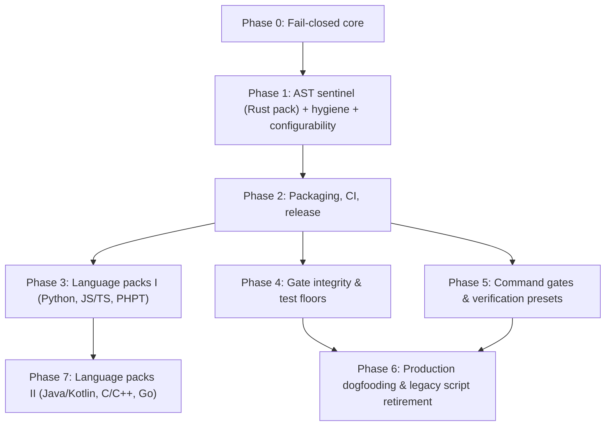

# Discipline Roadmap & Milestones

This document establishes the delivery phases, dependency graph, go/no-go gates, shipped gates, planned extensions, and outstanding checks for `discipline`.

**Superseded when:** A milestone completes, a new phase is initiated, or planned gate scope evolves. Update in place; do not fork.

---

## Dependency Graph

Phases 3, 4, and 5 depend upon Phase 2 and proceed in parallel.

---

## Shipped Gates

<!-- generated:gates -->
| Gate | Suite | Languages | Rule Description |
|---|---|---|---|
| [`agents-md`](GATES.md#agents-md) | agent-guard | any | AGENTS.md exists; CLAUDE.md / GEMINI.md do not fork it |
| [`assertion-reduction`](GATES.md#assertion-reduction) | agent-guard | Rust, Python, JS/TS, PHPT, Java, Go, PHP, C/C++, C#, Ruby | assertion count / strength must not drop in an existing test |
| [`vacuous-tests`](GATES.md#vacuous-tests) | agent-guard | Rust, Python, JS/TS, PHPT, Java, Go, PHP, C/C++, C#, Ruby | new tests must carry a non-tautological assertion |
| [`ignored-tests`](GATES.md#ignored-tests) | agent-guard | Rust, Python, JS/TS, PHPT, Java, Go, PHP, C/C++, C#, Ruby | tests must not be newly #[ignore]d or skipped without directive |
| [`unsafe-safety-comment`](GATES.md#unsafe-safety-comment) | agent-guard | Rust | unsafe blocks / impls carry a // SAFETY: comment |
| [`deletion-rationale`](GATES.md#deletion-rationale) | agent-guard | any | deleted files and removed tests need a scoped removes: rationale |
| [`time-estimates`](GATES.md#time-estimates) | hygiene | any | no calendar / duration estimates in markdown or the PR body |
| [`pii`](GATES.md#pii) | hygiene | any | no home paths, LAN IPs, or denylisted hostnames in tracked text |
| [`agent-scratch`](GATES.md#agent-scratch) | hygiene | any | agent scratch state is never tracked |
| [`shell-secrets`](GATES.md#shell-secrets) | hygiene | shell, docker, workflows | no command-line secrets or unverified piped scripts in shell, docker, or CI |
| [`issue-link`](GATES.md#issue-link) | hygiene | any | PR title or description links a tracking issue (#123, Fixes #123) |
| [`config-integrity`](GATES.md#config-integrity) | integrity | any | a change cannot weaken its own discipline.toml without a token |
| [`scope-confinement`](GATES.md#scope-confinement) | agent-guard | any | changes stay inside authorized paths |
| [`suppression-delta`](GATES.md#suppression-delta) | agent-guard | per pack | new #[allow], commented-out tests, cfg-gated tests |
| [`provenance-tags`](GATES.md#provenance-tags) | hygiene | any | published numerics carry (measured|target|projected) |
| [`ci-integrity`](GATES.md#ci-integrity) | integrity | any | workflow weakening: continue-on-error, || true, unpinned actions |
| [`ci-skip-set`](GATES.md#ci-skip-set) | integrity | any | rollup skip set matches each job's `if:` under the observed filter outputs |
| [`test-floor`](GATES.md#test-floor) | integrity | any | test-count ratchet read from the base ref |
| [`golden-output`](GATES.md#golden-output) | integrity | any | prevents stealth edits to committed golden/test output files without explicit override |
| [`dependency-delta`](GATES.md#dependency-delta) | integrity | any | manifest diff inspection: zero wildcards, source/license allowlists, and deny.toml verification |
| [`test-budget`](GATES.md#test-budget) | integrity | Rust, Python, JS/TS, Go, any | property-test and fuzz effort ratchet (cases, shrink iters, fuzztime, seed corpus) |
| [`pr-checklist`](GATES.md#pr-checklist) | hygiene | any | ticked PR checkboxes are reconciled against the diff |
| [`command`](GATES.md#command) | verification | any | fail-closed wrapper for any tool: zero-tests guard, canary, count ratchet |
| [`sanitizers`](GATES.md#sanitizers) | verification | Rust, C/C++ | ASan / TSan preset with audited suppressions and a race canary |
| [`msrv`](GATES.md#msrv) | quality | Rust | cargo check under the pinned MSRV |
| [`miri`](GATES.md#miri) | verification | Rust | Miri tiers with zero-tests guard |
| [`unsafe-budget`](GATES.md#unsafe-budget) | verification | Rust | unsafe count ratchet |
| [`bench-regression`](GATES.md#bench-regression) | bench | Rust, Go, Python, C/C++ | benchmark drift via harness adapters (deterministic counts or BCa intervals) |
| [`archive-contents`](GATES.md#archive-contents) | integrity | any | distribution archive must contain required paths and zero forbidden developer artifacts |
| [`manifest-sync`](GATES.md#manifest-sync) | integrity | any | reconcile git-tracked files against packaging manifest declarations |
| [`version-lockstep`](GATES.md#version-lockstep) | integrity | any | version declarations across headers, manifests, and files must remain in lockstep |
<!-- /generated -->

---

## Milestone Phases & Go / No-Go Gates

### Phase 0: Fail-Closed Core
- **Deliverables:** Three-state exit codes (`0`, `1`, `2`), three-state git context, merge-base diff inspection, strict layered configuration resolution, stable gate registry, line-anchored directive parsing, truthful reporting with examined counts.
- **Go / no-go gate:** Every invariant rule in the Fail-Closed Contract (F1–F12) has discriminating tests that fail if the behavior is removed.
- **Status:** **Completed & Verified**.

### Phase 1: Sentinel, Hygiene, Configurability
- **Deliverables:** AST gates on Rust pack, whole-tree hygiene sweeps (`time-estimates`, `pii`, `agent-scratch`), `agents-md` guide sentinel, full 5-layer configurability, unanalysed source reporting.
- **Go / no-go gate:** Positive and negative unit controls, e2e binary tests, embedded self-test cases, and mutation verification.
- **Status:** **Completed & Verified**.

### Phase 2: Packaging, Multi-Platform CI, Release
- **Deliverables:** Composite `action.yml` for GitHub, Gitea, and Forgejo Actions; pre-commit hooks (`.pre-commit-hooks.yaml`); GitLab CI component template; Argo Workflow template; Dockerfile container; automated multi-architecture release pipeline (`release.yml`).
- **Go / no-go gate:** `ci-gate` 100% green across all platforms; release pipeline builds verified static musl and macOS binaries with SHA-256 attestations.
- **Status:** **Completed & Verified**.

### Phase 3: Language Packs I (Fact Model Split)
- **Deliverables:** Tree-sitter extractor trait and language pack abstraction; Python pack (`test_*`, `unittest`, pytest markers); JavaScript / TypeScript pack (Jest, Vitest, Mocha matchers and callbacks); Golden (PHPT) pack.
- **Go / no-go gate:** Each language pack satisfies 4-point test discipline in its own language, including callback test renaming and assertion weakening detection.
- **Status:** **Completed & Verified**.

### Phase 4: Gate Integrity & Test Floors
- **Deliverables:**
  - `ci-integrity`: Workflow diff inspection detecting dropped jobs from `needs`, addition of `continue-on-error`, unpinned third-party actions, or stripped `-D warnings`.
  - `test-floor`: Test-count ratchet with baseline count read from merge-base ref; `allow-test-shrink:` directive.
  - `suppression-delta`: Catching net increases in compiler/linter suppression annotations (`#[allow]`, `@ts-ignore`, `# type: ignore`, `// NOLINT`).
  - `scope-confinement`: Restricting agent file modifications strictly within authorized directory boundaries.
- **Go / no-go gate:** Incident replays of historical workflow weakening and all-skipped test rollups are rejected with exit `1`.
- **Status:** **Completed & Verified** (`ci-integrity`, `test-floor`, `suppression-delta`, and `scope-confinement` shipped).

### Phase 5: Verification Presets & Benchmark Adapters
- **Deliverables:**
  - `command`: Fail-closed execution wrapper for arbitrary external tools with canary checks, zero-test guards, and timeout limits.
  - Verification presets: `sanitizers` (ASan/TSan), `miri`, `msrv`, `unsafe-budget`.
  - Benchmark regression sentinel (`bench-regression` shipped with dual-file mode, two-tier threshold, and iai/json adapters).
- **Go / no-go gate:** Zero-test runs, missing baseline artifacts, and unprovenanced runs fail closed; deterministic counts and conservative bootstrap intervals discriminate regressions without false positives.
- **Status:** **Completed & Verified** (`command`, presets, and `bench-regression` shipped).

### Phase 6: Production Dogfooding
- **Deliverables:** Production deployment of `discipline.toml` in high-assurance consumer repositories; phased retirement of bespoke shell verification scripts.
- **Go / no-go gate:** Incident replay fixtures reproducing historical bypasses are caught by Discipline without regressing verification fidelity.
- **Status:** **Parity Achieved** (all 12 parity gaps shipped with zero false positives across historical PR corpus).

### Phase 7: Language Packs II
- **Deliverables:** Java / Kotlin pack (JUnit 5, AssertJ, Hamcrest); C / C++ pack (GoogleTest, Catch2); Go pack (`testing.T`, `testify`); PHP AST pack (PHPUnit, Pest).
- **Go / no-go gate:** 100% discriminating test coverage per language pack.
- **Status:** In progress (Java, Go, PHP, and C / C++ packs shipped; Kotlin planned).

---

## Default Changes (Compatibility Ledger)

Default enablement and severity are part of the compatibility contract (`docs/ARCHITECTURE.md` §3.1). Every change to a built-in default is recorded here, newest first; a **loosening** within a major version is not allowed without an entry. Each entry names the one-line configuration that restores the previous behaviour.

| Release | Gate | Old default | New default | Direction | Reason | Restore previous behaviour |
|---|---|---|---|---|---|---|
| v0.7.0 | `ci-skip-set` | (new gate) | on, `error` | stricter | Checks a rollup job's skip set against the filter outputs it observed. Inert (reported as not evaluated) until a workflow passes `DISCIPLINE_CI_CONTEXT`. | `[gates.ci-skip-set]` `enabled = false` |
| v0.7.0 | `suppression-delta` | on, `error` | on, `warning` | looser | `#[allow(...)]` is the reviewed escape hatch from `clippy -D warnings` and `# noqa` is routine; 78 findings (measured) across one consumer's last 100 merged pull requests. First entry recorded under this contract. | `[gates.suppression-delta]` `severity = "error"` |
| v0.5.0 (retrospective) | `time-estimates` | on, `error` | on, `warning` | looser | Brownfield documentation produced mostly pre-existing findings. Shipped without a migration note; a consumer relying on the default stopped blocking silently. | `[gates.time-estimates]` `severity = "error"` |
| v0.5.0 (retrospective) | `agents-md` | on, `error` | on, `warning` | looser | Missing or forked agent guidance is hygiene, not a code defect. Shipped without a migration note. | `[gates.agents-md]` `severity = "error"` |
| v0.5.0 (retrospective) | `bench-regression` | on, `error` | on, `warning` | looser | Wall-clock benchmarks are sensitive to runner jitter. Shipped without a migration note. | `[gates.bench-regression]` `severity = "error"` |
| v0.2.1 (retrospective) | `issue-link` | on, `error` | off | looser | Needs a repository-specific tracker convention. Shipped without a migration note. | `[gates.issue-link]` `enabled = true` |
| v0.2.1 (retrospective) | `provenance-tags` | on, `error` | off | looser | Encodes a research-publication policy most repositories do not hold. Shipped without a migration note. | `[gates.provenance-tags]` `enabled = true` |

From v0.7.0 a new gate that ships enabled is listed too, since for a consumer it changes what blocks. Gates introduced between v0.2.0 and v0.6.0 are not listed.

### Behaviour Changes

A change to what a gate reports, an exit code, or an output, with an unchanged default. Newest first; each release's rows are copied into its release notes under "Upgrading" (`scripts/release_notes_upgrade.py`).

| Release | Area | Change | Direction | Migration |
|---|---|---|---|---|
| v0.7.0 | configuration | New keys (`superseded_registry`, `pending_issue_repos`, `mode`, `citation_*`, `[gates.ci-skip-set]`, ...) are rejected by older binaries, which refuse unknown keys. | stricter | Upgrade every binary that reads the file (pre-commit `rev:`, pinned images) together. |
| v0.7.0 | `test-floor` | `test_command` without `min_tests` or a `constant_*` floor exits 2 instead of passing. | stricter | Set `min_tests`, or remove `test_command`. |
| v0.7.0 | `time-estimates` | `allow_patterns` exempt only the text they match, not the whole line. | stricter | Widen the pattern to cover the text to exempt. |
| v0.7.0 | test detection | Python tests follow pytest/unittest collection (`self_test` is not a test; methods count only in `Test*` / `TestCase` classes); the C# name-only fallback is removed. Test counts can drop. | stricter | Re-baseline `min_tests` / constant floors after upgrading. |
| v0.7.0 | `bench-regression` | A malformed `exempt_arms` glob exits 2; an entry that matches no arm in the run is an error at any gate severity. | stricter | Fix or remove the entry. |
| v0.7.0 | `miri`, `sanitizers` | A missing or unsupported toolchain exits 2 (action `status: error`) instead of reporting undefined behaviour or a race (exit 1). | reclassified | Install the toolchain component, or disable the gate. |
| v0.7.0 | `baseline` | `baseline --write` records blocking findings only; `--all-severities` restores the previous output. `--write` refuses to replace an unreadable baseline (exit 2). | narrower | Pass `--all-severities` to keep warnings and notes. |
| v0.7.0 | submodules | A submodule pointer change is skipped instead of exiting 2. | looser | None needed. |
| v0.7.0 | `ci-integrity` | A renamed CI step is paired with its original by body similarity (at least 0.60, same verification markers) instead of being reported as deleted. | looser | None; the rename is listed in the gate notes. |
| v0.7.0 | `pr-checklist` | A ticked test box is backed by a test function added or extended in any analysed file, not only by a changed test file. | looser | None. |
| v0.7.0 | `provenance-tags` | The superseded registry is the base registry plus the head registry; a pending statement citing only another repository's issue is a violation unless listed in `pending_issue_repos`. | stricter | List the tracking repository in `pending_issue_repos`. |
| v0.7.0 | report | A gate that examined nothing because its input is absent is "not evaluated", not passed: the summary adds "N not evaluated" and the `passed_gates` output drops by one. | reclassified | Read `status` / exit code, not `passed_gates`. |
| v0.7.0 | forge access | Forge features call the API over HTTPS in-process: `gh` and `curl` are no longer used and `DISCIPLINE_GH` is gone. GitHub tokens come from `GH_TOKEN` or `GITHUB_TOKEN`. | reclassified | Pass `GH_TOKEN` / `GITHUB_TOKEN` to the job. |
| v0.7.0 | action | `uses: orieg/discipline@v0` downloads the binary of the release the tag points at, not the newest release. | reclassified | None. |
| v0.7.0 | `ci-skip-set` | With `workflow` left at its default, the gate reads the running workflow (`GITHUB_WORKFLOW_REF`) or the first `ci.yml` under `.github/`, `.gitea/` or `.forgejo/workflows/`, instead of always `.github/workflows/ci.yml`. | reclassified | Set `workflow` to keep a fixed path. |
| v0.7.0 | submodules | A skipped submodule pointer change is named in the `deletion-rationale` (and `scope-confinement`) notes. | narrower | None. |
| v0.7.0 | packaging | MacPorts: the `Portfile` is a release asset (the in-tree copy is gone); the in-tree Homebrew formula is removed (the release generates it and updates the tap). | reclassified | Fetch `Portfile` from the release. |

---

## Outstanding Checks & Known Limitations

- **No external review:** The architecture and test coverage were established through internal pairing and rigorous self-tests. External review by independent systems engineers is an outstanding verification check.
- **Runner environment testing:**
  - GitHub Actions: verified on hosted Linux and macOS runners in CI.
  - Gitea Actions: tested via `act` runner images; testing on a physical production Gitea server is outstanding.
  - Forgejo Actions: verified under local and CI runner environments; testing against enterprise Forgejo clusters is outstanding.
  - GitLab CI: reusable component template linted and schema-validated; live GitLab runner execution is outstanding.
  - Argo Workflows: template linted; live Kubernetes cluster DAG execution is outstanding.
- **Macro opacity:** Tests generated dynamically inside complex macro bodies (`proptest! { ... }`, `quickcheck! { ... }`) are invisible to tree-sitter AST fact extractors without compilation expansion. Use `extra_assert_macros` and `assert_helper_fns` to configure macro vocabulary.
- **Grammar lag:** Source syntax newer than the bundled tree-sitter grammars is treated as a parse error, failing closed by design. Use `exempt_paths` until grammars are updated.
